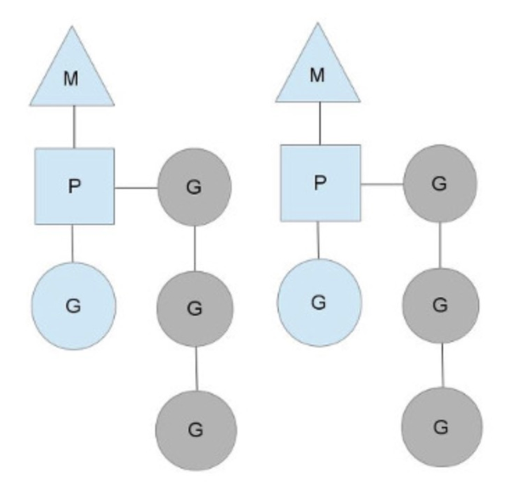

# Golang-CSP 模型

## 什么是 CSP 模型？

>   Do not communicate by sharing memory; instead, share memory by communicating.

KEY：以通信的方式共享内存。

Golang 实现的方式，goroutine + channel

## 三种线程模型

线程模型，三种：

1，用户级线程模型

多个用户态线程对应一个内核级线程，程序线程的的创建、终止、切换或者同步等线程工作必须自身来完成。

2，内核级线程模型

直接操作系统内核线程，线程的创建、终止、切换、同步等操作，都交由内核完成。

3，两级线程模型

介于 用户级线程 and 内核级线程 模型之间。

一个内核可以操作多个用户线程，但进程的线程不一一对应内核线程。

先创建多个内核级线程，用自身的用户级线程对应创建多个内核线程。

自身用户线程需要程序本身去调度，内核级线程交给操作系统内核去调度。

## Go ‘MPG‘ 线程 模型

M，Machine，一个 M 关联一个 内核线程。

P，Processor，M 的上下文环境，处理用户线程代码逻辑处理器。

G，Gotoutine，轻量级线程。

图形化如下：

一个 M 对应一个 内核线程，一个 M 连接一个 上下文 P，P 又会链接多个 G。

P 执行 G，处于蓝色，灰色属于待执行态，同时 P 维护着一个 G 队列。

#### 抛弃P(Processor)

为什么需要 P？直接让 M 操作 G 不好么？

P 是一个抽象的概念，它并不能真正执行任务，它只是负责创建or唤醒一个系统线程执行它队列中的任务。（必须存在 P，P 可以将当前处于堵塞的 G 放开，放置到全局的 G 队列中，切换执行下一个 G。当然，P 亦会周期性检查 全局 G 队列的情况，避免饿死。）

形象比喻，P 真正 意义两件事：

-   M 是租客，P 相当于一个房东，M 需要租房，必须 从 P 那里获得钥匙，获得一个入租资格。
-   M 只有拿到  P 手上的房子钥匙资源，才能进入租房。

#### 均衡的分配工作

如果全局 G 队列没有内容了，当前的  P 会从其他运行着的 P 偷一半 G 过来给自己操作。

## 总结

**处理器（P）来控制并发，线程（M）负责具体执行，并发任务（G）来保存任务状态，**各自承担自己的角色，共同协作来完成并发任务执行。