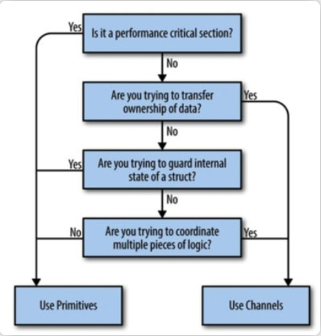
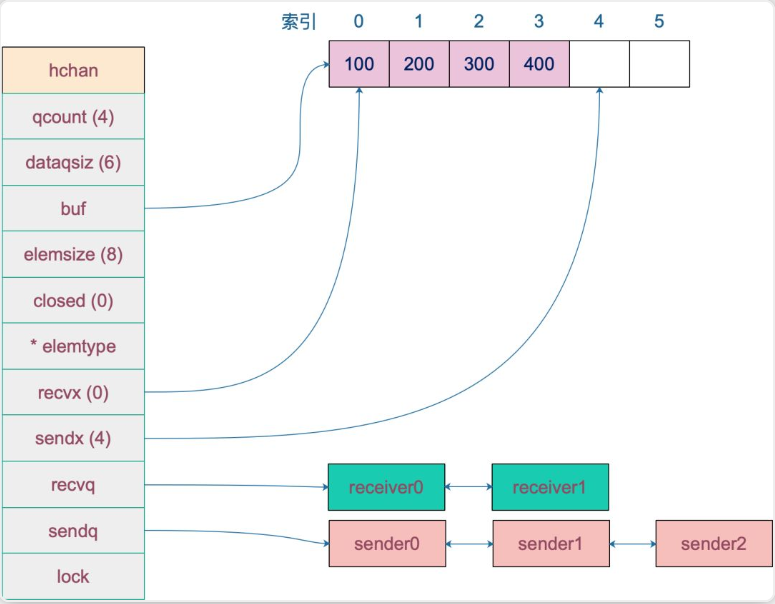
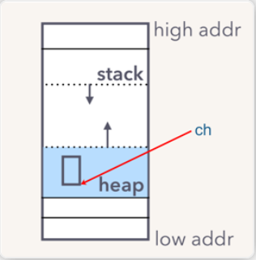

# Golang Channel

目录

[TOC]

## 并发模型

### 并发与并行

并发的几个问题：

-   数据竞争。
-   原子性。
-   内存访问同步。
-   死锁。每个线程都在等待其他线程，造成一个首尾相连的尴尬局面，使程序无法继续运行下去。
-   活锁。看似都在工作，但工作无法推进。
-   饥饿。长时间占着茅坑不拉X。

关于并发和并行的区别，三种描述：

-   经典的描述：

    并发是同一时间应对（dealing with）多件事情的能力；

​	并行是同一时间动手（doing）做多件事情的能力；

-   雨痕老师《Go 语言学习笔记》解释：

    并发是指逻辑上具备同时处理多个任务的能力；

    并行则是物理上同时执行多个任务；

-   《Concurrency in Go》描述：

    Concurrency is a property of the code; 并发是代码的特性

    parallelism is a property of the running program. 并行是正在运行的程序的特性；

跑起来的代码，大多只是一个并发态，并行操作只是一个理想化的操作，并发的代码能否并行，取决于抽象的层级：代码里的并发原语、runtime，操作系统（虚拟机、容器）。层级越来越底层，要求也越来越高。

### 什么是 CSP

Tony Hoare 在 1978 年发表在 ACM 的一篇论文。论文里指出一门编程语言应该重视 input 和 output 的原语，尤其是并发编程的代码。

文章中，CSP 也是一门自定义的编程语言，作者定义了输入输出语句，用于 processes 间的通信（communicatiton）。processes 被认为是需要输入驱动，并且产生输出，供其他 processes 消费，processes 可以是进程、线程、甚至是代码块。

## 什么是 channel

 Go 语言并发编程的 两大基石：Goroutine 和 channel。Goroutine 用于执行并发任务，channel 用于 goroutine 之间的同步、通信。

Channel 在 gouroutine 间架起了一条管道，在管道里传输数据，实现 gouroutine 间的通信；由于它是线程安全的，所以用起来非常方便；channel 还提供“先进先出”的特性；它还能影响 goroutine 的阻塞和唤醒。

来来来，Golang 并发哲学：

>   Do not communicate by sharing memory; instead, share memory by communicating.
>
>   不要通过共享内存来通信，而要通过通信来实现内存共享。

选择 sync 包里的底层并发编程原语还是 channel，《Concurrency In Go》这本书的第 2 章 “Go's Philosophy on Concurrency”一张决策树



>   后面补上中文版的

### channel 实现 CSP

channel 字面意义是“通道”，类似于 Linux 中的管道。

```
chan T // 双向
chan<- T // 用于发送
<-chan T // 用于接收
```

## 为什么要 channel

Go 通过 channel 实现 CSP 通信模型，主要用于 goroutine 之间的消息传递和事件通知。

有了 channel 和 goroutine 之后，Go 的并发编程变得异常容易和安全，得以让程序员把注意力留到业务上去，实现开发效率的提升。

## channel 实现原理

Channel 分为两种：带缓冲、不带缓冲。可对应看作，同步模式、异步模式。

同步模式下，必须要使 发送方 和 接收方 配对，操作才会成功，否则会被阻塞；

异步模式下，缓冲槽要有剩余容量，操作才会成功，否则也会被阻塞。

### 数据结构

channel 源码对应结构体：hchan。

重点几个字段：

`buf` 指向底层循环数组，只有缓冲型的 channel 才有。

`sendx`， `recvx` 均指向底层循环数组，表示当前可以发送和接收的元素位置索引值（相对于底层数组）。

`sendq`， `recvq` 分别表示被阻塞的 goroutine，这些 goroutine 由于尝试读取 channel 或向 channel 发送数据而被阻塞。

`waitq` 是 `sudog` 的一个双向链表，而 `sudog` 实际上是对 goroutine 的一个封装。

`lock` 用来保证每个读 channel 或写 channel 的操作都是原子的。



### 创建

```
// 无缓冲通道
chan1 := make(chan, int)
// 带 10 单位缓冲通道
chan2 := make(chan int, 10)
```

创建 channel 函数：makechan，原型如下：

```
func makechan(t *chantype, size int64) *hchan
```

注意，创建的时一个 指针，所以它能在函数内容直接传递

新建一个 chan 后，内存在堆上分配



例子，理解创建、发送、接收的整个过程：

```
func goroutineA(a <-chan int) {
	val := <- a
	fmt.Println("G1 received data: ", val)
	return
}

func goroutineA(b <-chan int) {
	val := <- b
	fmt.Println("G2 received data: ", val)
	return
}

func main() {
    ch := make(chan int) // 创建一个缓冲 channel
    go goroutineA(ch) // 开启两个 goroutine
    go goroutineB(ch)
    ch <- 3 // 向 channel 丢数据
    time.Sleep(time.Second) // 沉睡 1 秒
}
```

### 接收

接收对应函数：chanrecv1 & chanrecv2；

再，调用 recv 函数；

更多阅读原文...

### 发送

发送调用函数：chansend；

更多阅读原文...

### 关闭

关闭 channel 执行函数：closechan；

更多阅读原文...

## channel 进阶

操作 channel 的结果

| 操作     | nil channel | closed channel     | not nil, not closed channel                                  |
| :------- | :---------- | :----------------- | :----------------------------------------------------------- |
| close    | panic       | panic              | 正常关闭                                                     |
| 读 <- ch | 阻塞        | 读到对应类型的零值 | 阻塞或正常读取数据。缓冲型 channel 为空或非缓冲型 channel 没有等待发送者时会阻塞 |
| 写 ch <- | 阻塞        | panic              | 阻塞或正常写入数据。非缓冲型 channel 没有等待接收者或缓冲型 channel buf 满时会被阻塞 |

发生 panic 的情况有三种：向一个关闭的 channel 进行写操作；关闭一个 nil 的 channel；重复关闭一个 channel。

读、写一个 nil channel 都会被阻塞。

### 发送和接收元素的本质

>   Remember all transfer of value on the go channels happens with the copy of value.

channel 的发送和接收操作本质上都是 “值的拷贝”

### 资源泄露

泄漏的原因是 goroutine 操作 channel 后，处于发送或接收阻塞状态，而 channel 处于满或空的状态，一直得不到改变。同时，垃圾回收器也不会回收此类资源，进而导致 gouroutine 会一直处于等待队列中，不见天日。

### happend before

这是什么？？？

简单来说就是如果事件 a 和事件 b 存在 happened-before 关系，即 a -> b，那么 a，b 完成后的结果一定要体现这种关系。

由于现代编译器、CPU 会做各种优化，包括编译器重排、内存重排等等，在并发代码里，happened-before 限制就非常重要了。

>   晃岳攀老师在 Gopher China 2019 上的并发编程分享

关于 channel 的发送（send）、发送完成（send finished）、接收（receive）、接收完成（receive finished）的 happened-before 关系如下：

1.  第 n 个 `send` 一定 `happened before` 第 n 个 `receive finished`，无论是缓冲型还是非缓冲型的 channel。
2.  对于容量为 m 的缓冲型 channel，第 n 个 `receive` 一定 `happened before` 第 n+m 个 `send finished`。
3.  对于非缓冲型的 channel，第 n 个 `receive` 一定 `happened before` 第 n 个 `send finished`。
4.  channel close 一定 `happened before` receiver 得到通知。

### 优雅关闭 channel

建议阅读原文...

### 关闭 channel 仍读出数据

## channel 应用

### 停止信号

关注：如何优雅关闭 channel 

### 任务定时

```
select {
    case <-time.After(100 * time.Millisecond):
    case <-s.stopc:
    	return false
}
```

指定执行任务：

```
func worker() {
    ticker := time.Tick(1*time.Second)
    for {
        select {
            case <- ticker:
            	fmt.Println("定时 1s 任务")
        }
    }
}
```

### 解耦生厂方和消费方

服务启动时，启动 n 个 worker，作为工作协程池，这些协程工作在一个 `for{}` 无限循环里，从某个 channel 消费工作任务并执行。

工作协程在不断地从工作队列里取任务，生产方只管往 channel 发送任务即可，解耦生产方和消费方。

### 控制并发数

```
var limit = make(chan int, 3)
func main() {
    for _, w := range work {
        go func() {
			limit <- 1
            w()
            <-limit
		}()
    }
}
```

真正执行任务，访问第三方的动作在 w() 中完成，在执行 w() 之前，先要从 limit 中拿“许可证”，拿到许可证之后，才能执行 w()，并且在执行完任务，要将“许可证”归还。这样就可以控制同时运行的 goroutine 数。

>   `limit<-1` 放在 func 内部而不是外部，解释：
>
>   如果在外层，就是控制系统 goroutine 的数量，可能会阻塞 for 循环，影响业务逻辑。
>
>   limit 其实和逻辑无关，只是性能调优，放在内层和外层的语义不太一样。

注意的是，如果 w() 发生 panic，那“许可证”可能就还不回去了，因此需要使用 defer 来保证。

## 总结

更多阅读原文...

## 参考

饶全成@深度解密Go语言之channel

<https://mp.weixin.qq.com/s?__biz=MjM5MDUwNTQwMQ==&mid=2257483870&idx=1&sn=1c61a1f530b3e52d801a7916065f3eec&chksm=a5391888924e919e39ddb8f017b572fd6f199184d6ad85c4ae4dacf2749312b70717d7beee44&scene=27#wechat_redirect&cpage=0>