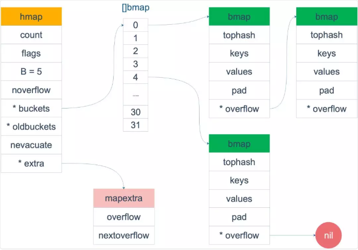
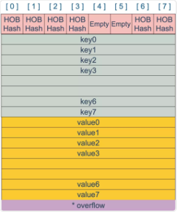
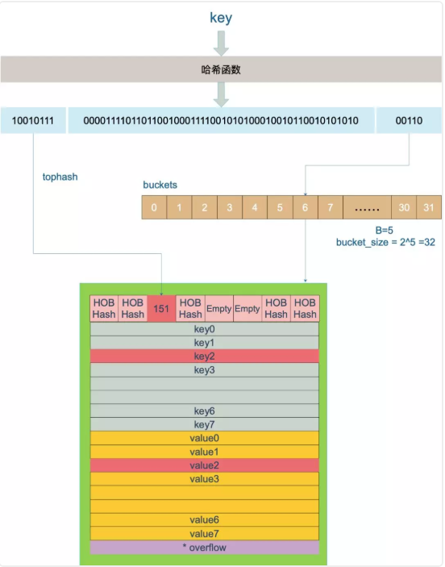

# Golang wiki map

目录

[TOC]

## 总结

-   Go 语言中，通过哈希查找表实现 map，用链表法解决哈希冲突。
-   通过 key 的哈希值将 key 散落到不同的桶中，每个桶中有 8 个 cell。哈希值的低位决定桶序号，高位标识同一个桶中的不同 key。
-   当向桶中添加了很多 key，造成元素过多，或者溢出桶太多，就会触发扩容。扩容分为等量扩容和 2 倍容量扩容。扩容后，原来一个 bucket 中的 key 一分为二，会被重新分配到两个桶中。
-   扩容过程是渐进的，主要是防止一次扩容需要搬迁的 key 数量过多，引发性能问题。触发扩容的时机是增加了新元素，bucket 搬迁的时机则发生在赋值、删除期间，每次最多搬迁两个 bucket。
-   查找、赋值、删除的一个很核心的内容是如何定位到 key 所在的位置，需要重点理解。

## 什么是 map

什么是 map？在计算机科学里，被称为相关数组、map、符号表或者字典，是由一组 `<key,value>` 对组成的抽象数据结构，并且同一个 key 只会出现一次。

map 的设计也被称为 “The dictionary problem”，它的任务是设计一种数据结构用来维护一个集合的数据，并且可以同时对集合进行增删查改的操作。最主要的数据结构有两种：`哈希查找表（Hashtable）`、 `搜索树（Searchtree）`。

-   哈希查找表用一个哈希函数将 key 分配到不同的桶（bucket，也就是数组的不同 index）。这样，开销主要在哈希函数的计算以及数组的常数访问时间。在很多场景下，哈希查找表的性能很高。

    >   哈希查找表一般会存在“碰撞”的问题，就是说不同的 key 被哈希到了同一个 bucket。一般有两种应对方法：`链表法`和 `开放地址法`。`链表法`将一个 bucket 实现成一个链表，落在同一个 bucket 中的 key 都会插入这个链表。`开放地址法`则是碰撞发生后，通过一定的规律，在数组的后面挑选“空位”，用来放置新的 key。

-   搜索树法一般采用自平衡搜索树，包括：AVL 树，红黑树。

## 为什么要用 map

hash table 是计算机数据结构中一个最重要的设计。大部分 hash table 都实现了快速查找、添加、删除的功能。

Why？因为它太强大了，各种增删查改的操作效率非常高。

## map 底层如何实现

### map 内存模型

map 结构体：hmap；

buckets 是个指针，最终指向一个结构体：bmap，但百衲衣期间会动态创建一个新的结构体；

`bmap` 就是我们常说的“桶”，桶里面会最多装 8 个 key，这些 key 之所以会落入同一个桶，是因为它们经过哈希计算后，哈希结果是“一类”的。在桶内，又会根据 key 计算出来的 hash 值的高 8 位来决定 key 到底落入桶内的哪个位置（一个桶内最多有8个位置）。

整体的图：



 bucket 的内存模型



`HOBHash` 指的就是 top hash。

为什么是按照 key/key/.../value/value/... 排列？

如果按照 `key/value/key/value/...` 这样的模式存储，那在每一个 key/value 对之后都要额外 padding 7 个字节；而将所有的 key，value 分别绑定到一起，这种形式 `key/key/.../value/value/...`，则只需要在最后添加 padding。

每个 bucket 设计成最多只能放 8 个 key-value 对，如果有第 9 个 key-value 落入当前的 bucket，那就需要再构建一个 bucket ，通过 `overflow` 指针连接起来。

### 创建 map

```
ageMp := make(map[string]int)
ageMp := make(map[string]int, 8)
// ageMp 为 nil，不能向其添加元素，会直接panic
var ageMp map[string]int
```

底层调用函数：makemap，主要做的工作就是初始化 `hmap` 结构体的各种字段，例如计算 B 的大小，设置哈希种子 hash0 等等。

makemap 和 makeslice 的区别，带来一个不同点：当 map 和 slice 作为函数参数时，在函数参数内部对 map 的操作会影响 map 自身；而对 slice 却不会。

Why？主要原因：一个是指针（ `*hmap`），一个是结构体（ `slice`）。Go 语言中的函数传参都是值传递

### 哈希函数

hash 函数，有加密型和非加密型。

-   加密型的一般用于加密数据、数字摘要等，典型代表就是 md5、sha1、sha256、aes256 这种；
-   非加密型的一般就是查找。在 map 的应用场景中，用的是查找。

选择 hash 函数主要考察的是两点：性能、碰撞概率。

### key 定位过程

key 经过哈希计算后得到哈希值，共 64 个 bit 位（64位机，32位机就不讨论了，现在主流都是64位机），计算它到底要落在哪个桶时，只会用到最后 B 个 bit 位。

案例：

现在有一个 key 经过哈希函数计算后，得到的哈希结果是：

10010111 | 000011110110110010001111001010100010010110010101010 │ 01010

用最后的 5 个 bit 位，`01010`，值为 10，获取到 10 号桶。

再用哈希值的高 8 位，找到此 key 在 bucket 中的位置，这是在寻找已有的 key。最开始桶内还没有 key，新加入的 key 会找到第一个空位，放入。

注意：buckets 编号就是桶编号，当两个不同的 key 落在同一个桶中，也就是发生了哈希冲突。

>   冲突的解决手段是用链表法：在 bucket 中，从前往后找到第一个空位。这样，在查找某个 key 时，先找到对应的桶，再去遍历 bucket 中的 key。



查找某个 key 的底层函数： `mapacess` 系列函数，对，系列函数

看看 key and value 的定位公是：

```
// key 定位公式
k := add(unsafe.Pointer(b), dataOffset+i*uintptr(t.keysize))
// value 定位公式
v := add(unsafe.Pointer(b), dataOffset+bucketCnt*uintptr(t.keysize)+i*uintptr(t.valuesize))
```

更多阅读原文...

### map 两种 get 操作

Go 语言中读取 map 有两种语法：

-   带 comma 和 不带 comma。当要查询的 key 不在 map 里，带 comma 的用法会返回一个 bool 型变量提示 key 是否在 map 中；
-   而不带 comma 的语句则会返回一个 value 类型的零值。

```
    // 不带 comma 用法
    age1 := ageMap["stefno"]
    // 带 comma 用法
    age2, ok := ageMap["stefno"]
```

另外，根据 key 的不同类型，编译器还会将查找、插入、删除的函数**用更具体的函数替换**，以优化效率

| key 类型 | 查找                                                         |
| :------- | :----------------------------------------------------------- |
| uint32   | mapaccess1_fast32(t *maptype, h *hmap, key uint32) unsafe.Pointer |
| uint32   | mapaccess2_fast32(t *maptype, h *hmap, key uint32) (unsafe.Pointer, bool) |

更多阅读原文...

### 如何进行扩容

由于 map 扩容需要将原有的 key/value 重新搬迁到新的内存地址，如果有大量的 key/value 需要搬迁，会非常影响性能。因此 Go map 的扩容采取了一种称为“渐进式”地方式，原有的 key 并不会一次性搬迁完毕，每次最多只会搬迁 2 个 bucket。

真正搬迁 buckets 的动作在 `growWork()` 函数中，而调用 `growWork()` 函数的动作是在 mapassign 和 mapdelete 函数中。

搬迁的关键函数：evacuate

搬迁的目的：将老的 buckets 搬迁到新的 buckets。

等下，为什么遍历 map 是无序的？

map 在扩容后，会发生 key 的搬迁，原来落在同一个 bucket 中的 key，搬迁后，有些 key 就要远走高飞了（bucket 序号加上了 2^B）。而遍历的过程，就是按顺序遍历 bucket，同时按顺序遍历 bucket 中的 key。搬迁后，key 的位置发生了重大的变化，有些 key 飞上高枝，有些 key 则原地不动。这样，遍历 map 的结果就不可能按原来的顺序了。

当然，Go 做得更绝，当我们在遍历 map 时，并不是固定地从 0 号 bucket 开始遍历，每次都是从一个随机值序号的 bucket 开始遍历，并且是从这个 bucket 的一个随机序号的 cell 开始遍历。这样，即使你是一个写死的 map，仅仅只是遍历它，也不太可能会返回一个固定序列的 key/value 对了。

再来讲搬迁函数中的几个关键点：

evacuate 函数每次只完成一个 bucket 的搬迁工作，因此要遍历完此 bucket 的所有的 cell，将有值的 cell copy 到新的地方。bucket 还会链接 overflow bucket，它们同样需要搬迁。因此会有 2 层循环，外层遍历 bucket 和 overflow bucket，内层遍历 bucket 的所有 cell。这样的循环在 map 的源码里到处都是，要理解透了。

确定了要搬迁到的目标 bucket 后，搬迁操作就比较好进行了。将源 key/value 值 copy 到目的地相应的位置。

在搬迁过程中，oldbuckets 指针还会指向原来老的 []bmap，并且已经搬迁完毕的 key 的 tophash 值会是一个状态值，表示 key 的搬迁去向。

### map 的遍历

如何遍历？遍历所有的 bucket 以及它后面挂的 overflow bucket，然后挨个遍历 bucket 中的所有 cell。每个 bucket 中包含 8 个 cell，从有 key 的 cell 中取出 key 和 value，这个过程就完成了。

难点在哪？遍历如果发生在扩容的过程中，就会涉及到遍历新老 bucket 的过程；

具体内容查看原文...

只要知道，遍历操作，会按照新 bucket 的序号顺序进行，碰到老 bucket 未搬迁的情况时，要在老 bucket 中找到将来要搬迁到新 bucket 来的 key。

>   map 遍历的核心在于理解 2 倍扩容时，老 bucket 会分裂到 2 个新 bucket 中去。

### map 的赋值

向 map 中插入或者修改 key，最终调用的是 `mapassign` 函数。

mapassign 有一个系列的函数，根据 key 类型的不同，编译器会将其优化为相应的“快速函数”。

| key 类型 | 插入                                                         |
| :------- | :----------------------------------------------------------- |
| uint32   | mapassign_fast32(t *maptype, h *hmap, key uint32) unsafe.Pointer |

整体：对 key 计算 hash 值，根据 hash 值按照之前的流程，找到要赋值的位置（可能是插入新 key，也可能是更新老 key），对相应位置进行赋值。

函数并没有传入 value 值，所以赋值操作是什么时候执行的呢？

```
func mapassign(t *maptype, h *hmap, key unsafe.Pointer) unsafe.Pointer
```

`mapassign` 函数返回的指针就是指向的 key 所对应的 value 值位置，有了地址，就很好操作赋值了。

### map 的删除

写操作底层的执行函数是 `mapdelete`：

```
func mapdelete(t *maptype, h *hmap, key unsafe.Pointer) 
```

根据 key 类型的不同，删除操作会被优化成更具体的函数：

| key 类型 | 删除                                              |
| :------- | :------------------------------------------------ |
| uint32   | mapdelete_fast32(t *maptype, h *hmap, key uint32) |

计算 key 的哈希，找到落入的 bucket。检查此 map 如果正在扩容的过程中，直接触发一次搬迁操作。

删除操作同样是两层循环，核心还是找到 key 的具体位置。寻找过程都是类似的，在 bucket 中挨个 cell 寻找。

找到对应位置后，对 key 或者 value 进行“清零”操作：

## map 进阶

### 边遍历边删除？真的吗？

map 并不是一个线程安全的数据结构。同时读写一个 map 是未定义的行为，如果被检测到，会直接 panic。

一般而言，这可以通过读写锁来解决：`sync.RWMutex`。

l另外，`sync.Map` 是线程安全的 map

### key 可以是 float

当用 float64 作为 key 的时候，先要将其转成 unit64 类型，再插入 key 中。通过 `Float64frombits` 函数完成。

## 参考

饶全成@深度解密Go语言之map

<https://mp.weixin.qq.com/s?__biz=MjM5MDUwNTQwMQ==&mid=2257483772&idx=1&sn=a6462bc41ec70edf5d60df37a6d4e966&chksm=a539172a924e9e3c41bac1abd9e752f9db7786d813f667a04fb9c7f717bde90c47012558bd59&scene=27#wechat_redirect&cpage=0>

