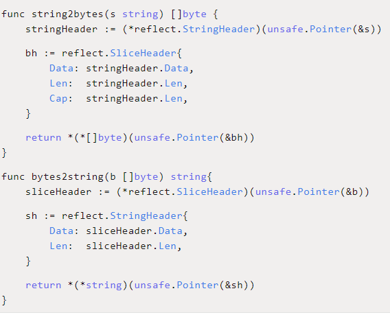

# Golang wiki unsafe

目录

[TOC]

## 指针类型

为什么需要指针类型？因为，Golang 中函数传参都是  值传递。无法跳跃改变底层内容。

注意几点限制：

限制一：Go的指针不能进行数学运算；

限制二：不同类型的指针不能相互转换；

限制三：不同类型的指针不能使用 == 或 != 比较；

限制四：不同类型的指针变量不能相互赋值；

## 什么是 unsafe

Go 非类型安全的指针。

unsafe 包用于 Go 编译器，在编译阶段使用。

它可以绕过 Go 语言的类型系统，直接操作内存。

## 为什么有 unsafe

Go 语言类型系统是为了安全和效率设计的，有时，安全会导致效率低下。有了 unsafe 包，高阶的程序员就可以利用它绕过类型系统的低效。

## unsafe 实现原理

```
type ArbitraryType int

type Pointer *ArbitraryType
```

 `Arbitrary` 是任意的意思，也就是说 Pointer 可以指向任意类型。

unsafe 包还有其他三个函数：

```
func Sizeof(x ArbitraryType) uintptr
func Offsetof(x ArbitraryType) uintptr
func Alignof(x ArbitraryType) uintptr
```

-   `Sizeof` 返回类型 x 所占据的字节数，但不包含 x 所指向的内容的大小。
-   `Offsetof` 返回结构体成员在内存中的位置离结构体起始处的字节数，所传参数必须是结构体的成员。
-   `Alignof` 返回 m，m 是指当类型进行内存对齐时，它分配到的内存地址能整除 m。

注意事项：

-   以上三个函数返回的结果都是 uintptr 类型，这和 unsafe.Pointer 可以相互转换。

-   三个函数都是在编译期间执行，它们的结果可以直接赋给 `const型变量`。

-   因为三个函数执行的结果和操作系统、编译器相关，所以是不可移植的。

-   pointer 不能直接进行数学运算，但可以把它转换成 uintptr，对 uintptr 类型进行数学运算，再转换成 pointer 类型。

-   uintptr 并没有指针的语义，意思就是 uintptr 所指向的对象会被 gc 无情地回收。

    unsafe.Pointer 有指针语义，可以保护它所指向的对象在“有用”的时候不会被垃圾回收。

综上，unsafe 包提供了 2 点重要的能力：

-   任何类型的指针和 unsafe.Pointer 可以相互转换。
-   uintptr 类型和 unsafe.Pointer 可以相互转换。


## unsafe 如何使用

### 获取 slice 长度

底层调用 makeslice 函数，返回  slice 结构体

```
func makeslice(et *_type, len, cap int) slice
```

具体实现：

```
func main() {
    s := make([]int, 9, 20)
    var Len = *(*int)(unsafe.Pointer(uintptr(unsafe.Pointer(&s)) + uintptr(8)))
    fmt.Println(Len, len(s)) // 9 9
    
    var Cap = *(*int)(unsafe.Pointer(uintptr(unsafe.Pointer(&s)) + uintptr(16)))
    fmt.Println(Cap, cap(s)) // 20 20
}
```

Len，cap 的转换流程如下：

```
Len: &s => pointer => uintptr => pointer => *int => int
Cap: &s => pointer => uintptr => pointer => *int => int
```

### 获取 map 长度

makemap 函数返回的是 hmap 的指针，注意是指针：

```
func makemap(t *maptype, hint int64, h *hmap, bucket unsafe.Pointer) *hmap
```

通过 unsafe.Pointer 和 uintptr 进行转换，得到 hamp 字段的值，只不过，现在 count 变成二级指针了：

```
func main() {
    mp := make(map[string]int)
    mp["qcrao"] = 100
    mp["stefno"] = 18
    
    count := **(**int)(unsafe.Pointer(&mp))
    fmt.Println(count, len(mp)) // 2 2
}
```

count 转换过程：

```
&mp => pointer => **int => int
```

### map 源码中的应用

在 map 源码中，mapaccess1、mapassign、mapdelete 函数中，需要定位 key 的位置，会先对 key 做哈希运算。

例如：

```
b := (*bmap)(unsafe.Pointer(uintptr(h.buckets) + (hash&m)*uintptr(t.bucketsize)))
```

`h.buckets` 是一个 `unsafe.Pointer`，将它转换成 `uintptr`，然后加上 `(hash&m)*uintptr(t.bucketsize)`，二者相加的结果再次转换成 `unsafe.Pointer`，最后，转换成 `bmap指针`，得到 key 所落入的 bucket 位置。

### offsetof 获取成员偏移量

前言：对于一个结构体，通过 offset 函数可以获取结构体成员的偏移量，进而获取成员的地址，读写该地址的内存，就可以达到改变成员值的目的。

结构体会被分配一块连续的内存，结构体的地址也代表了第一个成员的地址。

```
type Programmer struct {
    name string
    language string
    // language string 三个私有成员
}

func main() {
    p := Programmer{"stefno", "go"}
    fmt.Println(p)
    
    name := (*string)(unsafe.Pointer(&p))
    *name = "qcrao"
    
    lang := (*string)(unsafe.Pointer(uintptr(unsafe.Pointer(&p)) + unsafe.Offsetof(p.language)))
    *lang = "Golang"
    
    fmt.Println(p)
}

output：
{stefno go}
{qcrao Golang}
```

花式操作

三个私有成员变量，不能直接修改的情况下：

```
lang := (*string)(unsafe.Pointer(uintptr(unsafe.Pointer(&p)) + unsafe.Sizeof(int(0)) + unsafe.Sizeof(string(""))))
```

### string 和 slice 的相互转换

实现字符串和 bytes 切片之间的转换，要求是 `zero-copy`。

slice 和 string 的底层数据结构：


通过构造 slice header 和 string header，来完成 string 和 byte slice 之间的转换，代码如下：



其他案例

```
// 来源地: https://www.cnblogs.com/shuiyuejiangnan/p/9707066.html
func str2bytes(s string) []byte {
	x := (*[2]uintptr)(unsafe.Pointer(&s))
	h := [3]uintptr{x[0], x[1], x[1]}
	
	// 转换过程：&h -> Pointer -> *[]byte -> []byte
	return *(*[]byte)(unsafe.Pointer(&h))
}

func bytes2str(b []byte) string {
	// 转换过程：&b -> Pointer -> *string -> string
	return *(*string)(unsafe.Pointer(&b))
}
```

## 总结

-   unsafe 包绕过了 Go 的类型系统，达到直接操作内存的目的，使用它有一定的风险性。但是在某些场景下，使用 unsafe 包提供的函数会提升代码的效率；
-   通过三个函数可以获取变量的大小、偏移、对齐等信息；
-   uintptr 可以和 unsafe.Pointer 进行相互转换，uintptr 可以进行数学运算。这样，通过 uintptr 和 unsafe.Pointer 的结合就解决了 Go 指针不能进行数学运算的限制。
-   通过 unsafe 相关函数，可以获取结构体私有成员的地址，进而对其做进一步的读写操作，突破 Go 的类型安全限制。

## 参考

饶全成@深度解密Go语言之unsafe

<https://mp.weixin.qq.com/s?__biz=MjM5MDUwNTQwMQ==&mid=2257483779&idx=1&sn=462a76ec6f36a012ed7d2705c227f562&chksm=a53918d5924e91c350045f332174d2de75c35efadb96b7896bdcf2c5027cc5171fe4ee4b2f0d&scene=27#wechat_redirect&cpage=0>