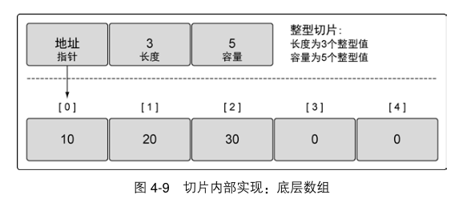
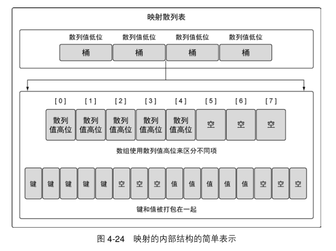
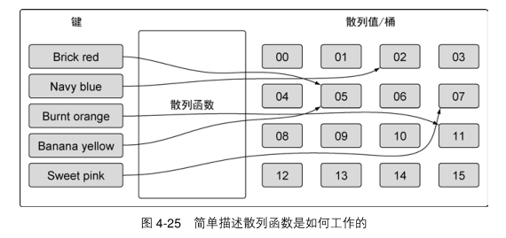

# <<Go语言实战>> - 阅读笔记

>   前记：
>
>   相关代码：https://github.com/goinaction/code/
>
>   笔记时间：07062019


## 构建现代程序

-   写并发程序的时候，最佳做法，在 main 函数返回以前，清理并终止之前启动的所有 goroutines。有助于减少bug，防止资源异常。
-   同时，可以使用 sync 包的 WaitGroup 跟踪所有启动的 goroutine，利用它来统计所有的goroutine 是不是都完成了工作。

-   在 Go 语言中，所有的变量都以值的方式传递。因为指针变量的值是所指向的内存地址，在函数间传递指针变量，实际上是在传递这个地址值，所以依旧被看作以值的方式在传递。 

-   关键字 defer 会安排随后的函数调用在函数返回时才执行。哪怕函数意外崩溃终止， 也能保证关键字 defer 安排调用的函数会被执行。 关键字 defer 可以缩短打开文件和关闭文件之间间隔的代码行数，有助提高代码可读性，减少错误。

-   如果接口类型只包含一个方法，那么这个类型的名字以 er 结尾。如果接口类型内部声明了多个方法，其名字需要与其行为关联。

-   每个代码文件都属于一个包，而包名应该与代码文件所在的文件夹同名。

-   如果变量的值没有显式初始化，编译器会将变量初始化为零值。 

-   使用指针可以在函数间或者 goroutine 间共享数据。

-   每个包可以包含任意多个 init 函数，这些函数都会在程序执行开始的时候被调用。所有被编译器发现的 init 函数都会安排在 main 函数之前执行。init 函数用在设置包、初始化变量或者其他要在程序运行前优先完成的引导工作。 

### 如何与他人更好协作

-   包应该在代码库的根目录中
-   包可以非常小 
-   对代码执行 go fmt
-   给代码写文档 

## 数组 Array，切片 Slice，映射 Map

### 数组 Array

在 Go 语言里，数组是一个长度固定的数据类型，用于存储一段具有相同的类型的元素的连续块。

-   使用值传递，在函数间传递大数组 
-   使用指针在函数间传递大数组，更高效操作

### 切片 Slice

切片是一个很小的对象，对底层数组进行了抽象，并提供相关的操作方法。



-   容量小于长度的切片会在编译时报错【len larger than cap in make([]int) 】

-   空切片在底层数组包含 0 个元素，也没有分配任何存储空间。想表示空集合时空切片很有用。

-   切片只能访问到其长度内的元素。 试图访问超出其长度的元素将会导致语言运行时异常

-   如何计算长度和容量

    对底层数组容量是 k 的切片 slice[i:j]来说

    长度: j - i

    容量: k - i

-   如果切片的底层数组没有足够的可用容量，append 函数会创建一个新的底层数组，将被引用的现有的值复制到新数组里，再追加新的值。- 很重要

-   range 提供了每个元素的副本

-   Go 语言里使用 append 函数处理追加的方式很简明：先增长切片，再将新的整型切片赋值给外层切片的第一个元素。

-   将切片复制到任意函数的时候，对底层数组大小都不会有影响。复制时只会复制切片本身，不会涉及底层数组

### 映射 Map

映射是一种数据结构，用于存储一系列无序的键值对。 



内部：映射的散列表包含一组桶。在存储、删除或者查找键值对的时候，所有操作都要先选择一个桶。把操作映射时指定的键传给映射的散列函数，就能选中对应的桶。这个散列函数的目的是生成一个索引，这个索引最终将键值对分布到所有可用的桶里。 

随着映射存储的增加，索引分布越均匀，访问键值对的速度就越快。

映射使用两个数据结构来存储数据：

第一个，数据结构是一个数组， 内部存储的是用于选择桶的散列键的高八位值。 这个数组用于区分每个键值对要存在哪个桶里。

第二个，数据结构是一个字节数组，用于存储键值对。该字节数组先依次存储了这个桶里所有的键， 之后依次存储了这个桶里所有的值。 

实现这种键值对的存储方式目的在于减少每个桶所需的内存。



-   映射的键可以是任何值。

-   可以通过声明一个未初始化的映射来创建一个值为 nil 的映射（称为 nil 映射 ） 
-    nil 映射不能用于存储键值对，否则，会产生一个语言运行时错误。【Runtime Error: panic: runtime error: assignment to entry in nil map 】

### 小结

-   映射的增长没有容量或者任何限制。

-   内置函数 len 可以用来获取 切片 Slice or 映射 Map 的长度。
-   内置函数 cap 只能用于切片 Slice。
-   通过组合， 可以创建多维数组和多维切片。 也可以使用切片或者其他映射作为映射的值。但是切片不能用作映射的键。

-   将切片或者映射传递给函数成本很小，并且不会复制底层的数据结构。

## 类型系统

### 用户自定义类型

-   任何时候，创建一个变量并初始化为其零值，习惯是使用关键字 var。这种用法是为了更明确地表示一个变量被设置为零值。 如果变量被初始化为某个非零值， 就配合结构字面量和短变量声明操作符来创建变量。 
-   给不同类型的变量赋值会产生编译错误。

### 方法

值接收者使用值的副本来调用方法，而指针接受者使用实际值来调用方法。 

### 类型的本质

-   不要只关注某个方法是如何处理这个值，而是要关注这个值的本质是什么。

#### 引用类型

-   Go 语言里的引用类型有如下几个：切片、映射、通道、接口和函数类型。
-   当声明上述类型的变量时，创建的变量被称作标头（header）值。每个引用类型创建的标头值是包含一个指向底层数据结构的指针。每个引用类型还包含一组独特的字段，用于管理底层数据结构。（从技术细节上说，字符串也是一种引用类型。）
-   因为标头值是为复制而设计的，所以永远不需要共享一个引用类型的值。
-   标头值里包含一个指针，因此通过复制来传递一个引用类型的值的副本，本质上就是在共享底层数据结构。

#### 结构类型

-   结构类型可以用来描述一组数据值，这组值的本质即可以是原始的，也可以是非原始的。

#### 接口

-   多态是指代码可以根据类型的具体实现采取不同行为的能力。如果一个类型实现了某个接口，所有使用这个接口的地方，都可以支持这种类型的值。

#### 实现 

-   接口是用来定义行为的类型。这些被定义的行为不由接口直接实现，而是通过方法由用户定义的类型实现。
-   如果用户定义的类型实现了某个接口类型声明的一组方法，那么这个用户定义的类型的值就可以赋给这个接口类型的值。这个赋值会把用户定义的类型的值存入接口类型的值。 
-   对接口值方法的调用会执行接口值里存储的用户定义的类型的值对应的方法。 因为任何用户定义的类型都可以实现任何接口，所以对接口值方法的调用自然就是一种多态。

#### 方法集

-   方法集定义了接口的接受规则。

-   方法集定义了一组关联到给定类型的值或者指针的方法。 定义方法时使用的接收者的类型决定了这个方法是关联到值，还是关联到指针，还是两个都关联。
-   如果使用指针接收者来实现一个接口，那么只有指向那个类型的指针才能够实现对应的接口。如果使用值接收者来实现一个接口，那么那个类型的值和指针都能够实现对应的接口。

### 嵌入类型

Go 语言允许用户扩展或者修改已有类型的行为。这个功能对代码复用很重要，在修改已有类型以符合新类型的时候也很重要。这个功能是通过嵌入类型（type embedding）完成的。嵌入类型是将已有的类型直接声明在新的结构类型里。被嵌入的类型被称为新的外部类型的内部类型。

### 小结

-   方法提供了一种给用户定义的类型增加行为的方式。
-   设计类型时需要确认类型的本质是原始的，还是非原始的。
-   接口是声明了一组行为并支持多态的类型。
-   嵌入类型提供了扩展类型的能力，而无需使用继承。
-   标识符要么是从包里公开的，要么是在包里未公开的。

## 并发

-   Go 语言里的并发指的是能让某个函数独立于其他函数运行的能力。

-   Go 语言的并发同步模型来自一个叫作通信顺序进程 （Communicating Sequential Processes， CSP）的范型（paradigm） 。CSP 是一种消息传递模型，通过在 goroutine 之间传递数据来传递消息，而不是对数据进行加锁来实现同步访问。

### 并发与并行

-   一个线程是一个执行空间，这个空间会被操作系统调度来运行函数中所写的代码。每个进程至少包含一个线程，每个进程的初始线程被称作主线程。因为执行这个线程的空间是应用程序的本身的空间，所以当主线程终止时，应用程序也会终止。

-   操作系统会在物理处理器上调度线程来运行，而 Go 语言的运行时会在逻辑处理器上调度 goroutine 来运行。每个逻辑处理器都分别绑定到单个操作系统线程。

-   并发（concurrency）不是并行（parallelism） 。并行是让不同的代码片段同时在不同的物理处理器上执行。并行的关键是同时做很多事情，而并发是指同时管理很多事情，这些事情可能只做了一半就被暂停去做别的事情了。

### goroutine

-   调用 runtime 包的 GOMAXPROCS 函数。这个函数允许程序更改调度器可以使用的逻辑处理器的数量。 
-   包 runtime 提供了修改 Go 语言运行时配置参数的能力。【runtime.GOMAXPROCS(runtime.NumCPU()) 】
-   使用多个逻辑处理器并不意味着性能更好。在修改任何语言运行时配置参数的时候，都需要配合基准测试来评估程序的运行效果。
-   只有在有多个逻辑处理器且可以同时让每个 goroutine 运行在一个可用的物理处理器上的时候，goroutine 才会并行运行。

### 竞争状态

-   如果两个或者多个 goroutine 在没有互相同步的情况下，访问某个共享的资源，并试图同时读和写这个资源，就处于相互竞争的状态，这种情况被称作竞争状态（race candition） 。

```go
go build -race   // 用竞争检测器标志来编译程序
```

### 锁住共享资源 

如果需要顺序访问一个整型变量或者一段代码，atomic 和 sync 包里的函数提供了很好的解决方案。

#### 原子函数 

当 goroutine 试图去调用任何原子函数时，这些 goroutine 都会自动根据所引用的变量做同步处理。

#### 互斥锁

-   互斥锁用于在代码上创建一个临界区， 保证同一时间只有一个 goroutine 可以
    执行这个临界区代码。
-   同一时刻只有一个 goroutine 可以进入临界区。之后，直到调用 Unlock()函数之后，其他 goroutine 才能进入临界区。

### 通道

-   当一个资源需要在 goroutine 之间共享时，通道在 goroutine 之间架起了一个管道，并提供了确保同步交换数据的机制。
-   声明通道时，需要指定将要被共享的数据的类型。
-   可以通过通道共享内置类型、命名类型、结构类型和引用类型的值或者指针。

#### 无缓冲的通道

-   无缓冲的通道（unbuffered channel）是指在接收前没有能力保存任何值的通道。这种类型的通道要求发送 goroutine 和接收 goroutine 同时准备好，才能完成发送和接收操作。
-   这种对通道进行发送和接收的交互行为本身就是同步的。其中任意一个操作都无法离开另一个操作单独存在。

#### 有缓冲的通道 

-   有缓冲的通道（buffered channel）是一种在被接收前能存储一个或者多个值的通道。这种类型的通道并不强制要求 goroutine 之间必须同时完成发送和接收。
-   缓冲的通道和无缓冲的通道之间的一个很大的不同：无缓冲的通道保证进行发送和接收的 goroutine 会在同一时间进行数据交换；有缓冲的通道没有这种保证。


## 后记

推荐一下第 7 章相关代码，以便更好理解 并发