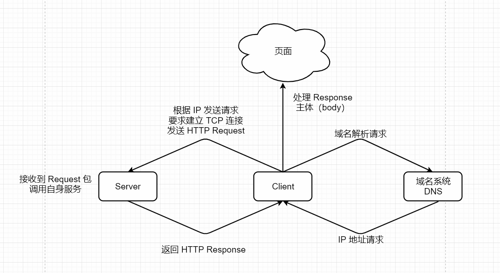
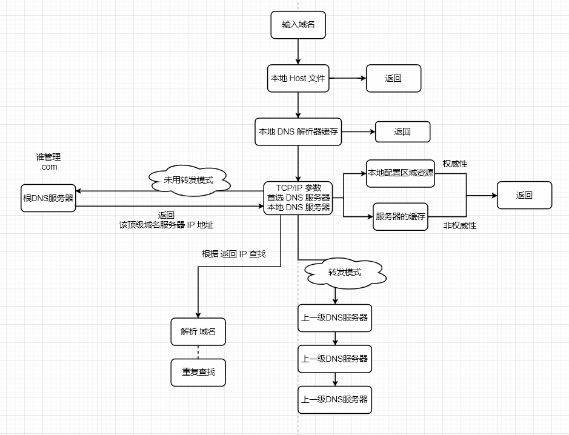
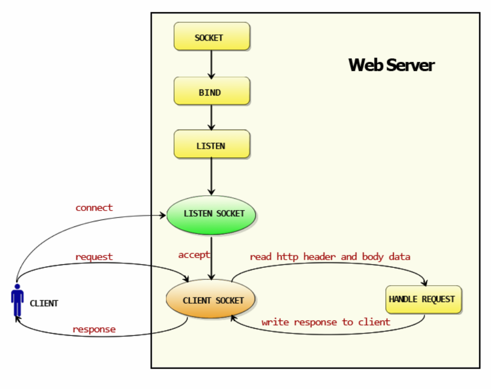
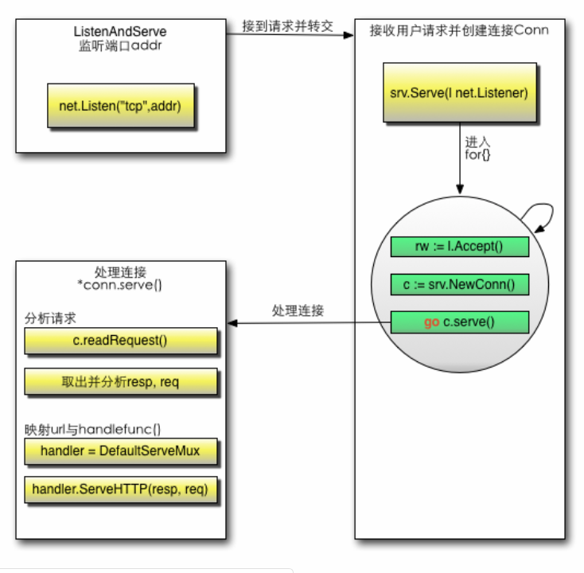

# Web开发

文章整理自：https://github.com/astaxie/build-web-application-with-golang/blob/master/zh/03.0.md

## 3.1 web工作方式

### 普通的上网过程

浏览器本身是一个客户端，当输入 URL 的时候，首先浏览器会去请求 DNS 服务器，通过 DNS 获取相应的 域名 对应的 IP，然后通过 IP 地址 找到 IP 对应的 服务器 后，要求建立 TCP 连接，等浏览器发送完 HTTP Request（请求）包后，在服务器 接收到 请求包 之后才开始处理请求包，服务器调用自身服务，返回 HTTP Response（响应）包；客户端收到来自服务器的响应后开始渲染这个 Response 包里的 主体（body），等收到全部的内容随后 断开 与该服务器之间的 TCP 连接。



### DNS - 域名系统

它用于 TCP/IP 网络，它从事将 主机名 或 域名 转换为 实际 IP 地址 的工作。

更详细的 DN S解析的过程如下：

1.  在浏览器中输入 www.qq.com 域名，操作系统会先检查自己本地的 hosts 文件是否有这个网址映射关系，如果有，就先调用这个IP地址映射，完成域名解析。
2.  如果 hosts 里没有这个域名的映射，则查找 本地 DNS 解析器 缓存，是否有这个网址映射关系，如果有，直接返回，完成域名解析。
3.  如果 hosts 与 本地 DNS 解析器缓存 都没有相应的网址映射关系，首先会找 TCP/IP参数 中设置的 首选 DNS 服务器，在此我们叫它 本地 DNS 服务器，此服务器收到查询时，如果要查询的域名，包含在 本地配置区域资源 中，则 返回解析结果给客户机，完成域名解析，此解析具有权威性。
4.  如果要查询的域名，不在 本地DNS服务器区域 解析，但该 服务器 已 缓存 了此网址 映射 关系，则调用这个 IP 地址映射，完成域名解析，此解析不具有权威性。
5.  如果 本地 DNS 服务器本地区域文件 与 缓存解析 都失效，则根据本地DNS服务器的设置（是否设置转发器）进行查询，如果未用转发模式，本地DNS就把请求发至 “根DNS服务器”，“根DNS服务器”收到请求后会判断这个域名(.com)是谁来授权管理，并会返回一个负责该顶级域名服务器的一个 IP。本地 DNS 服务器收到 IP 信息后，将会联系负责 .com 域的这台服务器。这台负责 .com 域的服务器收到请求后，如果自己无法解析，它就会找一个管理 .com 域的下一级 DNS 服务器地址 (qq.com) 给本地 DNS 服务器。当 本地DNS服务器 收到这个地址后，就会找 qq.com 域服务器，重复上面的动作，进行查询，直至找到 www.qq.com 主机。
6.  如果用的是转发模式，此 DNS 服务器就会把请求转发至上一级 DNS 服务器，由上一级服务器进行解析，上一级服务器如果不能解析，或找根DNS或把转请求转至上上级，以此循环。不管本地DNS服务器用的是转发，还是根提示，最后都是把结果返回给本地DNS服务器，由此DNS服务器再返回给客户机。



我们最后获取的是IP地址，也就是浏览器最后发起请求的时候是基于 IP 去和 服务器 做信息交互的。

### GET 和 POST 区别：

-   GET 请求 消息体 为 空，POST 请求带有 消息体。
-   GET 提交的数据会放在 URL 之后，以 `?` 分割URL和传输数据，参数之间以 `&` 相连。POST 方法是把提交的数据放在 HTTP包 的 body 中。
-   GET提交的数据大小有限制（浏览器对URL的长度有限制）。POST方法提交的数据没有限制。
-   GET方式提交数据，会带来安全问题。可以从历史记录获得该用户的账号和密码。

### 状态码

-   1XX 提示信息 - 表示 请求已被成功接收，继续处理
-   2XX 成功 - 表示 请求已成功被接收，理解，接受
-   3XX 重定向 - 要完成请求必须进行更进一步的处理
-   4XX 客户端错误 - 请求有语法错误 或 请求无法实现
-   5XX 服务器端错误 - 服务器未能实现合法的请求

### 无状态，Connection: keep-alive 的区别

无状态，指协议对于事务处理没有记忆能力，服务器不知道客户端是什么状态。从另一方面讲，打开一个服务器上的网页和你之前打开这个服务器上的网页之间没有任何联系。

从 HTTP/1.1 起，默认都开启了 `Keep-Alive` 保持连接特性，简单地说，当一个网页打开完成后，客户端和服务器之间用于传输 HTTP 数据的 TCP 连接不会关闭，如果客户端再次访问这个服务器上的网页，会继续使用这一条已经建立的 TCP 连接。

>   Keep-Alive不会永久保持连接，它有一个保持时间，可以在不同服务器软件（如Apache）中设置这个时间。

浏览器第一次请求 url，服务器端返回的是 html 页面，然后浏览器开始渲染 HTML：当解析到 HTML DOM 里面的图片连接，css 脚本 和 js 脚本的链接，浏览器就会自动发起一个请求静态资源的 HTTP 请求，获取相对应的静态资源，然后浏览器就会渲染出来，最终将所有资源整合、渲染，完整展现在我们面前的屏幕上。

## 3.3 Go 如何使得 Web 工作

### Web工作几个概念

Request：用户请求的信息，用来解析用户的请求信息，包括 post、get、cookie、url 等信息

Response：服务器需要反馈给客户端的信息

Conn：用户的每次请求链接

Handler：处理请求和生成返回信息的处理逻辑

### Go 实现 Web 服务的工作模式



>   图片来源：https://github.com/astaxie/build-web-application-with-golang/

1.  创建 Listen Socket，监听指定的端口，等待客户端请求到来。
2.  Listen Socket 接受客户端的请求，得到 Client Socket ，接下来通过 Client Socket 与客户端通信。
3.  处理客户端的请求，首先从 Client Socket 读取 HTTP 请求的协议头，如果是 POST 方法，还可能要读取客户端提交的数据，然后交给相应的 HANDLER 处理请求，handler 处理完毕准备好客户端需要的数据，通过 Client Socket 写给客户端。

### 下面三个问题

-   如何监听端口？
-   如何接收客户端请求？
-   如何分配 handler ？

```go
func (srv *Server) Serve(l net.Listener) error {
	defer l.Close()
	var tempDelay time.Duration // how long to sleep on accept failure
	for {
		rw, e := l.Accept() // Listener 接收信息
		if e != nil {
			if ne, ok := e.(net.Error); ok && ne.Temporary() {
				if tempDelay == 0 {
					tempDelay = 5 * time.Millisecond
				} else {
					tempDelay *= 2
				}
				if max := 1 * time.Second; tempDelay > max {
					tempDelay = max
				}
				log.Printf("http: Accept error: %v; retrying in %v", e, tempDelay)
				time.Sleep(tempDelay)
				continue
			}
			return e
		}
		tempDelay = 0
		c, err := srv.newConn(rw) // 其次，创建一个 conn
		if err != nil {
			continue
		}
		go c.serve() // 单开 gotouine， 把请求数据交给 conn 处理
	}
}
```

监听端口：Go 是通过一个函数 `ListenAndServe` 来处理这些事情的。这个底层其实这样处理的：初始化一个 server 对象，然后调用了 `net.Listen("tcp", addr)` ，也就是底层用 TCP协议 搭建了一个服务，然后 监控 我们设置的端口。

接收客户端的请求：调用 `srv.Serve(net.Listener)` 函数，这个函数就是处理接收客户端的请求信息。起了一个`for{}`，首先通过  Listener  接收请求，其次创建一个 Conn，最后单独开了一个 goroutine，把这个请求的数据当做参数扔给这个conn去服务：`go c.serve()`。

分配 handler：conn首先会解析  request：`c.readRequest()`，然后获取相应 handler：`handler := c.server.Handler` ，`ListenAndServe` 第二个参数，传递的是 nil，也就是为空，那么默认获取  `handler = DefaultServeMux` ：这个变量就是一个路由器，它用来匹配 url 跳转到其相应的 handle 函数。

分配案例：`http.HandleFunc("/", sayhelloName)`。这个作用就是注册了请求 `/` 的路由规则，当请求uri为 "/"，路由就会转到函数 sayhelloName ，DefaultServeMux 会调用 ServeHTTP方法，这个方法内部其实就是调用 sayhelloName 本身，最后通过写入response的信息反馈到客户端。

详细的整个流程：



>   图片来源：https://github.com/astaxie/build-web-application-with-golang/

## 3.4 http包详解

>    更多：https://github.com/astaxie/build-web-application-with-golang/blob/master/zh/03.4.md

### http包 整个的代码执行过程

-   首先调用 Http.HandleFunc

    按顺序做了几件事：

    1，调用了 DefaultServeMux 的 HandleFunc

    2，调用了 DefaultServeMux 的 Handle

    3，往 DefaultServeMux 的 map[string]muxEntry 中增加对应的 handler 和 路由规则

-   其次调用 http.ListenAndServe(":9090", nil)

    按顺序做了几件事情：

    1，实例化 Server

    2，调用 Server 的 ListenAndServe()

    3，调用 net.Listen("tcp", addr) 监听端口

    4，启动一个 for 循环，在循环体中 Accept 请求

    5，对每个请求实例化一个 Conn，并且开启一个 goroutine 为这个请求进行服务 go c.serve()

    6，读取每个请求的内容 w, err := c.readRequest()

    7，判断 handler 是否为空，如果没有设置 handler（这个例子就没有设置handler），handler 就设置为 DefaultServeMux

    8，调用 handler 的 ServeHttp 

    9，在这个例子中，下面就进入到 DefaultServeMux.ServeHttp

    10，根据 request 选择 handler，并且进入到这个 handler 的 ServeHTTP

    ```
      mux.handler(r).ServeHTTP(w, r)
    ```

    11，选择 handler：

    A，判断是否有路由能满足这个 request（循环遍历 ServeMux 的 muxEntry）

    B，如果有路由满足，调用这个路由 handler 的 ServeHTTP

    C，如果没有路由满足，调用 NotFoundHandler 的 ServeHTTP

