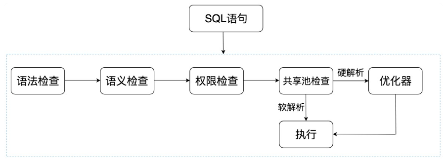
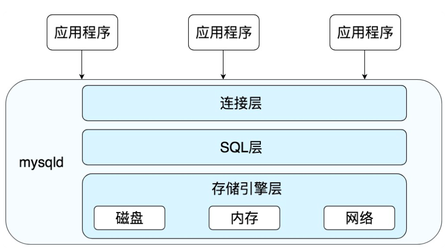
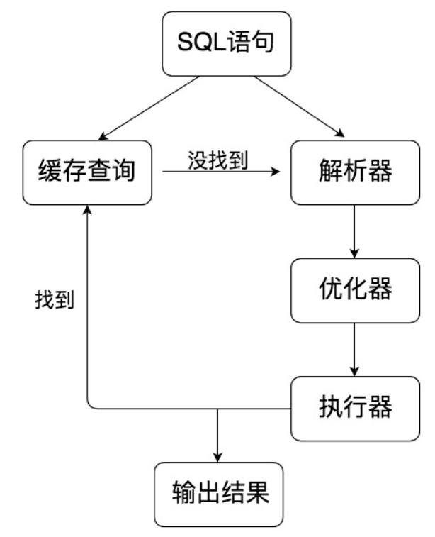

# 03丨学会用数据库的方式思考SQL是如何执行的

[TOC]

## Oracle中的SQL是如何执行的

>   Oracle中采用了共享池来判断SQL语句是否存在缓存和执行计划

### Oracle SQL 执行过程



-   **语法检查**：检查SQL 拼写是否正确，如果不正确，Oracle 会报语法错误。
-   **语义检查**：检查SQL中的访问对象是否存在。比如我们在写SELECT语句的时候，列名写错了，系统就会提示错误。语法检查和语义检查的作用是保证SQL语句没有错误。
-   **权限检查**：看用户是否具备访问该数据的权限。
-   **共享池检查**：共享池（Shared Pool）是一块内存池，最主要的作用是缓存SQL语句和该语句的执行计划。Oracle通过检查共享池是否存在SQL语句的执行计划，来判断进行软解析，还是硬解析。那软解析和硬解析又该怎么理解呢？
    -   在共享池中，Oracle 首先对SQL 语句进行Hash运算，然后根据 Hash 值在库缓存（Library Cache）中查找，如果存在SQL语句的执行计划，就直接拿来执行，直接进入
        “执行器”的环节，这就是软解析。
    -   如果没有找到SQL 语句和执行计划，Oracle 就需要创建解析树进行解析，生成执行计划，进入“优化器”这个步骤，这就是硬解析。
-   **优化器**：优化器中就是要进行硬解析，也就是决定怎么做，比如创建解析树，生成执行计划。
-   **执行器**：当有了解析树和执行计划之后，就知道了SQL该怎么被执行，这样就可以在执行器中执行语句了。

共享池是Oracle中的术语，包括了库缓存，数据字典缓冲区等。

-   库缓存区，它主要缓存SQL语句和执行计划。
-   数据字典缓冲区存储的是Oracle中的对象定义，比如表、视图、索引等对象。

当对SQL语句进行解析的时候，如果需要相关的数据，会从数据字典缓冲区中提取。库缓存这一个步骤，决定了SQL 语句是否需要进行硬解析。

为了提升SQL的执行效率，我们应该尽量避免硬解析，因为在SQL的执行过程中，创建解析树，生成执行计划是很消耗资源的。

如何避免硬解析，尽量使用软解析呢？在Oracle中，绑定变量是它的一大特色。绑定变量就是在SQL语句中使用变量，通过不同的变量取值来改变SQL的执行结果。这样做的好处是能提升软解析的可能性，不足之处在于可能会导致生成的执行计划不够优化，因此是否需要绑定变量还需要视情况而定。

可以通过使用绑定变量来减少硬解析，减少Oracle的解析工作量。但是这种方式也有缺点，使用动态SQL的方式，因为参数不同，会导致SQL的执行效率不同，同时SQL优化也会比较困难。

## Mysql中的SQL是如何执行的

MySQL是典型的C/S架构，即Client/Server架构，服务器端程序使用的mysaqld。

### 整体MySQL 流程



### MySQL 的三层构成

-   连接层：客户端和服务器端建立连接，客户端发送SQL至服务器端；
-   SQL层：对SQL语句进行查询处理；
-   存储引擎层：与数据库文件打交道，负责数据的存储和读取。

其中SQL层与数据库文件的存储方式无关

### SQL层的结构



-   查询缓存：Server 如果在查询缓存中发现了这条SQL 语句，就会直接将结果返回给客户端；如果没有，就进入到解析器阶段。需要说明的是，因为查询缓存往往效率不高，所以在MySQL8.0 之后就抛弃了这个功能。
-   解析器：在解析器中对 SQL 语句进行语法分析、语义分析。
-   优化器：在优化器中会确定 SQL 语句的执行路径，比如是根据全表检索，还是根据索引来检索等。
-   执行器：在执行之前需要判断该用户是否具备权限，如果具备权限就执行 SQL 查询并返回结果。在 MySQL8.0 以下的版本，如果设置了查询缓存，这时会将查询结果进行缓存。

发现没？SQL 语句在 MySQL 中的流程是：SQL 语句→缓存查询→解析器→优化器→执行器。在一部分中，MySQL 和 Oracle 执行SQL的原理是一样的。

与 Oracle 不同的是，MySQL 的存储引擎采用了插件的形式，每个存储引擎都面向一种特定的数据库应用环境。

### 常见的存储引擎

-   InnoDB 存储引擎：它是 MySQL5.5 版本之后默认的存储引擎，最大的特点是支持事务、行级锁定、外键约束等。
-   MyISAM 存储引擎：在 MySQL5.5 版本之前是默认的存储引擎，不支持事务，也不支持外键，最大的特点是速度快，占用资源少。
-   Memory 存储引擎：使用系统内存作为存储介质，以便得到更快的响应速度。不过如果mysqld 进程崩溃，则会导致所有的数据丢失，因此我们只有当数据是临时的情况下才使用Memory 存储引擎。
-   NDB 存储引擎：也叫做 NDB Cluster 存储引擎，主要用于 MySQL Cluster 分布式集群环境，类似于Oracle的RAC集群。
-   Archive 存储引擎：它有很好的压缩机制，用于文件归档，在请求写入时会进行压缩，所以也经常用来做仓库。

数据库的设计在于表的设计，而在 MySQL 中每个表的设计都可以采用不同的存储引擎，我们可以根据实际的数据处理需要来选择存储引擎，这也是 MySQL 的强大之处。

## 数据库管理系统也是一种软件

>   如果你只是简单地把 MySQL和 Oracle 看成数据库管理系统软件，从外部看难免会觉得“晦涩难懂”，毕竟组织结构太多了。

在学习的时候，还需要具备抽象的能力，抓取最核心的部分：SQL的执行原理。因为不同的DBMS的SQL的执行原理是相通的，只是在不同的软件中，各有各的实现路径。

在不同的模块中，SQL 执行所使用的资源（时间）是怎样的。

```
mysql> select @@profiling;

mysql> set profiling=1;

mysql> select * from wucai.heros;

mysql> show profile;
```

## 疑问解答

解析后的 SQL 语句在 Oracle 的哪个区域中进行缓存？

答：共享池。