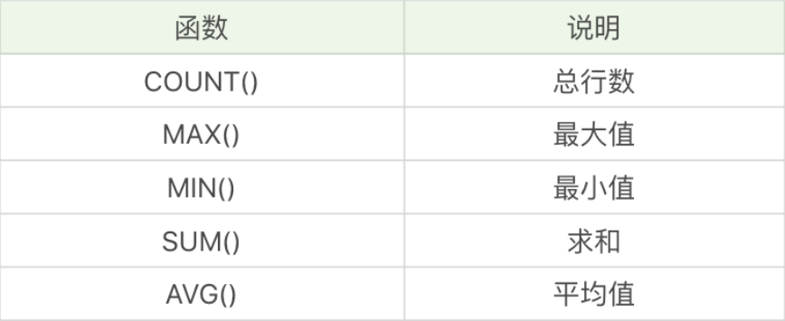

# 08丨什么是SQL的聚集函数，如何利用它们汇总表的数据？

[TOC]

## 提问

聚集函数都有哪些，能否在一条 SELECT 语句中使用多个聚集函数？

如何对数据进行分组，并进行聚集统计？

如何使用HAVING过滤分组，HAVING和WHERE的区别是什么？

筛选最大生命值大于6000的英雄，按照主要定位进行分组，选择分组英雄数量大于5的分组，按照分组英雄数从高到低进行排序，并显示每个分组的英雄数量、主要定位和平均最大生命值？

```
SELECT
	COUNT( * ) AS num,
	role_main,
	AVG( hp_max ) 
FROM
	heros 
WHERE
	hp_max > 6000 
GROUP BY
	role_main 
HAVING
	num > 5 
ORDER BY
	num DESC
```

筛选最大生命值与最大法力值之和大于7000的英雄，按照攻击范围来进行分组，显示分组的英雄数量，以及分组英雄的最大生命值与法力值之和的平均值、最大值和最小值，并按照分组英雄数从高到低进行排序，其中聚集函数的结果包括小数点后两位？

```
SELECT
	COUNT( * ) AS num,
	`name`,
	ROUND( AVG( hp_max + mp_max ), 2 ) AS '平均值',
	ROUND( MAX( hp_max + mp_max ), 2 ) AS '最大值',
	ROUND( MIN( hp_max + mp_max ), 2 ) AS '最小值' 
FROM
	heros 
WHERE
	( hp_max + mp_max ) > 7000 
GROUP BY
	attack_range
ORDER BY
	num DESC
```

## 聚集函数都有哪些



查询最大生命值大于6000的英雄数量

```

SQL：SELECT COUNT(*) FROM heros WHERE hp_max > 6000
```

查询最大生命值大于6000，且有次要定位的英雄数量

```

SQL：SELECT COUNT(role_assist) FROM heros WHERE hp_max > 6000
```

查询射手（主要定位或者次要定位是射手）的最大生命值的最大值是多少

```

SQL：SELECT MAX(hp_max) FROM heros WHERE role_main = '射手' OR role_assist = '射手'
```

需要对英雄的主要定位和次要定位进行筛选

```

SQL: SELECT COUNT(*), AVG(hp_max), MAX(mp_max), MIN(attack_max), SUM(defense_max) FROM heros WHERE role_main = '射手' or role_assist = '射手'
```

注意：AVG、MAX、MIN等聚集函数会自动忽略值为NULL的数据行，MAX和MIN函数也可以用于字符串类型数据的统计，如果是英文字母，则按照A-Z的顺序排列，越往后，数值越大。如果是汉字则按照全拼拼音进行排列。

```

SQL：SELECT MIN(CONVERT(name USING gbk)), MAX(CONVERT(name USING gbk)) FROM heros
```

对数据行中不同的取值进行聚集，先用DISTINCT函数取不同的数据，然后再使用聚集函数

```

SQL: SELECT COUNT(DISTINCT hp_max) FROM heros
```

统计不同生命最大值英雄的平均生命最大值，保留小数点后两位。

```

SQL: SELECT ROUND(AVG(DISTINCT hp_max), 2) FROM heros
```

不使用DISTINCT函数，就是对全部数据进行聚集统计。如果使用了DISTINCT函数，就可以对数值不同的数据进行聚集。一般我们使用MAX和MIN函数统计数据行的时候，不需要再额外使用DISTINCT，因为使用DISTINCT和全部数据行进行最大值、最小值的统计结果是相等的。

## 如何对数据进行分组，并进行聚集统计

按照英雄的主要定位进行分组，并统计每组的英雄数量

```

SQL: SELECT COUNT(*), role_main FROM heros GROUP BY role_main
```

对英雄按照次要定位进行分组，并统计每组英雄的数量

```

SELECT COUNT(*), role_assist FROM heros GROUP BY role_assist
```

按照英雄的主要定位、次要定位进行分组，查看这些英雄的数量，并按照这些分组的英雄数量从高到低进行排序

```

SELECT COUNT(*) as num, role_main, role_assist FROM heros GROUP BY role_main, role_assist ORDER BY num DESC
```

## 如何使用HAVING过滤分组，它与WHERE的区别是什么？

-   HAVING的作用和WHERE一样，都是起到过滤的作用，只不过WHERE是用于数据行，而HAVING则作用于分组。
-   对于分组的筛选，一定要用HAVING，而不是WHERE。
-   HAVING支持所有WHERE的操作，因此所有需要WHERE子句实现的功能，都可以使用HAVING对分组进行筛选。

按照英雄的主要定位、次要定位进行分组，并且筛选分组中英雄数量大于5的组，最后按照分组中的英雄数量从高到低进行排序

```

SQL: SELECT COUNT(*) as num, role_main, role_assist FROM heros GROUP BY role_main, role_assist HAVING num > 5 ORDER BY num DESC
```

筛选最大生命值大于6000的英雄，按照主要定位、次要定位进行分组，并且显示分组中英雄数量大于5的分组，按照数量从高到低进行排序。

```

SQL: SELECT COUNT(*) as num, role_main, role_assist FROM heros WHERE hp_max > 6000 GROUP BY role_main, role_assist HAVING num > 5 ORDER BY num DESC
```

## 总结

-   在SELECT查询中，关键字的顺序是不能颠倒的
    -   SELECT ... FROM ... WHERE ... GROUP BY ... HAVING ... ORDER BY ...
-   使用GROUP BY进行分组，如果想让输出的结果有序，可以在GROUP BY后使用ORDER BY。因为GROUP BY只起到了分组的作用，排序还是需要通过ORDER BY来完成。

