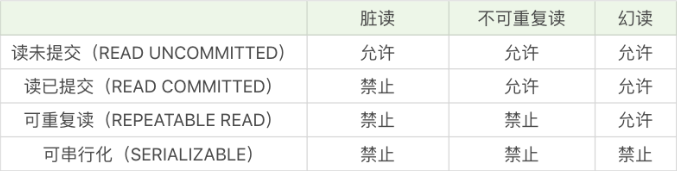

# 15丨初识事务隔离：隔离的级别有哪些，它们都解决了哪些异常问题？

[TOC]

## 前情

事务的四大特性 ACID，分别是原子性、一致性、隔离性和持久性，其中隔离性是事务的基本特性之一，它可以防止数据库在并发处理时出现数据不一致的情况。

最严格的情况下，我们可以采用串行化的方式来执行每一个事务，这就意味着事务之间是相互独立的，不存在并发的情况。然而在实际生产环境下，考虑到随着用户量的增多，会存在大规模并发访问的情况，这就要求数据库有更高的吞吐能力，这个时候串行化的方式就无法满足数据库高并发访问的需求，我们还需要降低数据库的隔离标准，来换取事务之间的并发能力。

这时我们可以牺牲一定的正确性来换取效率的提升，也就是说，我们需要通过设置不同的隔离等级，以便在正确性和效率之间进行平衡。

## 疑问

事务并发处理可能存在的三种异常有哪些？

什么是脏读、不可重复读和幻读？针对可能存在的异常情况，四种事务隔离的级别分别是什么？

如何使用 MySQL 客户端来模拟脏读、不可重复读和幻读？

## 事务并发处理可能存在的异常都有哪些？

在了解数据库隔离级别之前，我们需要了解设定事务的隔离级别都要解决哪些可能存在的问题，也就是事务并发处理时会存在哪些异常情况。

异常情况级别分别为脏读（Dirty Read）、不可重复读（Nnrepeatable Read）和幻读（Phantom Read）

### 三种异常情况的特点

-   脏读：读到了其他事务还没有提交的数据。
-   不可重复读：对某数据进行读取，发现两次读取的结果不同，也就是说没有读到相同的内容。这是因为有其他事务对这个数据同时进行了修改或删除。
-   幻读：事务 A 根据条件查询得到了 N 条数据，但此时事务 B 更改或者增加了 M 条符合事务 A 查询条件的数据，这样当事务 A 再次进行查询的时候发现会有 N+M 条数据，产生了幻读。

## 事务隔离的级别有哪些？

SQL-92 标准还定义了 4 种隔离级别来解决这些异常情况

解决异常数量从少到多的顺序（比如读未提交可能存在 3 种异常，可串行化则不会存在这些异常）决定了隔离级别的高低

这四种隔离级别从低到高分别是：

-   读未提交（READ UNCOMMITTED ）
-   读已提交（READ COMMITTED）
-   可重复读（REPEATABLE READ）
-   可串行化（SERIALIZABLE）



### 细说

读未提交，也就是**允许读到未提交的数据**，这种情况下查询是不会使用锁的，可能会产生脏读、不可重复读、幻读等情况。

读已提交，就是**只能读到已经提交的内容**，可以避免脏读的产生，**属于 RDBMS 中常见的默认隔离**级别（比如说 Oracle 和 SQL Server），但如果想要避免不可重复读或者幻读，就需要我们在 SQL 查询的时候编写带加锁的 SQL 语句（我会在进阶篇里讲加锁）。

可重复读，保证一个事务在相同查询条件下两次查询**得到的数据结果是一致**的，可以避免不可重复读和脏读，但无法避免幻读。**MySQL 默认的隔离级别**就是可重复读。

可串行化，**将事务进行串行化**，也就是在一个队列中按照顺序执行，可串行化是最高级别的隔离等级，可以解决事务读取中所有可能出现的异常情况，但是它**牺牲了系统的并发性**。

## 使用 MySQL 客户端来模拟三种异常

### 相关操作

两个客户端设置

```
// 显示事务隔离级别
mysql> SHOW VARIABLES LIKE 'transaction_isolation';
// 设置为 读未提交
mysql> SET SESSION TRANSACTION ISOLATION LEVEL READ UNCOMMITTED;
// 自动提交设置为 0
mysql> SET autocommit = 0;
```

#### 模拟“脏读”

客户端 1 中读取了客户端 2 未提交的新英雄“吕布”，实际上客户端 2 可能马上回滚，从而造成了“脏读”。

```
// 客户端2
SQL> BEGIN;
SQL> INSERT INTO heros_temp values(4, '吕布');

// 客户端1
SQL> SELECT * FROM heros_temp;
```

#### 模拟“不可重复读”

对于客户端 1 来说，同一条查询语句出现了“不可重复读”。

```
// 客户端1
SQL> SELECT name FROM heros_temp WHERE id = 1;

SQL> BEGIN;
SQL> UPDATE heros_temp SET name = '张翼德' WHERE id = 1;

// 客户端2
SQL> SELECT name FROM heros_temp WHERE id = 1;
```

#### 模拟“幻读”

数据表多出一条数据。

```
// 客户端1
SQL> SELECT * FROM heros_temp;

// 客户端2
SQL> BEGIN;
SQL> INSERT INTO heros_temp values(4, '吕布');

// 客户端1
SQL> SELECT * FROM heros_temp;
```

