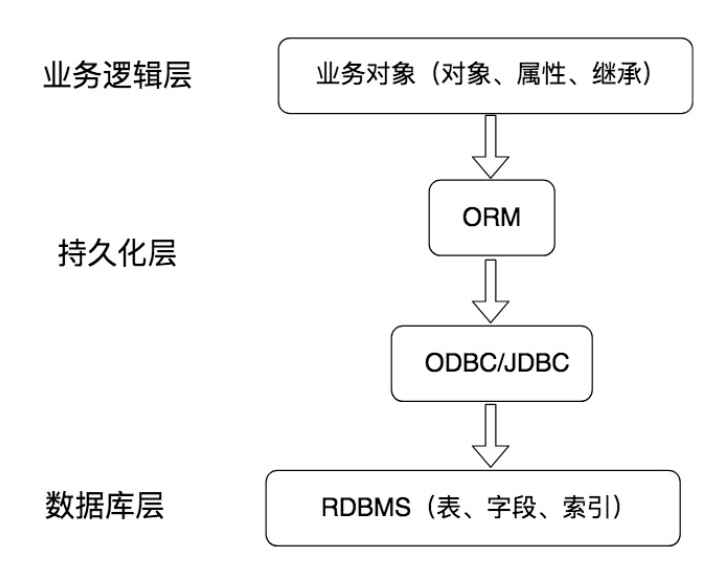

# 18丨SQLAlchemy：如何使用Python ORM框架来操作MySQL？

[TOC]

## 疑问

什么是 ORM 框架，以及为什么要使用 ORM 框架？

Python 中的 ORM 框架都有哪些？

如何使用 SQLAlchemy 来完成与 MySQL 的交互？

## 为什么要使用 ORM 框架？

先了解什么是持久化。

如下图所示，持久化层在业务逻辑层和数据库层起到了衔接的作用，它可以将内存中的数据模型转化为存储模型，或者将存储模型转化为内存中的数据模型。

事务的 4 大特性 ACID，持久性就是将对象数据永久存储在数据库中。

通常我们将数据库的作用理解为永久存储，将内存理解为暂时存储。我们在程序的层面操作数据，其实都是把数据放到内存中进行处理，如果需要数据就会通过持久化层，从数据库中取数据；如果需要保存数据，就是将对象数据通过持久化层存储到数据库中。

**ORM 解决的是什么问题呢？它提供了一种持久化模式，可以高效地对数据库进行访问。**

>   ORM 的英文是 Object Relation Mapping，中文叫对象关系映射。它是 RDBMS 和业务实体对象之间的一个映射，从图中你也能看到，它可以把底层的 RDBMS 封装成业务实体对象，提供给业务逻辑层使用。程序员往往关注业务逻辑层面，而不是底层数据库该如何访问，以及如何编写 SQL 语句获取数据等等。采用 ORM，就可以从数据库的设计层面转化成面向对象的思维。

### 优势

采用基于 ORM 的方式来操作数据库。这样做的好处就是一旦定义好了对象模型，就可以让它们简单可复用，从而不必关注底层的数据库访问细节，我们只要将注意力集中到业务逻辑层面就可以了。

即便数据库本身进行了更换，在业务逻辑代码上也不会有大的调整。这是因为 ORM 抽象了数据的存取，同时也兼容多种 DBMS，我们不用关心底层采用的到底是哪种 DBMS，是 MySQL，SQL Server，PostgreSQL 还是 SQLite。

## 总结

### 1，ORM的作用

对象关系映射，能够直接将数据库对象进行持久化。

在没有ORM前，我们要自己写数据库连接方法，自己在方法里面嵌入原生的sql语句去访问数据表……

这时问题就来了：

数据库名，数据表名完全暴露在代码中，有脱库的风险；

需要我们自己处理数据表对象，比如说把数据表中取出的数据转化为标准json等，sql语句安全过滤，数据表、字段别名、兼容多种数据库等一系列的数据处理工作；

下面介绍一下ORM到底是啥？

### 2，ORM是什么？

ORM作为数据库层与业务逻辑层之间的一个抽象，能够将业务逻辑的处理持久化为内存对象，交由数据库去处理。其封装了数据库的连接，数据表的操作细节……在文中我们可以看到ORM将sql语句做了封装，我们可以通过filter实现过滤，而不是写where子句。

### 3，ORM优缺点

#### 优点

-   安全：因为屏蔽了数据库的具体操作细节以及对sql做了严格的过滤，因此能够保证数据库信息的隐蔽性，同时防止sql注入。
-   简单：屏蔽了数据层的访问细节，我们只需要集中注意力处理业务逻辑就可以了。

#### 缺点

-   性能低：自动化意味着加载很多即使没有必要的关联和映射，牺牲性能。但ORM也采取了一些补救措施：对象懒加载，缓存技术等。
-   学习成本高：面向对象的封装设计，是的我们必须要去了解对象的处理细节。  
-   难以实现复杂查询：ORM实现的是一些通用的数据处理方法，一些负责的业务处理还是需要自己组装sql。