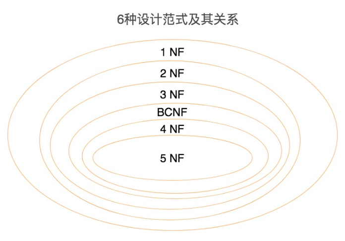
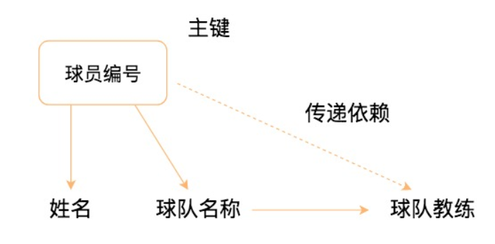

# 21丨范式设计：数据表的范式有哪些，3NF指的是什么？

[TOC]

## 前情

数据表的设计和工作流程的设计很像，我们既需要规范性，也要考虑到执行时的方便性。

数据表的设计范式。范式是数据表设计的基本原则，又很容易被忽略。

## 疑问

-   数据库的设计范式都有哪些？
-   数据表的键都有哪些？
-   1NF、2NF 和 3NF 指的是什么？
-   2NF 和 3NF 相对容易混淆，说下这两个范式之间的区别吗？
    -   答：2NF和3NF都强调非主属性对主属性的依赖关系，2N针对完全依赖，3NF针对直接依赖，都是为了保持表的原子性。

## 数据库的设计范式都包括哪些

关系型数据库一共有 6 种范式，按照范式级别，从低到高分别是：

-   1NF（第一范式）
-   2NF（第二范式）
-   3NF（第三范式）
-   BCNF（巴斯 - 科德范式）
-   4NF（第四范式）
-   5NF（第五范式，又叫做完美范式）

数据库的范式设计越高阶，冗余度就越低，同时高阶的范式一定符合低阶范式的要求

一般来说数据表的设计应尽量满足 3NF。但也不绝对，有时候为了提高某些查询性能，我们还需要破坏范式规则，也就是反规范化。

## 数据表中的那些键

范式的定义会使用到主键和候选键（因为主键和候选键可以唯一标识元组），数据库中的键（Key）由一个或者多个属性组成

数据表中常用的几种键和属性的定义

-   超键：能唯一标识元组的属性集叫做超键。
-   候选键：如果超键不包括多余的属性，那么这个超键就是候选键。
-   主键：用户可以从候选键中选择一个作为主键。
-   外键：如果数据表 R1 中的某属性集不是 R1 的主键，而是另一个数据表 R2 的主键，那么这个属性集就是数据表 R1 的外键。
-   主属性：包含在任一候选键中的属性称为主属性。
-   非主属性：与主属性相对，指的是不包含在任何一个候选键中的属性。

通常，我们也将候选键称之为“码”，把主键也称为“主码”。因为键可能是由多个属性组成的，针对单个属性，我们还可以用主属性和非主属性来进行区分。

### 例子

对于球员表来说，超键就是包括球员编号或者身份证号的任意组合，比如（球员编号）（球员编号，姓名）（身份证号，年龄）等。

候选键就是最小的超键，对于球员表来说，候选键就是（球员编号）或者（身份证号）。

主键是我们自己选定，也就是从候选键中选择一个，比如（球员编号）。

外键就是球员表中的球队编号。

在 player 表中，主属性是（球员编号）（身份证号），其他的属性（姓名）（年龄）（球队编号）都是非主属性。

## 从 1NF 到 3NF

### 1NF

1NF 指的是数据库表中的任何属性都是原子性的，不可再分。在设计某个字段的时候，对于字段 X 来说，就不能把字段 X 拆分成字段 X-1 和字段 X-2。

### 2NF

2NF 指的数据表里的非主属性都要和这个数据表的候选键有完全依赖关系。完全依赖不同于部分依赖，也就是不能仅依赖候选键的一部分属性，而必须依赖全部属性。

对于非主属性来说，并非完全依赖候选键。这样会产生怎样的问题呢？

-   数据冗余
-   插入异常
-   删除异常
-   更新异常

### 3NF

3NF 在满足 2NF 的同时，对任何非主属性都不传递依赖于候选键。也就是说不能存在非主属性 A 依赖于非主属性 B，非主属性 B 依赖于候选键的情况。

总结一下，1NF 需要保证表中每个属性都保持原子性；2NF 需要保证表中的非主属性与候选键完全依赖；3NF 需要保证表中的非主属性与候选键不存在传递依赖。

## 总结

-   关系型数据库的设计都是基于关系模型的，在关系模型中存在着 4 种键，这些键的核心作用就是标识。
-   范式只是提出了设计的标准，实际上设计数据表时，未必要符合这些原则。
    -   一方面是因为这些范式本身存在一些问题，可能会带来插入，更新，删除等的异常情况（这些会在下一讲举例说明）。
    -   另一方面，它们也可能降低会查询的效率。这是为什么呢？因为范式等级越高，设计出来的数据表就越多，进行数据查询的时候就可能需要关联多张表，从而影响查询效率。