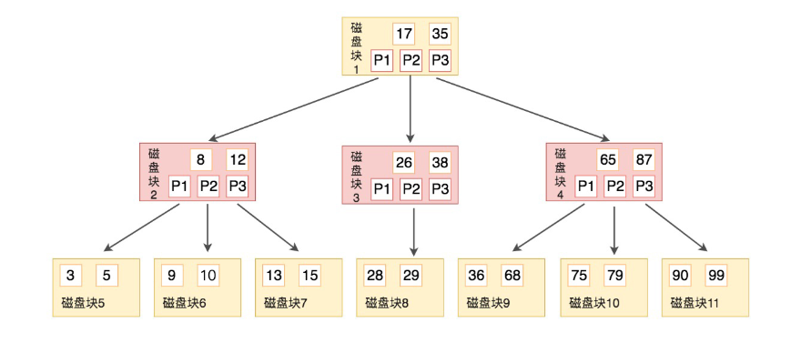
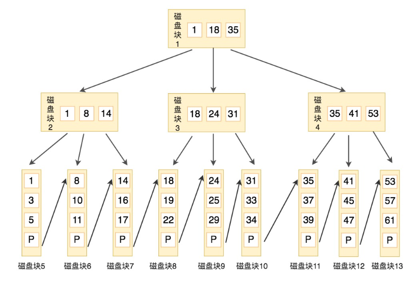

# 24丨索引的原理：我们为什么用B+树来做索引？

[TOC]

## 疑问

### 为什么索引要存放到硬盘上？如何评价索引的数据结构设计的好坏？

### 使用平衡二叉树作为索引的数据结构有哪些不足？

### B 树和 B+ 树的结构是怎样的？为什么我们常用 B+ 树作为索引的数据结构？

### 为什么数据库索引采用 B+ 树，而不是平衡二叉搜索树吗？

1. 平衡二叉树必须满足（所有节点的左右子树高度差不超过1）。执行插入还是删除操作，只要不满足上述条件，就要通过旋转来保持平衡，而旋转是非常耗时的，所以AVL树适合用于查找多的情况。
2. 二叉树的数据结构，会导致“深度”，比较深，这种“瘦高”的特性，加大了平均查询的磁盘IO次数，随着数据量的增多，查询效率也会受到影响；

### B+ 树和 B 树在构造和查询性能上有什么差异呢？

B+ 树的中间节点并不直接存储数据。
1. B+树的查询效率更加稳定：由于非终结点并不是最终指向文件内容的结点，而只是叶子结点中关键字的索引。所以任何关键字的查找必须走一条从根结点到叶子结点的路。**所有关键字查询的路径长度相同，导致每一个数据的查询效率相当。**
2. B+树的磁盘读写代价更低：**B+树的内部节点并没有指向关键字具体信息的指针**，因此其内部节点相对B树更小，如果把所有同一内部节点的关键字存放在同一盘块中，那么盘块所能容纳的关键字数量也越多，一次性读入内存的需要查找的关键字也就越多，相对IO读写次数就降低了。
3. 由于B+树的数据都存储在叶子结点中，分支结点均为索引，方便扫库，只需要扫一遍叶子结点即可，但是**B树因为其分支结点同样存储着数据**，我们要找到具体的数据，需要进行一次中序遍历按序来扫，所以B+树更加适合在区间查询的情况，所以通常B+树用于数据库索引。

## 如何评价索引的数据结构设计好坏

-   稳定性
-   产生的 磁盘 I/O 次数
    -   磁盘的 IO 消耗时间相对较长

## 二叉树的局限性

二分查找法是一种高效的数据检索方式，时间复杂度为 O(log2n)

插入数据流程：

-   如果 key 大于根节点，则在右子树中进行查找；
-   如果 key 小于根节点，则在左子树中进行查找；
-   如果 key 等于根节点，也就是找到了这个节点，返回根节点即可。

但是二叉树会存在特殊的情况，就是有时候二叉树的深度非常大，性能上已经退化成了一条链表，查找数据的时间复杂度变成了 O(n)。

为了解决这个问题（二叉树退化成为链表的问题），人们提出了平衡二叉搜索树（AVL 树），它在二分搜索树的基础上增加了约束，每个节点的左子树和右子树的高度差不能超过 1，也就是说节点的左子树和右子树仍然为平衡二叉树。

即使通过平衡二叉搜索树进行了改进，树的深度也是 O(log2n)，当 n 比较大时，深度也是比较高的。树的深度高了，这就意味着磁盘 I/O 操作次数多，会影响整体数据查询的效率。

## 什么是 B 树

如果用二叉树作为索引的实现结构，会让树变得很高，增加硬盘的 I/O 次数，影响数据查询的时间。因此一个节点就不能只有 2 个子节点，而应该允许有 M 个子节点 (M>2)。

B 树的出现就是为了解决这个问题，B 树的英文是 Balance Tree，也就是平衡的多路搜索树，它的高度远小于平衡二叉树的高度。在文件系统和数据库系统中的索引结构经常采用 B 树来实现。

-   B 树作为平衡的多路搜索树，它的每一个节点最多可以包括 M 个子节点，M 称为 B 树的阶。
-   每个磁盘块中包括了关键字和子节点的指针。
-   如果一个磁盘块中包括了 x 个关键字，那么指针数就是 x+1。
-   对于一个 100 阶的 B 树来说，如果有 3 层的话最多可以存储约 100 万的索引数据。
-   对于大量的索引数据来说，采用 B 树的结构是非常适合的，因为树的高度要远小于二叉树的高度。

-   B 树相比于平衡二叉树来说磁盘 I/O 操作要少，在数据查询中比平衡二叉树效率要高。

## 什么是 B+ 树

-   B+ 树基于 B 树做出了改进
-   主流的 DBMS 都支持 B+ 树的索引方式。比如 MySQL。

B+ 树和 B 树的差异在于以下几点：

-   有 k 个孩子的节点就有 k 个关键字。也就是孩子数量 = 关键字数，而 B 树中，孩子数量 = 关键字数 +1。
-   非叶子节点的关键字也会同时存在在子节点中，并且是在子节点中所有关键字的最大（或最小）。
-   非叶子节点仅用于索引，不保存数据记录，跟记录有关的信息都放在叶子节点中。而 B 树中，非叶子节点既保存索引，也保存数据记录。
-   所有关键字都在叶子节点出现，叶子节点构成一个有序链表，而且叶子节点本身按照关键字的大小从小到大顺序链接。

下图是一棵 B+ 树，阶数为 3，根节点中的关键字 1、18、35 分别是子节点（1，8，14），（18，24，31）和（35，41，53）中的最小值。

每一层父节点的关键字都会出现在下一层的子节点的关键字中，因此在叶子节点中包括了所有的关键字信息，并且每一个叶子节点都有一个指向下一个节点的指针，这样就形成了一个链表。

B+ 树和 B 树有个根本的差异在于，B+ 树的中间节点并不直接存储数据。

好处都有什么呢？

-   B+ 树查询效率更稳定。
    -   B+ 树每次只有访问到叶子节点才能找到对应的数据，而在 B 树中，非叶子节点也会存储数据，这样就会造成查询效率不稳定的情况，有时候访问到了非叶子节点就可以找到关键字，而有时需要访问到叶子节点才能找到关键字。
-   B+ 树的查询效率更高
    -   B+ 树比 B 树更矮胖（阶数更大，深度更低），查询所需要的磁盘 I/O 也会更少。同样的磁盘页大小，B+ 树可以存储更多的节点关键字。
-   B+ 树的查询范围效率也比 B 树高。
    -   所有关键字都出现在 B+ 树的叶子节点中，并通过有序链表进行了链接。而在 B 树中则需要通过中序遍历才能完成查询范围的查找，效率要低很多。

### 总结

-   磁盘的 I/O 操作次数对索引的使用效率至关重要。这也是为什么需要 B+ tree 这种数据结构，倾向于这种采用“矮胖”的数据结构。
-   B+ 树在查询性能上更稳定，在磁盘页大小相同的情况下，树的构造更加矮胖，所需要进行的磁盘 I/O 次数更少，更适合进行关键字的范围查询。