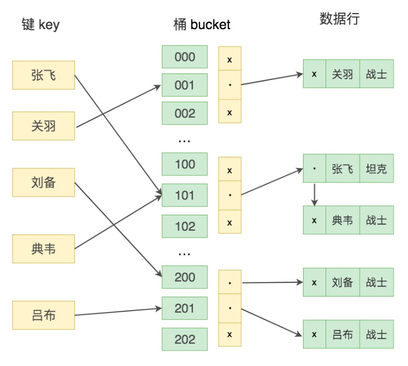

# 25丨Hash索引的底层原理是什么？

[TOC]

## 前情

Hash 本身是一个函数，又被称为散列函数，它可以帮助我们大幅提升检索数据的效率。

Hash 算法是通过某种确定性的算法（比如 MD5、SHA1、SHA2、SHA3）将输入转变为输出。

相同的输入永远可以得到相同的输出，假设输入内容有微小偏差，在输出中通常会有不同的结果。

## 疑问

动手写程序统计一下 Hash 检索的效率。

了解 MySQL 中的 Hash 索引，理解使用它的优点和不足。

Hash 索引和 B+ 树索引的区别以及使用场景。

查找某个固定值时 Hash 索引比 B+ 树更快，为什么 MySQL 还要采用 B+ 树的存储索引呢？

-   Hash索引有很大的限制，如联合索引、模糊查询、范围查询，以及列里有重复值多。

当两个关键字的 Hash 值相同时会发生什么？

-   需要遍历链表中所有行指针，逐一进行比较，直到找到所有符合条件的

## 动手统计 Hash 检索效率

数组 VS 字典

-   数组检索数据类似于全表扫描，需要对整个数组的内容进行检索；字典是由 Hash 表实现的，存储的是 key-value 值，对于数据检索来说效率非常快。
-   Hash 只需要一步就可以找到对应的取值，算法复杂度为 O(1)，而数组检索数据的算法复杂度为 O(n)。

## MySQL 中的 Hash 索引

HASH 索引过程

键值 key 通过 Hash 映射找到桶 bucket。在这里桶（bucket）指的是一个能存储一条或多条记录的存储单位。一个桶的结构包含了一个内存指针数组，桶中的每行数据都会指向下一行，形成链表结构，当遇到 Hash 冲突时，会在桶中进行键值的查找。

什么是 Hash 冲突呢？不同的输入可能会映射到同一个桶中

## Hash 索引与 B+ 树索引的区别

-   Hash 索引不能进行范围查询，而 B+ 树可以。这是因为 **Hash 索引指向的数据是无序**的，而 B+ 树的叶子节点是个有序的链表。
-   Hash 索引不支持联合索引的最左侧原则（即联合索引的部分索引无法使用），而 B+ 树可以。对于联合索引来说，**Hash 索引在计算 Hash 值的时候是将索引键合并后再一起计算 Hash 值**，所以不会针对每个索引单独计算 Hash 值。因此如果用到联合索引的一个或者几个索引时，联合索引无法被利用。
-   Hash 索引不支持 ORDER BY 排序，因为 **Hash 索引指向的数据是无序的**，因此无法起到排序优化的作用，而 B+ 树索引数据是有序的，可以起到对该字段 ORDER BY 排序优化的作用。同理，我们也**无法用 Hash 索引进行模糊查询**，而 B+ 树使用 LIKE 进行模糊查询的时候，LIKE 后面前模糊查询（比如 % 开头）的话就可以起到优化作用。

其他问题

-   对于等值查询来说，通常 Hash 索引的效率更高，不过也存在一种情况，就是索引列的重复值如果很多，效率就会降低。
-   遇到 Hash 冲突时，需要遍历桶中的行指针来进行比较，找到查询的关键字，非常耗时。
-   Hash 索引通常不会用到重复值多的列上，比如列为性别、年龄的情况等。

## 总结

Hash 索引存在着很多限制，相比之下在数据库中 B+ 树索引的使用面会更广，不过也有一些场景采用 Hash 索引效率更高，比如在键值型（Key-Value）数据库中，Redis 存储的核心就是 Hash 表。

MySQL 的 InnoDB 存储引擎还有个“**自适应 Hash 索引**”的功能，就是当某个索引值使用非常频繁的时候，它会在 B+ 树索引的基础上再创建一个 Hash 索引，这样让 B+ 树也具备了 Hash 索引的优点。

## 自适应 Hash 索引

自适应指的是不需要人工来制定，而是系统根据情况来自动完成的。

什么情况下才会使用自适应Hash索引呢？

如果某个数据经常会访问到，当满足一定条件的时候，就会将这个数据页的地址存放到Hash表中。这样下次查询的时候，就可以直接找到这个页面的所在位置。

注意几个点：

-   自适应哈希索引只保存热数据（经常被使用到的数据），并非全表数据。
-   InnoDB中的自适应Hash相当于是“索引的索引”，采用Hash索引存储的是B+树索引中的页面的地址。
-   自适应Hash采用Hash函数映射到一个哈希表中，所以对于字典类型的数据查找非常方便
    哈希表是数组+链表的形式。
-   是否开启了自适应Hash，可以通过innodb_adaptive_hash_index变量来查看

总结下，InnoDB本身不支持Hash，但是提供自适应Hash索引，不需要用户来操作，而是存储引擎自动完成的。

自适应Hash也是InnoDB三大关键特性之一，另外两个分别是插入缓冲（Insert Buffer）和二次写(Double Write)。