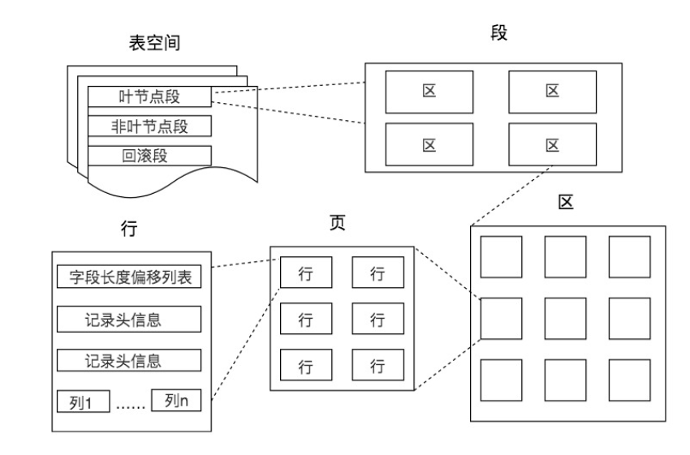
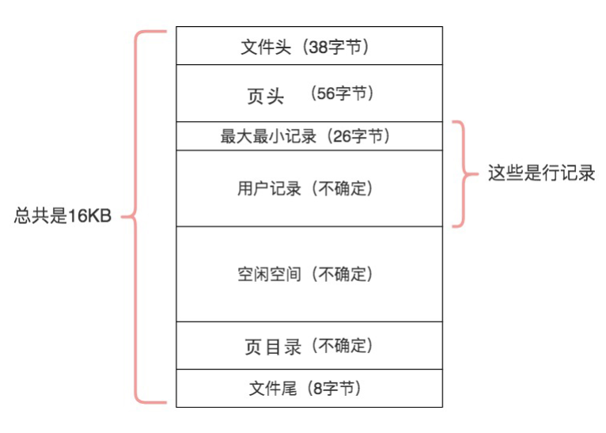
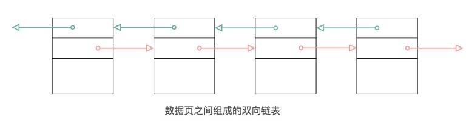
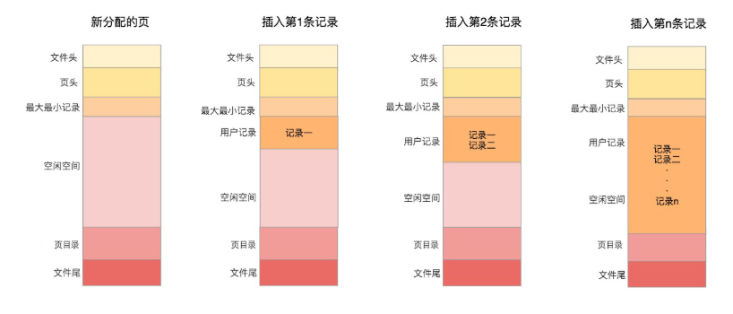
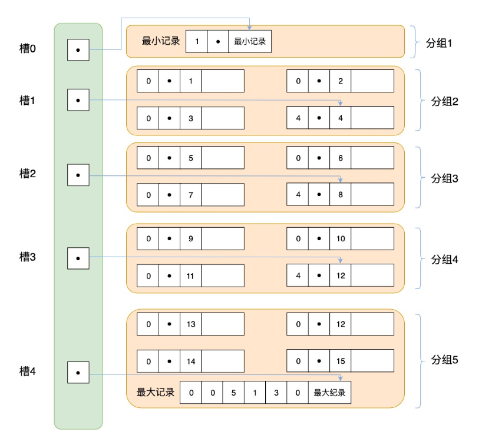
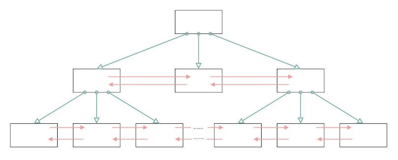

# 27丨从数据页的角度理解B+树查询

[TOC]

## 疑问

数据库中的存储结构是怎样的？页、区、段和表空间分别指的是什么？

为什么页（Page）是数据库存储空间的基本单位？

从数据页的角度来看，B+ 树是如何进行查询的？

按照聚集索引存储的行记录在物理上连续的，还是逻辑上连续的？

逻辑上连续，因为链表没有强制要求使用连续的物理空间，当然如果物理连续，配合局部性原理，性能会更好。

另外，通过 B+ 树进行记录的检索流程是怎样的？

先从根节点开始通过二分查找，确定到要找的页节点或页子节点，如果是页节点就继续，直到找到页子节点，到页子节点，再通过页目录，也是二分查找到对应的组，再通过单链表遍历找到相应的数据。

## 数据库中的存储结构是怎样的

在数据库中，不论读一行，还是读多行，都是将这些行所在的页进行加载。也就是说，数据库管理存储空间的基本单位是页（Page）。（单纯以行读取，数据量一大效率就骤减了）

一个页中可以存储多个行记录（Row），同时在数据库中，还存在着区（Extent）、段（Segment）和表空间（Tablespace）。关系如下：



-   区（Extent）是比页大一级的存储结构，在 InnoDB 存储引擎中，一个区会分配 64 个连续的页。
    -   因为 InnoDB 中的页大小默认是 16KB，所以一个区的大小是 64*16KB=1MB。
-   段（Segment）由一个或多个区组成，区在文件系统是一个连续分配的空间（在 InnoDB 中是连续的 64 个页），不过在段中不要求区与区之间是相邻的。
    -   段是数据库中的分配单位，不同类型的数据库对象以不同的段形式存在。
    -   当我们创建数据表、索引的时候，就会相应创建对应的段，比如创建一张表时会创建一个表段，创建一个索引时会创建一个索引段。
-   表空间（Tablespace）是一个逻辑容器，表空间存储的对象是段，在一个表空间中可以有一个或多个段，但是一个段只能属于一个表空间。
    -   数据库由一个或多个表空间组成，表空间从管理上可以划分为系统表空间、用户表空间、撤销表空间、临时表空间等。

在 InnoDB 中存在两种表空间的类型：共享表空间和独立表空间。

如果是共享表空间就意味着多张表共用一个表空间。如果是独立表空间，就意味着每张表有一个独立的表空间，也就是数据和索引信息都会保存在自己的表空间中。独立的表空间可以在不同的数据库之间进行迁移。

查看 InnoDB 的表空间类型

```

mysql > show variables like 'innodb_file_per_table';
```

innodb_file_per_table=ON，这就意味着每张表都会单独保存为一个.ibd 文件

## 数据页内的结构是怎样的

页（Page）如果按类型划分的话，常见的有数据页（保存 B+ 树节点）、系统页、Undo 页和事务数据页等。数据页是我们最常使用的页。

表页的大小限定了表行的最大长度，不同 DBMS 的表页大小不同。

比如在 MySQL 的 InnoDB 存储引擎中，默认页的大小是 16KB

通过下面的命令来进行查看

```

mysql> show variables like '%innodb_page_size%';
```

>   在 SQL Server 的页大小为 8KB，而在 Oracle 中我们用术语“块”（Block）来代表“页”，Oralce 支持的块大小为 2KB，4KB，8KB，16KB，32KB 和 64KB。

数据库 I/O 操作的最小单位是页，与数据库相关的内容都会存储在页结构里。数据页包括七个部分，分别是文件头（File Header）、页头（Page Header）、最大最小记录（Infimum+supremum）、用户记录（User Records）、空闲空间（Free Space）、页目录（Page Directory）和文件尾（File Tailer）。

页结构的示意图如下



作用解析


把这 7 个数据页分成 3 个部分

文件通用部分，也就是文件头和文件尾。它们类似集装箱，将页的内容进行封装，通过文件头和文件尾校验的方式来确保页的传输是完整的。

在文件头中有两个字段，分别是 FIL_PAGE_PREV 和 FIL_PAGE_NEXT，它们的作用相当于指针，分别指向上一个数据页和下一个数据页。连接起来的页相当于一个双向的链表

如下图所示：



采用链表的结构让数据页之间不需要是物理上的连续，而是逻辑上的连续。

>   当我们进行页传输的时候，如果突然断电了，造成了该页传输的不完整，这时通过文件尾的校验和（checksum 值）与文件头的校验和做比对，如果两个值不相等则证明页的传输有问题，需要重新进行传输，否则认为页的传输已经完成。

记录部分，页的主要作用是存储记录，所以“最小和最大记录”和“用户记录”部分占了页结构的主要空间。另外空闲空间是个灵活的部分，当有新的记录插入时，会从空闲空间中进行分配用于存储新记录。

如下图



索引部分，这部分重点指的是页目录，它起到了记录的索引作用，因为在页中，记录是以单向链表的形式进行存储的。

为提高单链表的检索效率，在页目录中提供了二分查找的方式，用来提高记录的检索效率。

这个过程就好比是给记录创建了一个目录：

-   将所有的记录分成几个组，这些记录包括最小记录和最大记录，但不包括标记为“已删除”的记录。
-   第 1 组，也就是最小记录所在的分组只有 1 个记录；最后一组，就是最大记录所在的分组，会有 1-8 条记录；其余的组记录数量在 4-8 条之间。这样做的好处是，除了第 1 组（最小记录所在组）以外，其余组的记录数会尽量平分。
-   在每个组中最后一条记录的头信息中会存储该组一共有多少条记录，作为 n_owned 字段。
-   页目录用来存储每组最后一条记录的地址偏移量，这些地址偏移量会按照先后顺序存储起来，每组的地址偏移量也被称之为槽（slot），每个槽相当于指针指向了不同组的最后一个记录。

如下图



页目录存储的是槽，槽相当于分组记录的索引。我们通过槽查找记录，实际上就是在做二分查找。

## 从数据页的角度看 B+ 树是如何进行查询的

一棵 B+ 树按照节点类型可以分成两部分：

-   叶子节点，B+ 树最底层的节点，节点的高度为 0，存储行记录。
-   非叶子节点，节点的高度大于 0，存储索引键和页面指针，并不存储行记录本身



用页结构对比，看下 B+ 树的结构。

-   在一棵 B+ 树中，每个节点都是一个页，每次新建节点的时候，就会申请一个页空间。
-   同一层上的节点之间，通过页的结构构成一个双向的链表（页文件头中的两个指针字段）。
-   非叶子节点，包括了多个索引行，每个索引行里存储索引键和指向下一层页面的页面指针。
-   最后是叶子节点，它存储了关键字和行记录，在节点内部（也就是页结构的内部）记录之间是一个单向的链表，但是对记录进行查找，则可以通过页目录采用二分查找的方式来进行。

理解一些通过索引进行检索的原理：

-   B+ 树是如何进行记录检索的？
    -   从 B+ 树的根开始，逐层检索，直到找到叶子节点，也就是找到对应的数据页为止，将数据页加载到内存中，页目录中的槽（slot）采用二分查找的方式先找到一个粗略的记录分组，然后再在分组中通过链表遍历的方式查找记录。
-   普通索引和唯一索引在查询效率上有什么不同？
    -   唯一索引就是在普通索引上增加了约束性，也就是关键字唯一，找到了关键字就停止检索。普通索引，可能会存在用户记录中的关键字相同的情况
    -   根据页结构的原理，当我们读取一条记录的时候，不是单独将这条记录从磁盘中读出去，而是将这个记录所在的页加载到内存中进行读取。
    -   普通索引的字段上进行查找也就是在内存中多几次“判断下一条记录”的操作，对于 CPU 来说，这些操作所消耗的时间是可以忽略不计的。
    -   对一个索引字段进行检索，采用普通索引还是唯一索引在检索效率上基本上没有差别。

## 总结

在分配空间的时候会按照页为单位来进行分配，同一棵树上同一层的页与页之间采用双向链表，而在页里面，记录之间采用的单向链表的方式。

链表这种数据结构的特点是增加、删除比较方便，所以在对记录进行删除的时候，有时候并不是真的删除了记录，而只是逻辑上的删除，也就是在标记为上标记为“已删除”。但链表还有个问题就是查找效率低，因此在页结构中还专门设计了页目录这个模块，专门给记录做一个目录，通过二分查找法的方式进行检索提升效率。