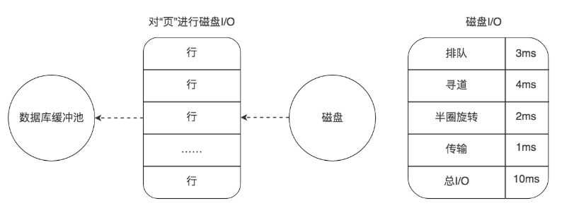

# 28丨从磁盘I/O的角度理解SQL查询的成本

[TOC]

## 前情

数据库存储的基本单位是页，对于一棵 B+ 树的索引来说，是先从根节点找到叶子节点，也就是先查找数据行所在的页，再将页读入到内存中，在内存中对页的记录进行查找，从而得到想要数据。

虽然我们想要查找的，只是一行记录，但是对于磁盘 I/O 来说却需要加载一页的信息，因为页是最小的存储单位。

想要查找多行记录，查询时间是否会成倍地提升呢？其实数据库会采用缓冲池的方式提升页的查找效率。

## 疑问

数据库的缓冲池在数据库中起到了怎样的作用？如果我们对缓冲池内的数据进行更新，数据会直接更新到磁盘上吗？

对数据页进行加载都有哪些方式呢？

如何查看一条 SQL 语句需要在缓冲池中进行加载的页的数量呢？

## 数据库缓冲池

磁盘 I/O 需要消耗的时间很多，而在内存中进行操作，效率则会高很多，为了能让数据表或者索引中的数据随时被我们所用，DBMS 会申请占用内存来作为数据缓冲池，这样做的好处是可以让磁盘活动最小化，从而减少与磁盘直接进行 I/O 的时间。

缓冲池如何读取数据呢？

缓冲池管理器会尽量将经常使用的数据保存起来，在数据库进行页面读操作的时候，首先会判断该页面是否在缓冲池中，如果存在就直接读取，如果不存在，就会通过内存或磁盘将页面存放到缓冲池中再进行读取。

缓存在数据库中的结构和作用如下图所示：


更新了缓存池中的数据，那么这些数据会马上同步到磁盘上吗？

当我们对数据库中的记录进行修改的时候，首先会修改缓冲池中页里面的记录信息，然后数据库会以一定的频率刷新到磁盘上。注意并不是每次发生更新操作，都会立刻进行磁盘回写。缓冲池会采用一种叫做 checkpoint 的机制将数据回写到磁盘上，这样做的好处就是提升了数据库的整体性能。

## 查看缓冲池的大小

MySQL MyISAM 存储引擎，它只缓存索引，不缓存数据，对应的键缓存参数为 key_buffer_size

InnoDB 存储引擎，可以通过查看 innodb_buffer_pool_size 变量来查看缓冲池的大小

```

mysql > show variables like 'innodb_buffer_pool_size'
```

在 InnoDB 存储引擎中，我们可以同时开启多个缓冲池，这里我们看下如何查看缓冲池的个数

```

mysql > show variables like 'innodb_buffer_pool_instances'
```

## 数据页加载的三种方式

内存读取

数据存在于内存中，基本上执行时间在 1ms 左右，效率还是很高的


随机读取

如果数据没有在内存中，就需要在磁盘上对该页进行查找，整体时间预估在 10ms 左右，这 10ms 中有 6ms 是磁盘的实际繁忙时间（包括了寻道和半圈旋转时间），有 3ms 是对可能发生的排队时间的估计值，另外还有 1ms 的传输时间，将页从磁盘服务器缓冲区传输到数据库缓冲区中。

>   这 10ms 看起来很快，但实际上对于数据库来说消耗的时间已经非常长了，因为这还只是一个页的读取时间



顺序读取

顺序读取其实是一种批量读取的方式，因为我们请求的数据在磁盘上往往都是相邻存储的，顺序读取可以帮我们批量读取页面，这样的话，一次性加载到缓冲池中就不需要再对其他页面单独进行磁盘 I/O 操作了。

采用批量读取的方式，即使是从磁盘上进行读取，效率也比从内存中只单独读取一个页的效率要高。

## 通过 last_query_cost 统计 SQL 语句的查询成本

想要查看某条 SQL 语句的查询成本，可以在执行完这条 SQL 语句之后，通过查看当前会话中的 last_query_cost 变量值来得到当前查询的成本

采用了顺序读取的方式将页面一次性加载到缓冲池中，然后再进行查找。虽然页数量（last_query_cost）增加了不少，但是通过缓冲池的机制，并没有增加多少查询时间。

## 总结

SQL 查询是一个动态的过程，从页加载的角度来看，得到一下两点结论：

-   位置决定效率。
    -   针对单个页的读取来说，如果页存在于内存中，会比在磁盘中读取效率高很多。
-   批量决定效率。
    -   如果我们从磁盘中对单一页进行随机读，那么效率是很低的

经常使用的数据就要尽量放到缓冲池中，其次我们可以充分利用磁盘的吞吐能力，一次性批量读取数据，这样单个页的读取效率也就得到了提升。