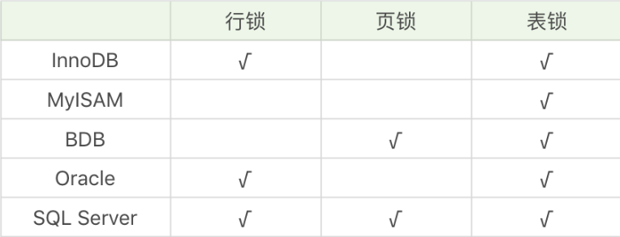
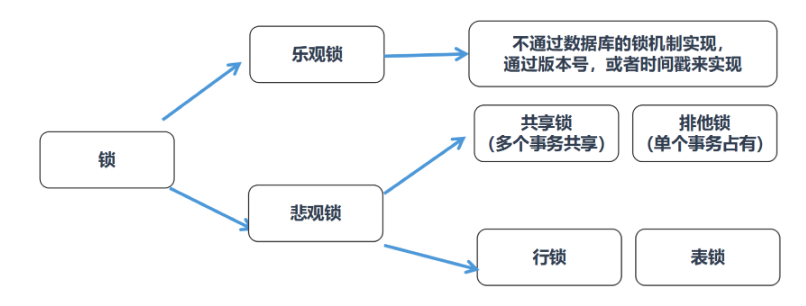

# 30丨锁：悲观锁和乐观锁是什么？

[TOC]

## 前情

索引和锁是数据库中的两个核心知识点。

加锁是为了保证数据的一致性。

## 疑问

就分类而言，锁的划分有多种方式，这些划分方式都包括哪些？

为什么共享锁会发生死锁？

乐观锁和悲观锁的思想是什么？乐观锁有两种实现方式，这两种实现方式是什么？

多个事务并发，发生死锁时该如何解决？怎样降低死锁发生的概率？

## 按照锁粒度进行划分

从锁定对象的粒度大小来对锁进行划分，分别为行锁、页锁和表锁。

-   行锁就是按照行的粒度对数据进行锁定。
    -   锁定力度小，发生锁冲突概率低，可以实现的并发度高，但是对于锁的开销比较大，加锁会比较慢，容易出现死锁情况。
-   页锁就是在页的粒度上进行锁定。
    -   锁定的数据资源比行锁要多，因为一个页中可以有多个行记录。
    -   使用页锁的时候，会出现数据浪费的现象
    -   页锁的开销介于表锁和行锁之间，会出现死锁。锁定粒度介于表锁和行锁之间，并发度一般。

-   表锁就是对数据表进行锁定
    -   锁定粒度很大，同时发生锁冲突的概率也会较高，数据访问的并发度低。
    -   好处在于对锁的使用开销小，加锁会很快

不同的数据库和存储引擎支持的锁粒度不同



### 锁升级

每个层级的锁数量是有限制的，因为锁会占用内存空间，锁空间的大小是有限的。

当某个层级的锁数量超过了这个层级的阈值时，就会进行锁升级。锁升级就是用更大粒度的锁替代多个更小粒度的锁

## 从数据库管理的角度对锁进行划分

从数据库管理的角度对锁进行划分。共享锁和排它锁

-   共享锁也叫读锁或 S 锁，共享锁锁定的资源可以被其他用户读取，但不能修改。
    -   在进行SELECT的时候，会将对象进行共享锁锁定，当数据读取完毕之后，就会释放共享锁，这样就可以保证数据在读取时不被修改。

给 product_comment 在表上**加共享锁**

```

LOCK TABLE product_comment READ;
```

当对数据表加上共享锁的时候，该数据表就变成了只读模式

此时我们想要更新 product_comment 表中的数据

```

UPDATE product_comment SET product_id = 10002 WHERE user_id = 912178;

ERR:

ERROR 1099 (HY000): Table 'product_comment' was locked with a READ lock and can't be updated
```

当共享锁没有释放时，不能对锁住的数据进行修改。

如果我们想要对表上的共享锁进行解锁，可以使用

```

UNLOCK TABLE;
```

给某一行加上共享锁

```

SELECT comment_id, product_id, comment_text, user_id FROM product_comment WHERE user_id = 912178 LOCK IN SHARE MODE
```

给 product_comment 数据表**添加排它锁**

```

LOCK TABLE product_comment WRITE;
```

只有获得排它锁的事务可以对 product_comment 进行查询或修改，其他事务如果想要在 product_comment 表上查询数据，则需要等待

释放掉排它锁，使用这行命令

```

UNLOCK TABLE;
```

在某个数据行上添加排它锁

```

SELECT comment_id, product_id, comment_text, user_id FROM product_comment WHERE user_id = 912178 FOR UPDATE;
```

当我们对数据进行更新的时候，也就是INSERT、DELETE或者UPDATE的时候，数据库也会自动使用排它锁，防止其他事务对该数据行进行操作


当我们想要获取某个数据表的排它锁的时候，需要先看下这张数据表有没有上了排它锁。

如果这个数据表中的某个数据行被上了行锁，我们就无法获取排它锁。这时需要对数据表中的行逐一排查，检查是否有行锁，如果没有，才可以获取这张数据表的排它锁。这个过程是不是有些麻烦？这里就需要用到意向锁。

意向锁（Intent Lock），简单来说就是给更大一级别的空间示意里面是否已经上过锁。

如果给某一行数据加上了排它锁，数据库会自动给更大一级的空间

>   比如数据页或数据表加上意向锁，告诉其他人这个数据页或数据表已经有人上过排它锁了，这样当其他人想要获取数据表排它锁的时候，只需要了解是否有人已经获取了这个数据表的意向排他锁即可。

如果事务想要获得数据表中某些记录的共享锁，就需要在数据表上添加意向共享锁。

同理，事务想要获得数据表中某些记录的排他锁，就需要在数据表上添加意向排他锁。这时，意向锁会告诉其他事务已经有人锁定了表中的某些记录，不能对整个表进行全表扫描。

## 为什么共享锁会发生死锁的情况？

当有多个事务对同一数据获得读锁的时候，可能会出现死锁的情况。

## 从程序员的角度对进行划分

从程序员的视角来看锁的话，可以将锁分成乐观锁和悲观锁

乐观锁（Optimistic Locking）认为对同一数据的并发操作不会总发生，属于小概率事件，不用每次都对数据上锁，也就是不采用数据库自身的锁机制，而是通过程序来实现。在程序上，我们可以采用版本号机制或者时间戳机制实现。

### 乐观锁的版本号机制

在表中设计一个版本字段 version，第一次读的时候，会获取 version 字段的取值。然后对数据进行更新或删除操作时，会执行UPDATE ... SET version=version+1 WHERE version=version。此时如果已经有事务对这条数据进行了更改，修改就不会成功。

这种方式类似我们熟悉的 SVN、CVS 版本管理系统

### 乐观锁的时间戳机制

时间戳和版本号机制一样，也是在更新提交的时候，将当前数据的时间戳和更新之前取得的时间戳进行比较，如果两者一致则更新成功，否则就是版本冲突。

悲观锁（Pessimistic Locking）也是一种思想，对数据被其他事务的修改持保守态度，会通过数据库自身的锁机制来实现，从而保证数据操作的排它性。

乐观锁、悲观锁比较



乐观锁和悲观锁的适用场景

-   乐观锁适合读操作多的场景，相对来说写的操作比较少。
    -   优点在于程序实现，不存在死锁问题，不过适用场景也会相对乐观，因为它阻止不了除了程序以外的数据库操作。
-   悲观锁适合写操作多的场景
    -   因为写的操作具有排它性。采用悲观锁的方式，可以在数据库层面阻止其他事务对该数据的操作权限，防止读 - 写和写 - 写的冲突。

## 总结

既然有锁的存在，就有可能发生死锁的情况。

死锁就是多个事务（如果是在程序层面就是多个进程）在执行过程中，因为竞争某个相同的资源而造成阻塞的现象。

发生死锁，往往是因为在事务中，锁的获取是逐步进行的。

采取一些方法避免死锁的发生

-   如果事务涉及多个表，操作比较复杂，那么可以尽量一次锁定所有的资源，而不是逐步来获取，这样可以减少死锁发生的概率；
-   如果事务需要更新数据表中的大部分数据，数据表又比较大，这时可以采用锁升级的方式，比如将行级锁升级为表级锁，从而减少死锁产生的概率；
-   不同事务并发读写多张数据表，可以约定访问表的顺序，采用相同的顺序降低死锁发生的概率。

有一些情况是不会发生死锁的

-   采用乐观锁的方式
-   MySQL MyISAM 存储引擎中也不会出现死锁
    -   因为 MyISAM 总是一次性获得全部的锁，这样的话要么全部满足可以执行，要么就需要全部等待。

## 扩展

InnoDB中有三种行锁的方式

1）记录锁：针对单个行记录添加锁。

2）间隙锁（Gap Locking）：可以帮我们锁住一个范围（索引之间的空隙），但不包括记录本身。采用间隙锁的方式可以防止幻读情况的产生。

3）Next-Key锁：帮我们锁住一个范围，同时锁定记录本身，相当于间隙锁+记录锁，可以解决幻读的问题