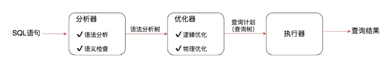
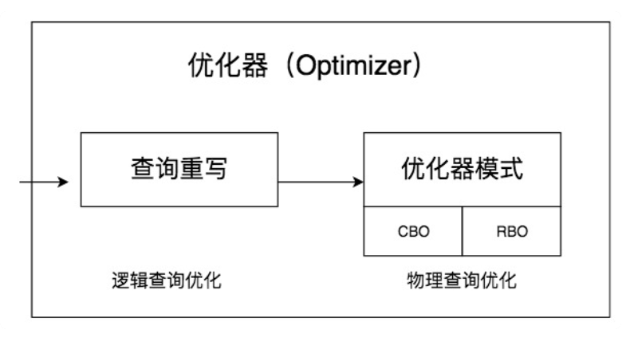

# 32丨查询优化器是如何工作的？

[TOC]

## 前情

事务和索引的使用是数据库中的两个重要核心，事务可以让数据库在增删查改的过程中，保证数据的正确性和安全性，而索引可以帮数据库提升数据的查找效率。

想要知道如何获取更高的 SQL 查询性能，最好的方式就是理解数据库是如何进行查询优化和执行的。

## 疑问

什么是查询优化器？一条 SQL 语句的执行流程都会经历哪些环节，在查询优化器中都包括了哪些部分？

查询优化器的两种优化方式分别是什么？

基于代价的优化器是如何统计代价的？总的代价又如何计算？

## 什么是查询优化器

一条 SQL 语句的执行都需要经历哪些环节，如下图所示：

一条 SQL 查询语句首先会经过分析器，进行语法分析和语义检查。

语法检查和语义检查可以保证 SQL 语句没有错误，最终得到一棵语法分析树，然后经过查询优化器得到查询计划，最后交给执行器进行执行。

查询优化器的目标是找到执行 SQL 查询的最佳执行计划，执行计划就是查询树，它由一系列物理操作符组成，这些操作符按照一定的运算关系组成查询的执行计划。

在查询优化器中，可以分为逻辑查询优化阶段和物理查询优化阶段。

逻辑查询优化就是通过改变 SQL 语句的内容来使得 SQL 查询更高效，同时为物理查询优化提供更多的候选执行计划。

逻辑查询优化是基于关系代数进行的查询重写，而关系代数的每一步都对应着物理计算。在这个阶段里，对于单表和多表连接的操作，需要高效地使用索引，提升查询效率。

在这两个阶段中，查询重写属于代数级、语法级的优化，也就是属于逻辑范围内的优化，而基于代价的估算模型是从连接路径中选择代价最小的路径，属于物理层面的优化。

## 查询优化器的两种优化方式

查询优化器的目的就是生成最佳的执行计划

生成最佳执行计划的策略通常有以下两种方式：

-   第一种是基于规则的优化器（RBO，Rule-Based Optimizer），规则就是人们以往的经验，或者是采用已经被证明是有效的方式。
    -   通过在优化器里面嵌入规则，来判断 SQL 查询符合哪种规则，就按照相应的规则来制定执行计划，同时采用启发式规则去掉明显不好的存取路径。
-   第二种是基于代价的优化器（CBO，Cost-Based Optimizer），这里会根据代价评估模型，计算每条可能的执行计划的代价，也就是 COST，从中选择代价最小的作为执行计划。
    -   相比于 RBO 来说，CBO 对数据更敏感，因为它会利用数据表中的统计信息来做判断，针对不同的数据表，查询得到的执行计划可能是不同的，因此制定出来的执行计划也更符合数据表的实际情况。

RBO 的方式更像是一个出租车老司机，凭借自己的经验来选择从 A 到 B 的路径。而 CBO 更像是手机导航，通过数据驱动，来选择最佳的执行路径。

>   SQL 是面向集合的语言，并没有指定执行的方式，因此在优化器中会存在各种组合的可能。我们需要通过优化器来制定数据表的扫描方式、连接方式以及连接顺序，从而得到最佳的 SQL 执行计划。

## CBO 是如何统计代价的

大部分 RDBMS 都支持基于代价的优化器（CBO）。

通过对 CBO 工作原理的了解，我们可以知道 CBO 可能存在的不足有哪些，有助于让我们知道优化器是如何确定执行计划的。

### 能调整的代价模型的参数有哪些

缺

### 代价模型如何计算

缺

## 总结

看得一头雾水.