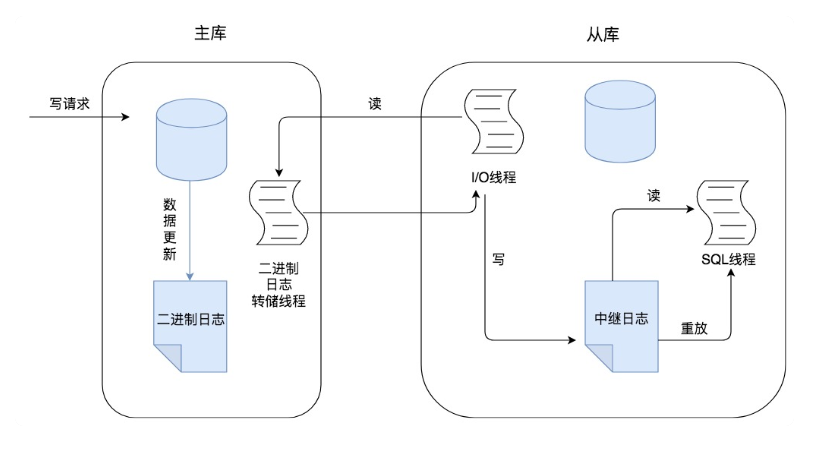

# 35丨数据库主从同步的作用是什么，如何解决数据不一致问题？

[TOC]

## 前情

在实际工作中，常常将 Redis 作为缓存与 MySQL 配合来使用，当有数据访问请求的时候，首先会从缓存中进行查找，如果存在就直接取出，如果不存在再访问数据库，这样就提升了读取的效率，也减少了对后端数据库的访问压力。可以说使用 Redis 这种缓存架构是高并发架构中非常重要的一环。

也可以对 MySQL 做主从架构并且进行读写分离，让主服务器（Master）处理写请求，从服务器（Slave）处理读请求，这样同样可以提升数据库的并发处理能力。

## 疑问

为什么需要主从同步，设置主从同步有什么样的作用？

主从同步的原理是怎样的？在进行主从同步的同时，会引入哪些问题？

为了保证主从同步的数据一致性，都有哪些方案？

## 为什么需要主从同步

设置架构本身是有成本的，如果我们的目的在于提升数据库高并发访问的效率，那么首先需要考虑的应该是如何优化你的 SQL 和索引，这种方式简单有效，其次才是采用缓存的策略

主从同步设计不仅可以提高数据库的吞吐量，还有以下 3 个方面的作用

-   第一个是读写分离。可以通过主从复制的方式来同步数据，然后通过读写分离提高数据库并发处理能力。
    -   简单来说就是同一份数据被放到了多个数据库中，其中一个数据库是 Master 主库，其余的多个数据库是 Slave 从库。
    -   当主库进行更新的时候，会自动将数据复制到从库中，而我们在客户端读取数据的时候，会从从库中进行读取，也就是采用读写分离的方式。
-   第二个作用就是数据备份。
    -   通过主从复制将主库上的数据复制到了从库上，相当于是一种热备份机制，也就是在主库正常运行的情况下进行的备份，不会影响到服务。
-   第三个作用是具有高可用性。
    -   数据备份实际上是一种冗余的机制，通过这种冗余的方式可以换取数据库的高可用性，也就是当服务器出现故障或宕机的情况下，可以切换到从服务器上，保证服务的正常运行。

实际上，更高的高可用性，意味着需要付出更高的成本代价。在现实中我们需要结合业务需求和成本来进行选择。

## 主从同步的原理是怎样的

Binlog 二进制日志，它记录了对数据库进行更新的事件。实际上主从同步的原理就是基于 Binlog 进行数据同步的。在主从复制过程中，会基于 3 个线程来操作，一个主库线程，两个从库线程。

二进制日志转储线程（Binlog dump thread）是一个主库线程。当从库线程连接的时候，主库可以将二进制日志发送给从库，当主库读取事件的时候，会在 Binlog 上加锁，读取完成之后，再将锁释放掉。

从库 I/O 线程会连接到主库，向主库发送请求更新 Binlog。这时从库的 I/O 线程就可以读取到主库的二进制日志转储线程发送的 Binlog 更新部分，并且拷贝到本地形成中继日志（Relay log）。

从库 SQL 线程会读取从库中的中继日志，并且执行日志中的事件，从而将从库中的数据与主库保持同步。

主从同步的内容就是二进制日志（Binlog），它虽然叫二进制日志，实际上存储的是一个又一个事件（Event），这些事件分别对应着数据库的更新操作，比如 INSERT、UPDATE、DELETE 等。

进行主从同步的内容是二进制日志，它是一个文件，在进行网络传输的过程中就一定会存在延迟（比如 500ms），这样就可能造成用户在从库上读取的数据不是最新的数据，也就是主从同步中的数据不一致性问题。

## 如何解决主从同步的数据一致性问题

在进行读写分离的同时，解决主从同步中数据不一致的问题，也就是解决主从之间数据复制方式的问题，如果按照数据一致性从弱到强来进行划分，有以下 3 种复制方式。

### 方法 1：异步复制

异步模式就是客户端提交 COMMIT 之后不需要等从库返回任何结果，而是直接将结果返回给客户端。

好处是不会影响主库写的效率，但可能会存在主库宕机，而 Binlog 还没有同步到从库的情况，也就是此时的主库和从库数据不一致。

### 方法 2：半同步复制

在客户端提交 COMMIT 之后不直接将结果返回给客户端，而是等待至少有一个从库接收到了 Binlog，并且写入到中继日志中，再返回给客户端。

好处就是提高了数据的一致性，当然相比于异步复制来说，至少多增加了一个网络连接的延迟，降低了主库写的效率。

### 方法 3：组复制

>   组复制技术，简称 MGR（MySQL Group Replication）。是 MySQL 在 5.7.17 版本中推出的一种新的数据复制技术，这种复制技术是基于 Paxos 协议的状态机复制。

MGR 是如何工作的？

将多个节点共同组成一个复制组，在执行读写（RW）事务的时候，需要通过一致性协议层（Consensus 层）的同意，也就是读写事务想要进行提交，必须要经过组里“大多数人”（对应 Node 节点）的同意，大多数指的是同意的节点数量需要大于（N/2+1），这样才可以进行提交，而不是原发起方一个说了算。而针对只读（RO）事务则不需要经过组内同意，直接 COMMIT 即可。

在一个复制组内有多个节点组成，它们各自维护了自己的数据副本，并且在一致性协议层实现了原子消息和全局有序消息，从而保证组内数据的一致性。

>   Paxos 算法提出来之后就作为分布式一致性算法被广泛应用，比如 Apache 的 ZooKeeper 也是基于 Paxos 实现的。

### 总结

目标仅仅是数据库的高并发，那么可以先从 SQL 优化，索引以及 Redis 缓存数据库这些方面来考虑优化，然后再考虑是否采用主从架构的方式。

在主从架构的配置中，如果想要采取读写分离的策略，我们可以自己编写程序，也可以通过第三方的中间件来实现。（可以考虑采取一些优秀的开源工具，比如 MaxScale。）