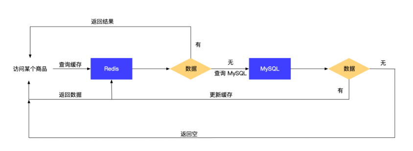
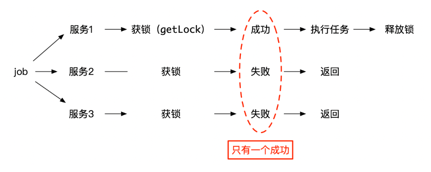
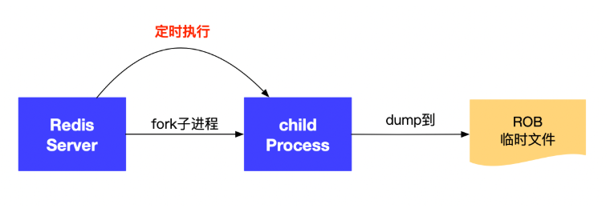

# Redis 基础总览

整理自：GitChat - 《Redis 实战场景详解》

地址：<https://gitbook.cn/gitchat/activity/5c81ff36aa24bf22d670e335>

声明：本文仅作为个人学习复习使用，切莫随意拷贝。

[TOC]

## 一、简介

使用缓存常见场景是：项目中部分数据访问比较频繁，对下游 DB（例如 MySQL）造成服务压力，这时候可以使用缓存来提高效率。

缓存组件有很多种，大家熟知的 Redis、Tair、MemCache 等。

Redis 作为缓存数据库和 MySQL 这种结构化数据库进行对比：

1，从数据类型上，Redis 是 NoSQL 半结构化缓存数据库， MySQL 是结构化关系型数据库；

2，从读写性能上，MySQL 是持久化硬盘存储，读写速度较慢， Redis 数据存储读取都在内存，同时也可以持久化到磁盘，读写速度较快；

3，从使用场景上，Redis 一般作为 MySQL 数据读取性能优化的技术选型，彼此配合使用。

## 二、Redis 基本数据结构与实战场景

### 2.1 基本类型

String：Redis 最基础类型，可存储任意类型的字符串

List：Redis 简单的字符串列表，按照插入顺序进行排序

Set：存储多个字符串，与List不同，Set 保证存储的字符串各不相同

Hash：存储多个键值对中间的映射，是一个 string 类型的 key，value 映射表

Sorted Set：String 类型元素的集合，且不允许重复的成员。每个键都有一个 double 类型的分值，然后根据关联的分值进行排序

### 2.2 常用指令

#### 2.2.1 String

**常用命令**

-   set ：设置 key 对应的 value 值
-   get ： 获取对应 key 的值，如不存在返回 nil 
-   setnx ： 只有设置的值不存在，才设置
-   setex ：设置键值，并指定对应的有效期
-   mset/mget ： 一次设置/获取多个 key 的值
-   incr/decr ： 对 key 值进行增加 / 减去 1 操作

**命令实例**

```
1.set name “tom” 
2.get name 结果 ：tom
3.setnx name “jim” 
4.setex name 10 “tom”
5.mset key1 “hh” key2 “kk”
6.+1/-1
```

#### 2.2.1 list

**常用命令**

-   lpush/rpush ：在 key 所对应的 list 左 / 右部添加一个元素
-   lrang/lindex ：获取列表给定范围 / 位置的所有值
-   lset ：设置 list 中指定下表元素的值

**命令实例**

```
1.lpush list*name value1; rpush list*name value2
2.lrang list name 0 -1 获取列表所有元素
3.lset list name 1 valuex
```

#### 2.2.1 set

**常用命令**

-   sadd ：向名称 为key 的 set 添加元素
-   smembers ：查看集合中的所有成员
-   spop ：随机返回并删除 set 中一个元素
-   sdiff ：返回所有 set 与第一个 set 的差集
-   sunion ：返回给定集合并集

**命令实例**

```
1.sadd wordset aa; sadd wordiest bb;
2.smembers wordset
3.spop wordset
4.sdiff wordset wordset1
5.sunion wordset wordset1
```

#### 2.2.1 hash

**常用命令**

-   hset ：设置一个 hash 的 field 的指定值，如果 key 不存在先创建
-   hget ：获取某个 hash 的某个 filed 值
-   hmset/hmget ：批量设置 / 获取 hash 内容
-   hlen ：返回 hash 表中 key 的数量
-   hkeys/hvals ：返回 hash 表中所有的 key/value

**命令实例**

```
1.hset user name “tom"
2.hget user name
3.hmget user name sex
4.hlen user
5.hkeys user / hvals user
```

#### 2.2.1 Sorted set

**常用命令**

-   zadd ：将一个带有给定分值的成员添加到有序集合里面
-   zrange ：取出集合中的元素
-   zcard ：返回集合中所有元素的个数

**命令实例**

```
1.zadd key 1 hello
2.zrang key 0 -1 
3.zcard key
```

### 2.3 场景解析

#### 2.3.1 String 类型使用场景

场景一：商品库存数

从业务上，商品库存数据是热点数据，交易行为会直接影响库存。

案例：

1.  `set goods_id 10;` 设置 id 为 good_id 的商品的库存初始值为 10；
2.  `decr goods_id;` 当商品被购买时候，库存数据减 1。

依次类推的场景：商品的浏览次数，问题或者回复的点赞次数等。

场景二：时效信息存储

Redis 的数据存储具有自动失效能力。也就是存储的 key-value 可以设置过期时间：`set(key, value, expireTime)`。

比如，用户登录某个 App 需要获取登录验证码，验证码在 30 秒内有效。

#### 2.3.2 List 类型使用场景

list 是按照插入顺序排序的字符串链表。可以在头部和尾部插入新的元素（双向链表实现，两端添加元素的时间复杂度为 O(1)）。

场景一：消息队列实现

list 存储就是一个队列的存储形式：

1.  `lpush key value;` 在 key 对应 list 的头部添加字符串元素；
2.  `rpop key;`移除列表的最后一个元素，返回值为移除的元素。

场景二：最新上架商品

使用 Redis 的 list 数据结构，来进行 TOP 100 新上架产品的存储。

Redis ltrim 指令对一个列表进行修剪（trim），这样 list 就会只包含指定范围的指定元素。

```
ltrim key start stop
```

start 和 stop 都是由 0 开始计数的，这里的 0 是列表里的第一个元素（表头），1 是第二个元素。

```
    //把新上架商品添加到链表里
    ret = r.lpush(“new:goods", goodsId)
    //保持链表 100 位
    ret = r.ltrim("new:goods", 0, 99)
    //获得前 100 个最新上架的商品 id 列表
    newest_goods_list = r.lrange("new:goods", 0, 99)
```

#### 2.3.3 set 类型使用场景

和 list 不同，set 具备去重功能。当需要存储一个列表信息，同时要求列表内的元素不能有重复，这时候使用 set 比较合适。同时，set 还提供的交集、并集、差集。

例如，在交易网站，在进行相似用户分析的时候， 可以通过计算两个不同用户之间感兴趣商品的数量来提供一些依据。

```
    //userid 为用户 ID ， goodID 为感兴趣的商品信息。 
    sadd “user:userId” goodID； 

    sadd “user:101”, 1
    sadd “user:101”, 2
    sadd “user:102”, 1
    Sadd “user:102”, 3

    sinter “user:101” “user:101”
```

类似应用场景：社交场景下共同关注好友， 相似兴趣 tag 等场景的支持。

#### 2.3.4 Hash 类型使用场景

对于一些对象类型，一种比较方便的类型，那就是按照 Redis 的 Hash 类型进行存储。

```
hset key field value
```

我们存储一些网站用户的基本信息：

```
    hset user101  name “小明”
    hset user101  phone  “123456”
    hset user101  sex “男”
    
存储信息则为：{name : 小明， phone : “123456”，sex : “男”}    
```

类似场景：存储订单的数据，产品的数据，商家基本信息等。

#### 2.3.5 Sorted Set 类型使用场景

sorted set 可以通过提供一个 score 参数来为存储数据排序，并且是自动排序，插入既有序。而 set 不是自动有序的。

案例：商品的购买热度可以将购买总量 num 当做商品列表的 score，这样获取最热门的商品时就是可以自动按售卖总量排好序。

使用场景：sorted set 适合有排序需求的集合存储场景。

## 三、Redis 常见异常及解决方案

#### 3.1 缓存穿透



场景描述：由于不恰当的业务功能实现，或者外部恶意攻击不断地请求某些不存在的数据内存，由于缓存中没有保存该数据，导致所有的请求都会落到数据库上，对数据库可能带来一定的压力，甚至崩溃。

解决方案：简单的对策就是将不存在的数据访问结果， 也存储到缓存中，避免缓存访问的穿透。最终不存在商品数据的访问结果也缓存下来。有效的避免缓存穿透的风险。

#### 3.2 缓存雪崩

场景描述：当缓存重启或者大量的缓存在某一时间段失效， 这样就导致大批流量直接访问数据库， 对 DB 造成压力， 从而引起 DB 故障，系统崩溃。

案例：抢购的促销运营活动，活动期间将带来大量的商品信息、库存等相关信息的查询。但抢购活动期间，大量的热门商品缓存同时失效过期了，导致很大的查询流量落到了数据库之上。

解决方案：

-   将商品根据品类热度分类， 购买比较多的类目商品缓存周期长一些， 购买相对冷门的类目商品，缓存周期短一些；
-   在设置商品具体的缓存生效时间的时候， 加上一个随机的区间因子， 比如说 5~10 分钟之间来随意选择失效时间；
-   提前预估 DB 能力， 如果缓存挂掉，数据库仍可以在一定程度上抗住流量的压力

#### 3.3 缓存预热

场景描述：缓存预热就是系统上线后，将相关的缓存数据直接加载到缓存系统。用户直接查询事先被预热的缓存数据。

解决方案：

-   数据量不大的时候，工程启动的时候进行加载缓存动作；
-   数据量大的时候，设置一个定时任务脚本，进行缓存的刷新；
-   数据量太大的时候，优先保证热点数据进行提前加载到缓存。

#### 3.4 缓存降级

场景描述：降级的情况，就是缓存失效或者缓存服务挂掉的情况下，我们也不去访问数据库。我们直接访问内存部分数据缓存或者直接返回默认数据。

案例：对于应用的首页，一般是访问量非常大的地方，首页里面往往包含了部分推荐商品的展示信息。这些推荐商品都会放到缓存中进行存储，同时我们为了避免缓存的异常情况，对热点商品数据也存储到了内存中。同时内存中还保留了一些默认的商品信息。


提示：降级一般是有损的操作，所以尽量减少降级对于业务的影响程度。

## 四、分布式环境下常见的应用场景

前情

### 4.1 分布式锁

作用：

-   当多个进程不在同一个系统中，用分布式锁 控制多个进程对资源的操作或者访问。
-   分布式锁可以避免 不同进程做重复相同的工作，减少资源浪费。
-    同时分布式锁可以避免 破坏数据正确性的发生， 例如多个进程对同一个订单操作，可能导致订单状态错误覆盖。

#### 4.1.1 定时任务重复执行

场景描述：随着业务的发展，业务系统势必发展为集群分布式模式。如果我们需要一个定时任务来进行订单状态的统计。每 15 分钟统计一下所有未支付的订单数量。那么我们启动定时任务的时候，肯定不能同一时刻多个业务后台服务都去执行定时任务， 这样就会带来重复计算以及业务逻辑混乱的问题。这时候，就需要使用分布式锁，进行资源的锁定。

实现：那么在执行定时任务的函数中，首先进行分布式锁的获取，如果可以获取的到，那么这台机器就执行正常的业务数据统计逻辑计算。如果获取不到则证明目前已有其他的服务进程执行这个定时任务，就不用自己操作执行了，只需要返回就行了。



#### 4.1.2 避免用户重复下单

分布式实现方式有很多种：

1.  数据库乐观锁方式
2.  基于 Redis 的分布式锁
3.  基于 ZK 的分布式锁

分布式锁实现要保证几个基本点：

-   互斥性：任意时刻，只有一个资源能够获取到锁。
-   容灾性：能够在未成功释放锁的的情况下，一定时限内能够恢复锁的正常功能。
-   统一性：加锁和解锁保证同一资源来进行操作。

#### 4.2 分布式自增 ID

应用场景：随着用户以及交易量的增加， 我们可能会针对用户数据，商品数据，以及订单数据进行分库分表的操作。这时候由于进行了分库分表的行为，所以 MySQL 自增 ID 的形式来唯一表示一行数据的方案不可行了。 因此需要一个分布式 ID 生成器，来提供唯一 ID 的信息。

实现方式：

通常对于分布式自增 ID 的实现方式有下面几种：

1.  利用数据库自增 ID 的属性
2.  通过 UUID 来实现唯一 ID 生成
3.  Twitter 的 SnowFlake 算法
4.  利用 Redis 生成唯一 ID

Redis 方案：使用 Redis 的 INCR 命令来实现唯一 ID。Redis 是单进程单线程架构，不会因为多个取号方的 INCR 命令导致取号重复。因此，基于 Redis 的 INCR 命令实现序列号的生成基本能满足全局唯一与单调递增的特性。

## 五、Redis 集群模式

原文自行查阅

## 六、Redis 常见面试题目详解

### 1. 什么是 Redis？

-   Redis 是一个基于内存的高性能 key-value 数据库。支持多种数据类型。

### 2. 简单描述一下 Redis 的特点有哪些？

-   Redis 本质上是一个 key-value 类型的内存数据库，很像 memcached，整个数据库统统加载在内存当中进行操作，定期通过异步操作把数据库数据 flush 到硬盘上进行保存。
-   纯内存操作，Redis 的性能非常出色，每秒可以处理超过 10 万次读写操作，是已知性能最快的 key-value DB。
-   Redis 的出色之处不仅仅是性能，Redis 最大的魅力是支持保存多种数据结构。
-   此外单个 value 的最大限制是 1GB，不像 memcached 只能保存 1MB 的数据，因此 Redis 可以用来实现很多有用的功能。
-   Redis 的主要缺点是数据库容量受到物理内存的限制，不能用作海量数据的高性能读写，因此 Redis 适合的场景主要局限在较小数据量的高性能操作和运算上。

### 3. Redis 支持的数据类型

-   Redis 通过 key-value 的单值不同类型来区分, 以下是支持的类型： String、List、Set、Sorted Set 、Hash。

### 4. 为什么 Redis 需要把所有数据放到内存中？

-   追求最快的数据读取速度，如果直接磁盘读取会非常慢；
-   为了保证数据安全，也会异步方式将数据写入磁盘；
-   可以设置 Redis 最大使用的内存，若达到内存限值后将不能继续存入数据。

### 5. Redis 是单线程的吗？

-   Redis是单线程处理网络指令请求，所以不需要考虑并发安全问题。
-   所有的网络请求都是一个线程处理。
-   但不代表所有模块都是单线程。

### 6. Redis 持久化机制有哪些？ 区别是什么？优缺点是什么？

-   RDB 持久化：原理是将 Reids 在内存中的数据库记录定时 dump 到磁盘上的 RDB 持久

-   AOF（append only file）持久化：原理是将 Redis 的操作日志以追加的方式写入文件。

两者的区别：

RDB 持久化是指在指定的时间间隔内将内存中的数据集快照写入磁盘，实际操作过程是 fork 一个子进程，先将数据集写入临时文件，写入成功后，再替换之前的文件，用二进制压缩存储。



AOF 持久化以日志的形式记录服务器所处理的每一个写、删除操作，查询操作不会记录，以文本的方式记录，可以打开文件看到详细的操作记录。


**RDB 优点**

1.  RDB 是紧凑的二进制文件，比较合适备份，全量复制等场景；
2.  RDB 恢复数据远快于 AOF。

**RDB 缺点**

1.  RDB 无法实现实时或者秒级持久化；
2.  新老版本无法兼容 RDB 格式。

**AOF 优点**

1.  可以更好地保护数据不丢失；
2.  append-only 模式写入性能比较高；
3.  适合做灾难性的误删除紧急恢复。

**AOF 缺点：**

1.  对于同一份文件，AOF 文件要比 RDB 快照大；
2.  AOF 开启后，写的 QPS 会有所影响，相对于 RDB 来说 写 QPS 要下降；
3.  数据库恢复比较慢， 不合适做冷备。

### 7. Redis 的缓存失效策略有哪几种？

**1) 定时删除策略**

在设置 key 的过期时间的同时，为该 key 创建一个定时器，让定时器在 key 的过期时间来临时，对 key 进行删除。

-   **优点**：保证内存尽快释放。
-   **缺点**：若 key 过多，删除这些 key 会占用很多 CPU 时间， 而且每个 key 创建一个定时器，性能影响严重。

**2) 惰性删除策略**

key 过期的时候不删除，每次从数据库获取 key 的时候去检查是否过期，若过期，则删除，返回 null。

-   **优点**：CPU 时间占用比较少。
-   **缺点**：若 key 很长时间没有被获取， 将不会被删除，可能造成内存泄露。

**3) 定期删除策略**

每隔一段时间执行一次删除（在 redis.conf 配置文件设置 hz，1s 刷新的频率）过期 key 操作。

**优点**：可以控制删除操作的时长和频率，来减少 CPU 时间占用，可以避免惰性删除时候内存泄漏的问题。

**缺点**：

1.  对内存友好方面，不如定时策略
2.  对 CPU 友好方面，不如惰性策略

Redis 一般采用：**惰性策略 + 定期策略**两个相结合。

### 8. 什么是缓存命中率？提高缓存命中率的方法有哪些？

-   **命中**：可以直接通过缓存获取到需要的数据。
-   **不命中**：无法直接通过缓存获取到想要的数据，需要再次查询数据库或者执行其它的操作。原因可能是由于缓存中根本不存在，或者缓存已经过期。

命中率越高表示使用缓存作用越好，性能越高（响应时间越短、吞吐量越高），并发能力也越好。

重点关注访问频率高且时效性相对低一些的业务数据上，利用预加载（预热）、扩容、优化缓存粒度、更新缓存等手段来提高命中率。

### 9. 使用过 Redis 分布式锁么，它是怎么实现的？

先拿setnx来争抢锁，抢到之后，再用expire给锁加一个过期时间防止锁忘记了释放。

**如果在setnx之后执行expire之前进程意外crash或者要重启维护了，那会怎么样？**

set指令有非常复杂的参数，可以同时把setnx和expire合成一条指令来用的！

### 10. 使用过 Redis 做异步队列么，你是怎么用的？有什么缺点？

一般使用 list 结构作为队列，rpush 生产消息，lpop 消费消息。当 lpop 没有消息的时候，要适当 sleep 一会再重试。

缺点：

在消费者下线的情况下，生产的消息会丢失，得使用专业的消息队列如 rabbitmq 等。

### 11. 如果有大量的key需要设置同一时间过期，一般需要注意什么？

如果大量的 key 过期时间设置的过于集中，到过期的那个时间点，redis 可能会出现短暂的卡顿现象。一般需要在时间上加一个随机值，使得过期时间分散一些

### 12. 是否使用过 Redis 集群，集群的原理是什么？

Redis Sentinal 着眼于高可用，在 master 宕机时会自动将 slave 提升为 master，继续提供服务。 

Redis Cluster 着眼于扩展性，在单个 redis 内存不足时，使用 Cluster 进行分片存储。