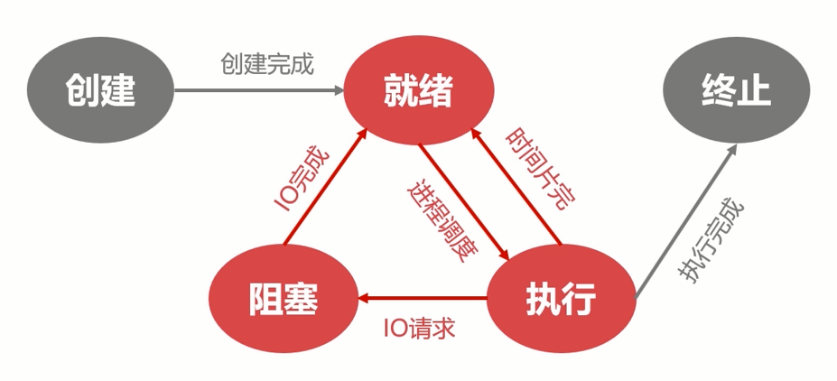
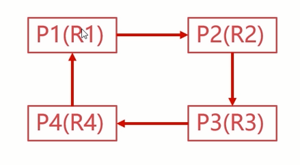

# 计算机操作系统-基础

[TOC]

## 操作系统的演进

### 无操作系统

-   人工操作
-   用户独占
-   CPU等待人工操作
-   资源利用率很低

### 批处理系统

-   无需等待人工操作
-   批量输入任务
-   资源利用率提升
-   *多道程序设计
    -   早期批处理系统只能一次处理一个任务
    -   意义：多道程序设计使得批处理系统可以一次处理多个任务
    -   多道程序设计是指在计算机内存中同时存放多个程序
    -   多道程序在计算机的管理程序之下相互穿插运行
    -   对多道程序的管理是操作系统的重要功能

### 分时系统

-   人-机交互
-   多用户共享
-   及时调试程序
-   资源利用率提升

## 操作系统概览

### What&Why

>   KEY：管理硬件、提供用户交互的软件系统

#### What

-   操作系统是管理计算机硬件和软件资源的计算机程序
-   管理配置内存、决定资源供需顺序、控制输入输出设备等
-   操作系统提供让用户和系统交互的操作界面
-   操作系统的种类是多种多样的，不局限于计算机
-   从手机到超级计算机，操作系统可简单也可复杂
-   在不同的设备上，操作系统可向用户呈现多种操作手段

#### WHY

-   我们不可能直接操作计算机硬件
-   设备种类繁多复杂，需要统一界面
-   操作系统的简易性使得更多人能够使用计算机

### 操作系统的基本功能

>   操作系统统一管理着计算机资源

-   用户无需面向硬件接口编程
-   IO设备管理软件，提供读写接口
-   文件管理软件，提供操作文件接口 


>   操作系统提供了用户与计算机之间的接口

-   图像窗口形式
-   命令形式
-   系统调用形式

### 操作系统相关概念

#### 并发性

-   并行是指两个或多个事件可以在同一个时刻发生（强调某一时刻）
-   并发是指两个或多个事件可以在同一个时间间隔发生（强调某个时段）


#### 共享性

-   共享性表现为操作系统中的资源可供多个并发的程序共同使用
-   这种共同使用的形式称之为资源共享
-   多个程序可以同时使用主存资源
-   资源共享根据属性可分为两种方式
    -   互斥共享形式
        -   当资源被程序A占用时，其他想使用的话只能等待
        -   只有进程A使用完以后，其他进程才可以使用该资源
    -   同时访问形式
        -   某种资源在一段时间内并发地被多个程序访问
        -   这种“同时”是宏观的，从宏观去看该资源可以被同时访问

#### 虚拟性

-   虚拟性表现为把一个物理实体转变为若干个逻辑实体
-   物理实体是真实存在的，逻辑实体是虚拟的
-   虚拟的技术主要有时分复用技术和空分复用技术
    -    时分复用技术
        -   优势
            -   资源在时间上进行复用，不同程序并发使用
            -   多道程序分时使用计算机的硬件资源
            -   提高资源的利用率
        -   虚拟处理器技术
            -   借助多道程序设计技术
            -   为每个程序建立进程
            -   多个程序分时复用处理器
        -   虚拟设备技术
            -   物理设备虚拟为多个逻辑设备
            -   每个程序占用一个逻辑设备
            -   多个程序通过逻辑设备并发访问
    -   空分复用技术
        -   优势
            -   空分复用技术用来实现虚拟磁盘、虚拟内存等
            -   提高资源的利用率，提升编程效率
        -   虚拟磁盘技术
            -   物理磁盘虚拟为逻辑磁盘
            -   C、D、E等逻辑盘
            -   使用起来更加安全、方便
        -   虚拟内存技术
            -   在逻辑上扩大程序的存储容量
            -   使用比实际内存更大的容量
            -   大大提升编程效率

#### 异步性

-   在多道程序环境下，允许多个进程并发执行
-   进程在使用资源时可能需要等待或放弃
-   进程的执行并不是一气呵成的，而是以走走停停的形式推进

>   进程以不可预知的速度向前推进
>
>   -   何时执行
>   -   何时暂停
>   -   何时完成

## 进程管理

### 进程管理之进程实体

#### 为什么需要进程

>   -   没有配置OS之前，资源属于当前运行的程序
>   -   配置OS之后，引入多道程序设计的概念
>   -   合理的隔离资源、运行环境，提升资源利用率

>   多道程序设计的意义非凡

-   进程是系统进行资源分配和调度的基本单位
-   进程作为程序独立运行的载体保障程序正常执行(保障运行，多个进程可能使用相同的IO设备，进程在此起到了保存资源的作用)
-   进程的存在使得操作系统资源的利用率大幅提升

#### 进程的实体

##### 主存中的进程形态

>   总结起来分为四块：
>
>   -   进程标识符
>   -   处理机状态
>   -   进程调度信息
>   -   进程控制信息

###### 标识符

-   标识符唯一标记一个进程，用于区别其他进程

###### 状态

-   标记进程的进程状态，如：运行态

###### 程序计数器

-   进程即将被执行的下一条指令的地址

内存指针

-   程序逻辑代码、进程数据相关指针

###### 上下文数据

-   进程执行时处理器存储的数据（重要）

###### IO状态信息

-   被进程IO操作所占用的文件列表

###### 记账信息

-   使用处理器时间、时钟数总和等进程与线程（调试，获取状态时起作用）

>   进程控制块（PCB）
>
>   -   用于描述和控制进程运行的通用数据结构
>   -   记录进程当前状态和控制进程运行的全部信息
>   -   PCB的使得进程是能够独立运行的基本单位
>   -   PCB是操作系统进行调度经常会被读取的信息
>   -   PCB是常驻内存的，存放在系统专门开辟的PCB区域内

##### 进程与线程

###### 线程

>   注意两点：
>
>   -   一个进程可以有一个或多个线程
>   -   进程的线程共享进程资源

-   线程是操作系统进行运行调度的最小单位（CPU调度进程实际上是调度进程里的线程）
    -   进程是系统进行资源分配和调唐的基本单位
-   包含在进程之中，是进程中实际运行工作的单位
-   一个进程可以并发多个线程，每个线程执行不同的任务
-   进程管理之五状态模型

###### 对比

|      | 进程               | 线程       |
| :--: | :----------------: | :--------: |
| 资源 | 资源分配的基本单位 | 不拥有资源 |
| 调度 | 独立调度的基本单位 | 独立调度的最小单位 |
| 系统开销 | 进程系统开销大 | 线程系统开销小 |
| 通信 | 进程IPC | 读写同一进程数据通信 |

>   进程系统开销大原因：管理多个线程并需要分配资源

### 进程管理之五状态模型

#### 就绪状态

-   当进程被分配到除CPU以外所有必要的资源后
-   只要再获得CPU的使用权，就可以立即运行
-   其他资源都准备好、只差CPU资源的状态为就绪状态
-   在一个系统中多个处于就绪状态的进程通常排成一个队列

#### 执行状态

-   进程获得CPU，其程序正在执行称为执行状态
-   在单处理机中，在某个时刻只能有一个进程是处于执行状态

#### 阻塞状态

-   进程因某种原因如：其他设备未就绪而无法继续执行
-   从而放弃CPU的状态称为阻塞状态

#### 创建状态

过程：分配PCB—>插入就绪队列

-   创建进程时拥有PCB但其他资源尚未就绪的状态称为创建状态
-   操作系统提供fork函数接口创建进程

#### 终止状态

过程：系统清理—>PCB归还

-   进程结束由系统清理或者归还PCB的状态称为终止状态

#### 图示



### 进程管理之进程同步

#### 为什么需要进程间同步

经典问题：生产者-消费者问题，哲学家进餐问题

-   根源问题是：彼此相互之间没有通信
    -   “如果生产者通知消费者我已经完成一件生产"
    -   “哲学家向旁边哲学家说我要进餐了"
-   需要进程间的同步原因
    -   对竞争资源在多进程间进行使用次序的协调
    -   使得并发执行的多个进程之间可以有效使用资源和相互合作

#### 进程间同步的原则

##### 临界资源

临界资源指的是一些虽作为共享资源却又无法同时被多个线程共同访问的共享资源。当有进程在使用临界资源时，其他进程必须依据操作系统的同步机制等待占用进程释放该共享资源才可重新竞争使用共享资源。

##### 进程间同步的四个原则

-   空闲让进：资源无占用，允许使用
-   忙则等待：资源有占用，请求进程等待
-   有限等待：保证有限等待时间能够使用资源
-   让权等待：等待时，进程需要让出CPU（保证CPU高效利用的一个前提）

##### 进程间同步的三个方法

-   消息队列
-   共享存储
-   信号量

#### 线程同步

>   -   进程内多线程也需要同步
>
>   -   进程的线程共享进程资源

##### 线程同步的四个方法

-   互斥量
-   读写锁
-   自旋锁
-   条件变量

### Linux的进程管理

#### Linux进程的相关概念

##### 进程的类型

###### 前台进程

-   前台进程就是具有终端，可以和用户交互的进程

###### 后台进程

-   与前台进程相对，没有占用终端的就是后台进程
-   后台程序基本上不和用户交互，优先级比前台进程低
-   将需要执行的命令以“&”符号结束

###### 守护进程

-   守护（daemon）进程是特殊的后台进程
-   很多守护进程在系统引导的时候启动，一直运行直到系统关闭
-   Linux有很多典型的守护进程
    -   sshd，crond，mysqld，httpd
    -   进程名字以“d”结尾的一般都是守护进程

##### 进程的标记

###### 进程ID

-   进程ID是进程的唯一标记，每个进程拥有不同的ID
-   进程ID表现为一个非负整数，最大值由操作系统限定
-   父子进程关系可以通过pstree命令查看
-   特数进程
    -   ID为0的进程为idle进程，是系统创建的第一个进程
    -   ID为1的进程为init进程，是0号进程的子进程，完成系统初始化
    -   Init进程是所有用户进程的祖先进程

###### 进程的状态标记

| 状态符号 |                           状态说明                           |
| :------: | :----------------------------------------------------------: |
|    R     |             （TASK_RUNNING），进程正处于运行状态             |
|    S     |          （TASK_INTERRUPTIBLE），进程正处于睡眠状态          |
|    D     |    （TASK_UNINTERRUPTIBLE），进程正在处于I0等待的睡眠状态    |
|    T     |             （TASK STOPPED），进程正处于暂停状态             |
|    Z     | （TASK_DEAD or EXIT_ZOMBIE），进程正处于退出状态，或僵尸进程 |

>   操作命令示例：ps -aux | grep PID

#### 操作Linux进程的相关命令

##### ps命令

-   ps命令常用于显示当前进程的状态
-   ps命令常配合aux参数或ef参数和grep命令检索特定进程

```
ps -ef --forest 查看进程树
ps -aux -sort=-pcpu 按照CPU使用情况排序
ps -aux -sort=-pmem 按照内存使用情况排序
```

##### top命令

```
top 查看机器状态信息
```

##### kill命令

-   kill命令发送指定信号给进程
-   kill-1可以查看操作系统支持的信号
-   只有（SIGKILL9）信号可以无条件终止进程，其他信号进程有权忽略

```
kill -9 PID 无条件停止PID
```

## 作业管理

### 作业管理之进程调度

#### 进程调度概述

-   进程调度是指计算机通过决策决定哪个就绪进程可以获得CPU使用权（与多道程序设计有关）
-   保留旧进程的运行信息，请出旧进程（收拾包袱）
-   选择新进程，准备运行环境并分配CPU（新进驻）

##### 就绪队列的排队机制

-   将就绪进程按照一定的方式排成队列，以便调度程序可以最快找到就绪进程

##### 选择运行进程的委派机制

-   调度程序以一定的策略选择就绪进程，将CPU资源分配给它

##### 新老进程的上下文切换机制

-   保存当前进程的上下文信息，装入被委派执行进程的运行上下文
-   老进程的上下文存储在主存中，再将新进程的上下文调入高速缓存中

**老进程还没执行完呢**？

##### 非抢占式的调度

-   处理器一旦分配给某个进程，就让该进程一直使用下去
-   调度程序不以任何原因抢占正在被使用的处理器
-   直到进程完成工作或因为IO阻塞才会让出处理器

##### 抢占式的调度

-   允许调度程序以一定的策略暂停当前运行的进程
-   保存好旧进程的上下文信息，分配处理器给新进程

##### 两种方式的优略

|          | 抢占式调度       | 非抢占式调度       |
| -------- | ---------------- | ------------------ |
| 系统开销 | 频繁切换，开销大 | 切换次数少，开销小 |
| 公平性   | 相对公平         | 不公平             |
| 应用     | 通用系统         | 专用系统           |

#### 进程调度算法

##### 先来先服务调度算法

##### 短进程优先调度算法

-   调度程序优先选择就绪队列中估计运行时间最短的进程
-   短进程优先调度算法不利于长作业进程的执行

##### 高优先权优先调度算法

-   进程附带优先权，调度程序优先选择权重高的进程
-   高优先权优先调度算法使得紧迫的任务可以优先处理
-   前台-后台进程处理也是使用高低优先权处理，前台进程保证时效性

##### 时间片轮转调度算法

-   按先来先服务的原则排列就绪进程
-   每次从队列头部取出待执行进程，分配一个时间片执行
-   是相对公平的调度算法，但不能保证及时响应用户

### 作业管理之死锁

#### 死锁

死锁是指两个或两个以上的进程在执行过程中，由于竞争资源或者由于彼此通信而造成的一种阻塞的现象，若无外力作用，它们都将无法推进下去。此时称系统处于死锁状态或系统产生了死锁，这些永远在互相等待的进程称为死锁进程。

#### 死锁的产生

##### 竞争资源

-   共享资源数量不满足各个进程需求
-   各个进程之间发生资源竞争进程导致死锁
-   等待请求的资源被释放
-   自身占用资源不释放

##### 进程调度顺序不当

##### 死锁的四个必要条件

-   互斥条件

    -   进程对资源的使用是**排他性的使用**
    -   某资源只能由一个进程使用，其他进程需要使用只能等待

-   请求保持条件

    -   进程至少保持一个资源，又提出新的资源请求
    -   新资源被占用，请求被阻塞
    -   被阻塞的进程不释放自己保持的资源

-   不可剥夺条件

    -   进程获得的资源在未完成使用前不能被剥夺
    -   获得的资源只能由进程自身释放

-   环路等待条件

    -   发生死锁时，必然存在进程-资源环形链

    -   图示

        

#### 死锁的处理

##### 预防死锁的方法

>   破坏死锁的四个条件的一个或者多个必要条件即可

###### 摒弃请求保持条件

-   系统规定进程运行之前，一次性申请所有需要的资源
    进程在运行期间不会提出资源请求，从而摒弃请求保持条件

###### 摒弃不可剥夺条件

-   当一个进程请求新的资源得不到满足时，必须释放占有的资源
-   进程运行时占有的资源可以被释放，意味着可以被剥夺

###### 摒弃环路等待条件

-   可用资源线性排序，申请必须按照需要递增申请
-   线性申请不再形成环路，从而摒弃了环路等待条件
-   A—>B—>C—>D—>E，按顺序申请

##### 银行家算法 

>   6-8 11.50 开始

-   是一个可操作的著名的避免死锁的算法
-   以银行借贷系统分配策略为基础的算法
-   客户申请的贷款是有限的，每次申请需声明最大资金量
-   银行家在能够满足贷款时，都应该给用户贷款
-   客户在使用贷款后，能够及时归还贷款
-   观察可分配资源表，哪个进程条件满足的，申请给予哪一个进程

## 存储管理

### 存储管理之内存分配与回收

#### 存储管理前情回顾

>   早期计算机编程并不需要过多的存储管理
>
>   随着计算机和程序越来越复杂，存储管理成为必要

-   确保计算机有足够的内存处理数据
-   确保程序可以从可用内存中获取一部分内存使用
-   确保程序可以归还使用后的内存以供其他程序使用

#### 内存分配的过程

##### 单一连续分配

>   划分为两块，系统区，用户区，系统使用系统区，用户使用用户区

-   单一连续分配是最简单的内存分配方式
-   只能在单用户、单进程的操作系统中使用

##### 固定分区分配

-   固定分区分配是支持多道程序的最简单存储分配方式
-   内存空间被划分为若干固定大小的区域
-   每个分区只提供给一个程序使用，互不干扰

##### 动态分区分配

-   根据进程实际需要，动态分配内存空间
-   相关数据结构、分配算法
    -   动态分区空闲表数据结构
        -   使用数组保存对应标志位标记，0空，1占用
    -   动态分区空闲链数据结构
        -   使用双向链表把节点链接起来
        -   节点需记录可存储的容量
    -   动态分区分配算法
        -   首次适应算法（FF算法）
            -   分配内存时从开始顺序查找适合内存区
            -   若没有合适的空闲区，则该次分配失败
            -   每次从头部开始，使得头部地址空间不断被划分（弊端）
            -   改良：循环适应算法，从上次检索末尾开始
        -   最佳适应算法（BF算法）
            -   最佳适应算法要求空闲区链表**按照容量大小排序**
            -   遍历空闲区链表找到最佳合适空闲区
            -   从小到大遍历，避免了大材小用的情况
        -   快速适应算法（QF算法）
            -   快速适应算法要求有多个空闲区链表
            -   每个空闲区链表存储一种容量的空闲区（一种容量一个链表）

#### 内存回收的过程

##### 回收区在空闲区后面

-   不需要新建空闲链表节点
-   只需要把空闲区1的容量增大为空闲区即可（空闲区直接囊括回收区）

##### 回收区在空闲区前面

-   将回收区与空闲区合并
-   新的空闲区使用回收区的地址

##### 回收区前后都是空闲区

-   将空闲区1、空闲区2和回收区合并
-   新的空闲区使用空闲区1的地址

##### 单独一个回收区

-   为回收区创建新的空闲节点
-   插入到相应的空闲区链表中去

### 存储管理之段页式存储管理

>    操作系统是如何管理进程的空间的呢？

#### 页面

-   字块是相对物理设备的定义
-   页面则是相对逻辑空间的定义

#### 页式存储管理

-   将进程逻辑空间等分成若干大小的页面（等分）
-   相应的把物理内存空间分成与页面大小的物理块
-   以页面为单位把进程空间装进物理内存中分散的物理块
-   页面大小应该适中，过大难以分配，过小内存碎片过多
-   页面大小通常是512B~8K
-   存在弊端：有一段连续的逻辑分布在多个页面中，将大大降低执行效率

**如何知道某页归到哪个具体的页面呢**?

##### 页表

-   页表记录进程逻辑空间与物理空间的映射（类似索引）

##### 地址

页地址-样式：页号|页内偏移

##### 图示


##### 存在问题

现代计算机系统中，可以支持非常大的逻辑地址空间（2^32~2^64），这样，页表就变得非常大，要占用非常大的内存空间，如，具有32位逻辑地址空间的分页系统，规定页面大小为4KB，则在每个进程页表中的页表项可达1M（2^20）个，如果每个页表项占用1Byte，故每个进程仅仅页表就要占用1MB的内存空间。

这时候需要一个**页表**，多级关联起来，存储时候只需要根页表，再根据所需页到二级页表

#### 段式存储管理

-   将进程逻辑空间划分成若干段（非等分）
-   段的长度由连续逻辑的长度决定
-   主函数MAIN、子程序段X、子函数Y等

##### 地址

段地址-样式：段号|段内偏移

##### 图示


#### 段式VS页式存储

>   段式存储和页式存储都离散地管理了进程的逻辑空间

-   页是物理单位，段是逻辑单位
-   分页是为了合理利用空间，分段是满足用户要求
-   页大小由硬件固定，段长度可动态
-   变化页表信息是一维的，段表信息是二维的

#### 段页式存储管理

-   分页可以有效提高内存利用率（虽然说存在页内碎片）
-   分段可以更好满足用户需求
-   两者结合，形成段页式存储管理
-   先将逻辑空间按段式管理分成若干段
-   再把段内空间按页式管理等分成若干页

##### 地址

段页地址-样式：段号|段内页号|页内地址

#### 三者图示比较


### 存储管理之虚拟内存

#### 虚拟内存概述

-   有些进程实际需要的内存很大，超过物理内存的容量
-   多道程序设计，使得每个进程可用物理内存更加稀缺
-   不可能无限增加物理内存物理内存总有不够的时候
-   虚拟内存是操作系统内存管理的关键技术
-   使得多道程序运行和大程序运行成为现实
-   把程序使用内存划分，将部分暂时不使用的内存放置在辅存

#### 程序的局部性原理

##### 局部性原理

局部性原理是指CPU访问存储器时，无论是**存取指令**还是**存取数据**，所访问的存储单元都**趋于聚集在一个较小的连续区域中**。（这是使得虚拟内存可以实现的原因）

-   程序运行时，无需全部装入内存，装载部分即可
-   如果访问页不在内存，则发出缺页中断，发起页面置换
-   从用户层面看，程序拥有很大的空间，即是虚拟内存

虚拟内存实际是对物理内存的补充，速度接近于内存，成本接近于辅存

#### 虚拟内存的置换算法

##### 置换算法

-   先进先出算法（FIFO）
-   最不经常使用算法（LFU）
-   最近最少使用算法（LRU）

##### 高速缓存的替换时机

-   高速缓存没有数据，需要从主存载入所需数据

##### 主存页面的替换时机

-   主存缺页，需要从辅存载入页面数据

##### 替换策略

-   替换策略发生在Cache-主存层次、主存-辅存层次
-   Cache-主存层次的替换策略主要是为了解决速度问题
-   主存-辅存层次主要是为了解决容量问题

### Linux的存储管理

#### Buddy内存管理算法

-   Buddy算法是经典的内存管理算法
-   算法基于计算机处理二进制的优势具有极高的效率
-   算法主要是为了解决内存外碎片的问题
-   目的：努力让内存分配与相邻内存合并能快速进行

>   页内碎片：
>
>   内部碎片是已经被分配出去（能明确指出属于哪个进程）的内存空间大于请求所需的内存空间，不能被利用的内存空间就是内部碎片。
>
>   
>
>   页外碎片：
>
>   外部碎片是指还没有分配出去（不属于任何进程），但是由于大小而无法分配给申请内存空间的新进程的内存空闲块。
>
>   

##### 内存分配原则

-   向上取整为2的幂大小
    -   70k->128k
    -   129k>256k

##### 伙伴系统

-   “伙伴”指的是内存的“伙伴”

-   一片连续内存的“伙伴”是相邻的另一片大小一样的连续内存

-   图示

    

##### 操作方式

-   创建一系列空闲块链表，每一种都是2的幂（1kb-2kb-4kb...1MB）

-   操作详细流程：6-12 05.44
    -   分配过程
    -   回收过程

##### 总结

-   Buddy算法是经典的内存管理算法
-   算法基于计算机处理二进制的优势具有极高的效率
-   算法主要是为了解决内存外碎片的问题
-   实际上是将内存外碎片问题转换为内存内碎片问题
-   虽有不足，但大大提高了内存的使用效率

#### Linux交换空间

-   交换空间（Swap）是磁盘的一个分区
-   Linux物理内存满时，会把一些内存交换至Swap空间
-   Swap空间是初始化系统时配置的

-   查看 top 指令，在左上角 KiB Swap
-   频繁使用 交换空间，会造成 Linux 系统慢

##### 作用

-   冷启动内存依赖
    -   提供给不怎么使用的内存数据，保存到交换空间，从而释放更多的内存
-   系统睡眠依赖
    -   系统睡眠时，把数据存储到交换空间中，加快启动时间
-   大进程空间依赖
    -   把进程需要使用的数据放在交换空间，从而可以启动大型程序

##### Swap 空间 VS 虚拟内存

###### Swap 空间

-   Swap空间存在于磁盘
-   Swap空间与主存发生置换
-   Swap空间是操作系统概念
-   Swap空间解决系统物理内存不足问题

###### 虚拟内存

-   虚拟内存存在于磁盘
-   虚拟内存与主存发生置换
-   虚拟内存是进程概念
-   虚拟内存解决进程物理内存不足问题

## 文件管理

### 操作系统的文件管理

#### 文件的逻辑结构

##### 逻辑结构的文件类型

###### 有结构文件

-   文件包括
    -   文本文件
    -   文档
    -   媒体文件
-   细节信息
    -   文件内容由定长记录和可变长记录组成
    -   定长记录存储文件格式、文件描述等结构化数据项
    -   可变长记录存储文件具体内容
    -   定长记录存储文件格式、文件描述等结构化数据项
    -   可变长记录存储文件具体内容
    -   示例：PNG文件【PNG文件标记|PNG数据块|文件结束标记】

###### 无结构文件

-   文件包括
    -   二进制文件
    -   链接库
    -   exe文件，dll文件，so文件
-   细节信息
    -   也称为流式文件
    -   文件内容长度以字节为单位

##### 顺序文件

顺序文件是指按顺序存放在存储介质中的文件

磁带的存储特性使得磁带文件只能存储顺序文件

顺序文件是所有逻辑文件当中存储效率最高的

弊端：顺序读写效率高，对随机增删改查不友好

##### 索引文件

-   可变长文件不适合使用顺序文件格式存储
-   索引文件是为了解决可变长文件存储而发明的一种文件格式
-   索引文件需要配合**索引表**完成存储的操作
-   图示
    -   

#### 辅存的存储空间分配

##### 辅存的分配方式

###### 连续分配

-   顺序读取文件内容非常容易，速度很快
-   对存储要求高，要求满足容量的连续存储空间
-   图示
    -   

###### 链接分配

>   -   隐式链接
>   -   显式链接

-   链接分配可以将文件存储在离散的盘块中
-   需要额外的存储空间存储文件的盘块链接顺序
-   隐式分配的下一个链接指向存储在当前盘块内
-   隐式分配适合顺序访问，随机访问效率很低
-   可靠性差，任何一个链接出问题都影响整个文件
-   图示
    -   
    -   这也叫 FAT，File Allocation Table
-   弊端
    -   不支持高效的直接存储（FAT记录项多）
    -   检索时FAT表占用较大的存储空间（需要将整个FAT加载到内存）

###### 索引分配

-   把文件的所有盘块集中存储（索引）
-   读取某个文件时，将文件索引读取进内存即可
-   图示

    -   

-   优势

    -   每个文件拥有一个索引块，记录所有盘块信息
    -   索引分配方式支持直接访问盘块
    -   文件较大时，索引分配方式具有明显优势

    

##### 存储空间管理

###### 空闲表

-   空闲盘区的分配与内存分配类似
-   首次适应算法、循环适应算法等
-   回收过程也与内存回收类似
-   图示
    -   

###### 空闲链表

-   空闲链表法把所有空闲盘区组成一个空闲链表
-   每个链表节点存储空闲盘块和空闲的数目

###### 位示图

-   图示
    -   
-   优势
    -   位示图维护成本很低
    -   位示图可以非常容易找到空闲盘块
    -   位示图使用0/1比特位，占用空间很小

#### 目录管理

-   图示
    -   
-   任何文件或目录都只有唯一路径

### Linux的基本操作

#### Linux目录

-   Linux常见文件目录信息


-   路径
    -   相对路径
    -   绝对路径

#### Linux文件常用操作

-   （目录/文件）创建、删除、读取、写入

#### Linux文件类型

-   文件类型
    -   普通文件（-）
    -   目录文件（d）
    -   符号链接（l）
    -   设备文件（b、c）
    -   套接字（s）
    -   FIFO（p）

### Linux文件系统

#### 文件系统概览

##### FAT

-   FAT（File Allocation Table）
-   FAT16、FAT32等，微软Dos/Windows使用的文件系统
-   使用一张表保存盘块的信息

##### NTFS

-   NTFS（New Technology File System）
-   WindowsNT环境的文件系统
-   NTFS对FAT进行了改进，取代了旧的文件系统

##### EXT2/3/4

-   EXT（Extended file system）：扩展文件系统
-   Linux的文件系统
-   EXT2/3/4数字表示第几代

#### Ext文件系统

-   Boot Sector：启动扇区，安装开机管理程序
-   Block Group：块组，存储数据的实际位置


##### Inode Table

-   存放文件Inode的地方
-   每一个文件（目录）都有一个lnode
-   是每一个文件（目录）的**索引节点**

##### Inode

-   存放文件信息
    -   索引节点编号，文件类型，文件权限，文件物理地址，文件长度，文件长度，文件长度，文件长度，文件长度，文件连接计数，文件存取时间，文件状态访问计数，链接指针
-   文件名不是存放在lnode节点上的，而是存放在目录的
-   Inode节点列出目录文件的时候无需加载文件的Inode

##### Inode bitmap

-   Inode的位示图
-   记录已分配的Inode和未分配的Inode

##### Data block

-   Data block是存放文件内容的地方
-   每个block都有唯一的编号
-   文件的block记录在文件的Inode上

##### Block bitmap

-   功能与Inode bitmap类似
-   记录Data block的使用情况

##### Superblock

-   记录整个文件系统相关信息的地方
-   Block和Inode的使用情况
-   时间信息、控制信息等

##### 操作指令

>   df -T
>
>   -   查看Linux挂载磁盘信息
>
>   dumpe2fs  对应磁盘
>
>   -   查看磁盘的inode信息

## 设备管理

### 操作系统的设备管理

#### 广义的IO设备

-   对CPU而言，凡是对CPU进行数据输入的都是输入设备
-   对CPU而言，凡是CPU进行数据输出的都是输出设备

##### 按使用特性分类

###### 存储设备

-   U盘
-   内存
-   磁盘

###### 交互IO设备

-   键盘
-   显示器

##### 按信息交换的单位分类

###### 块设备

-   磁盘
-   SD卡

###### 字符设备

-   打印机
-   Shell终端

##### 按设备的共享属性分类

-   独占设备
-   共享设备
-   虚拟设备

##### 按传输速率分类

-   低速设备
-   中速设备
-   高速设备

#### IO设备的缓冲区

>   CPU与IO设备的速率不匹配

-   减少CPU处理IO请求的频率
-   提高CPU与IO设备之间的并行性


-   专用缓冲区只适用于特定的IO进程
-   当这样的IO进程比较多时，对内存的消耗也很大
-   操作系统划出可供多个进程使用的公共缓冲区，称之为缓冲池


#### SPOOLing技术

>   虚拟设备技术

-   是关于慢速字符设备如何与计算机主机交换信息的一种技术
-   利用高速共享设备将低速的独享设备模拟为高速的共享设备
-   逻辑上，系统为每一个用户都分配了一台独立的高速独享设备


-   SPOOLing技术把同步调用低速设备改为异步调用
-   在输入、输出之间增加了排队转储环节（输入井、输出井）
-   SPOOLing负责输入（出）井与低速设备之间的调度
-   逻辑上，进程直接与高速设备交互，减少了进程的等待时间