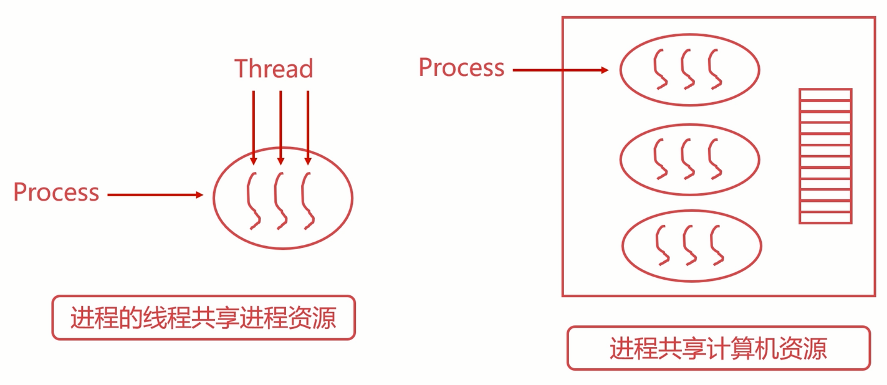
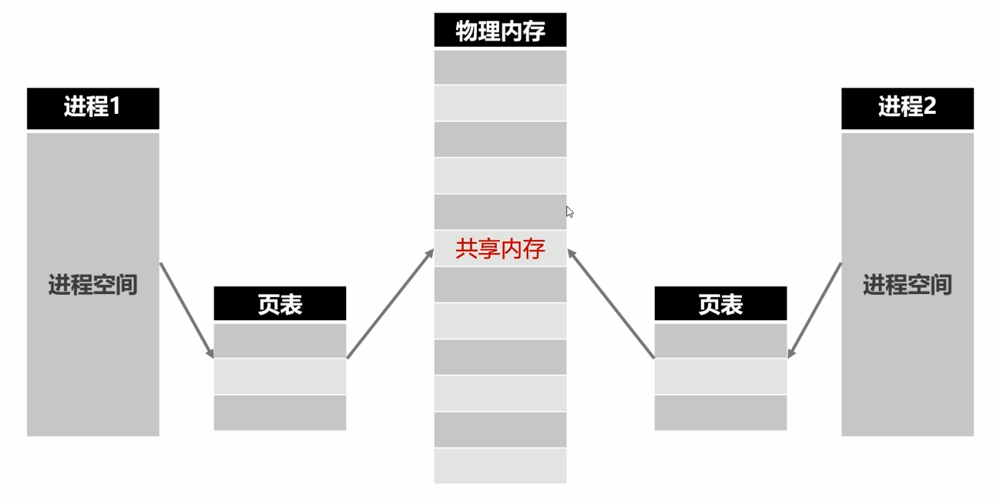

# 计算机操作系统-提升

>   保护临界资源/进行通信

[TOC]

## 线程间同步

### 互斥量

-   两个线程的指令交叉执行
-   互斥量可以保证先后执行
-   互斥量是最简单的线程同步的方法
-   互斥量（互斥锁），处于两态之一的变量：解锁和加锁
-   两个状态可以保证资源访问的串行
-   操作系统直接提供了互斥量的API
-   开发者可以直接使用API完成资源的加锁、解锁操作
-   pthread_mutex_t

#### 原子性

-   原子性是指一系列操作不可被中断的特性
-   这一系列操作要么全部执行完成，要么全部没有执行
-   不存在部分执行部分未执行的情况

### 自旋锁

-   自旋锁也是一种多线程同步的变量
-   使用自旋锁的线程会反复检查锁变量是否可用
-   自旋锁不会让出CPU，是一种忙等待状态（死循环等待锁被释放）
-   自旋锁避免了进程或线程上下文切换的开销
-   操作系统内部很多地方使用的是自旋锁
-   自旋锁不适合在单核CPU使用（等待的时候不释放CPU，会不断的等待，会引起其他进程或者线程不能执行）
-   pthread_spinlock t

### 读写锁

>   临界资源多读少写
>   读取的时候并不会改变临界资源的值
>   是否存在效率更高的同步方法？

-   读写锁是一种特殊的自旋锁
-   允许多个读者同时访问资源以提高读性能
-   对于写操作则是互斥的
-   pthread_rwlock_t
-   pthread rwlock_rdlock（读锁）
-   pthread rwlock_wrlock（写锁）

### 条件变量

>    生产-消费模型漏洞
>
>   -   缓冲区小于等于0时，不允许消费者消费，消费者必须等待
>   -   缓冲区满时，不允许生产者往缓冲区生产，生产者必须等待

-   条件变量是一种相对复杂的线程同步方法
-   条件变量允许线程睡眠，直到满足某种条件
-   当满足条件时，可以向该线程信号，通知唤醒
-   针对生产-消费模型
    -   当生产者生产一个产品时，唤醒可能等待的消费者
    -   当消费者消费一个产品时，唤醒可能等待的生产者
-   配合互斥量使用
    -   pthread_cond_t
    -   pthread_cond_wait（等待条件满足）
        pthread_cond notify（等待被唤醒）

### 总结

#### 互斥量、自旋锁、读写锁流程

流程一：访问->加锁->访问临界资源->解锁->离开

流程二：访问->等待解锁->加锁->访问临界资源->解锁->离开

#### 条件变量流程

流程：访问->加锁保护条件变量->继续访问->等待条件变量被唤醒->访问临界资源->解锁->离开

#### 表格化

| 同步方法 | 描述                                                   |
| -------- | ------------------------------------------------------ |
| 互斥锁   | 最简单的一种线程同步方法，会阻塞线程                   |
| 自旋锁   | 避免切换的一种线程同步方法，属于“忙等待"               |
| 读写锁   | 为“读多写少”的资源设计的线程同步方法，可以显著提高性能 |
| 条件变量 | 相对复杂的一种线程同步方法，有更灵活的使用场景         |

## 进程间同步

### fork系统调用创建进程

-   fork系统调用是用于创建进程的
-   fork创建的进程初始化状态与父进程一样
-   系统会为fork的进程分配新的资源
-   fork系统调用无参数
-   fork会返回两次，分别返回子进程id和0
-   返回子进程id的是父进程，返回0的是子进程

### 共享内存

-   在某种程度上，多进程是共同使用物理内存的
-   由于操作系统的进程管理，进程间的内存空间是独立的
-   进程默认是不能访问进程空间之外的内存空间的
-   实现图示
    -   
-   共享存储允许不相关的进程访问同一片物理内存
-   共享内存是两个进程之间共享和传递数据最快的方式
-   共享内存**未提供同步机制**，需要借助其他机制管理访问
-   共享内存是高性能后台开发中最常用的进程同步方式

#### 操作流程

申请共享内存->连接到进程空间->使用共享内存->脱离进程空间&删除

存在：客户端 <- 共享内存 -> 服务端

### 域套接字

-   域套接字是一种高级的进程间通信的方法
-   Unix域套接字可以用于同一机器进程间通信
-   套接字（socket）原是网络通信中使用的术语
-   Unix系统提供的域套接字提供了网络套接字类似的功能
-   不需要额外的机制保证多个进程间的访问问题
-   提供了单机简单可靠的进程通信同步服务
-   只能在单机使用，不能跨机器使用

#### 操作流程

流程一：创建套接字->绑定套接字->监听套接字->接受&处理信息

流程二：创建套接字->连接套接字->发送消息

存在：客户端 <- 共享内存 -> 服务端

