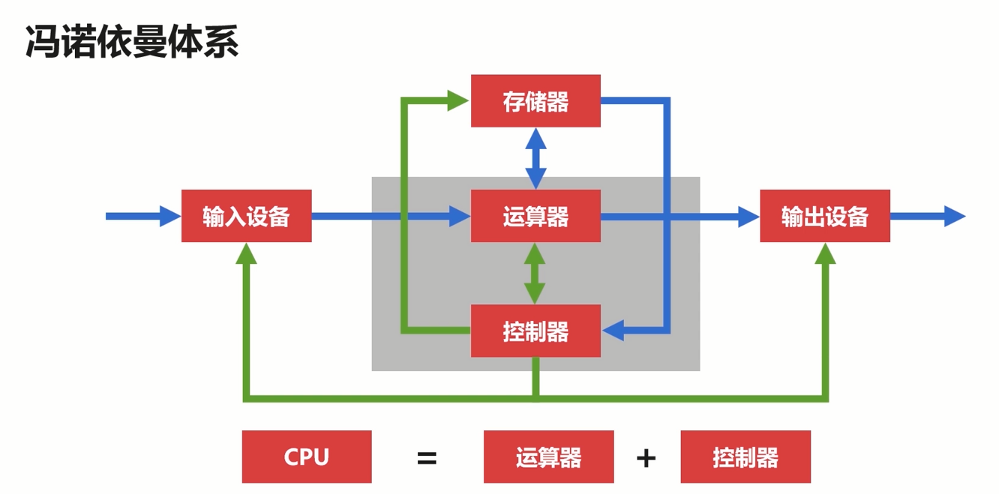
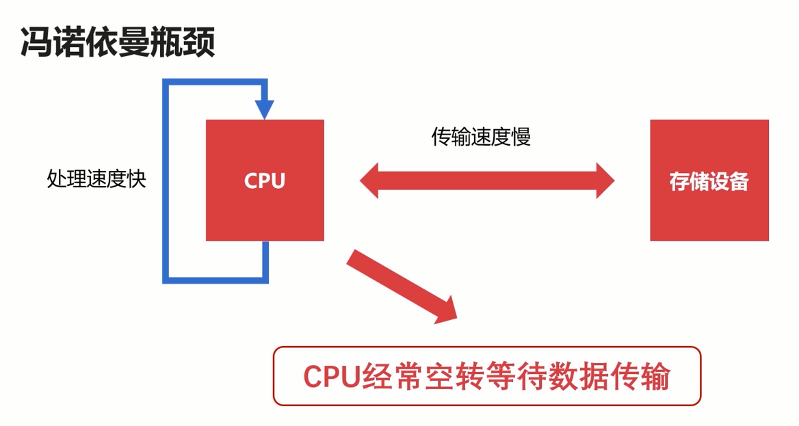
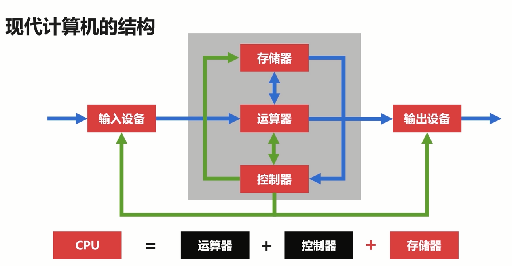
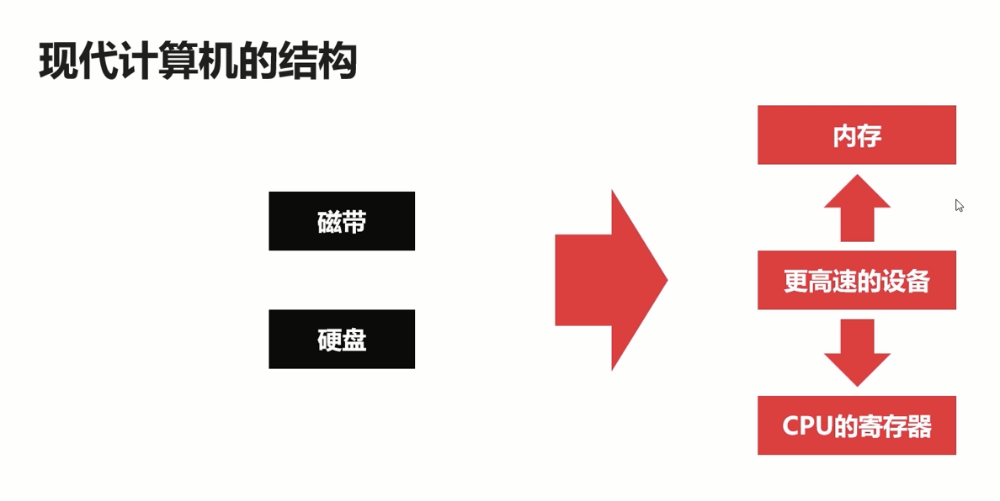
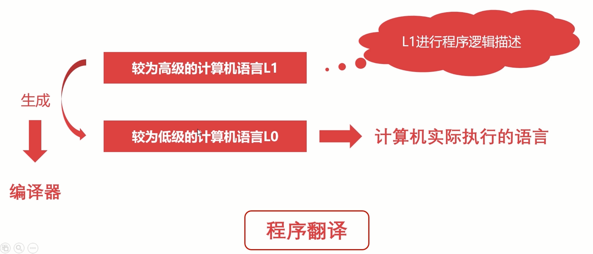
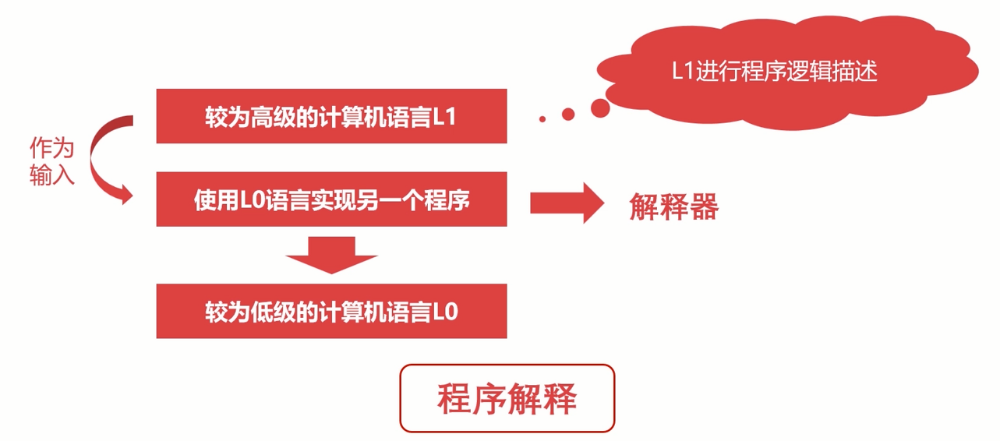
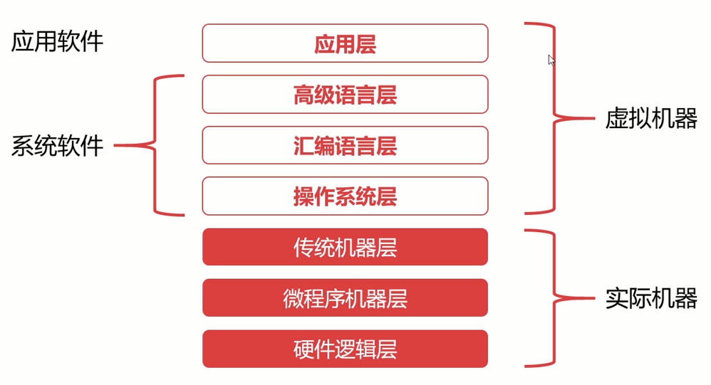
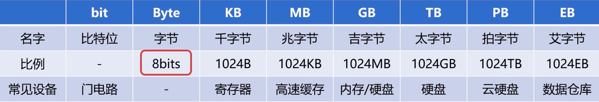

# 章节目录

[TOC]

## 计算机发展简史

### 计算机发展的四个阶段

#### 四个阶段主要是？

1964~1957：第一阶段：电子管计算机

1957~1964：第二阶段：晶体管计算机

1964~1980：第三阶段：集成电路计算机

1980~Now：第四阶段：超大规模集成电路计算机

#### 第一阶段：电子管计算机

-   集成度小，空间占用大

-   功耗高，运行速度慢

-   操作复杂，更换程序需要接线

#### 第二阶段：晶体管计算机

-   集成度相对较高，空间占用相对小

-   功耗相对较低，运行速度较快

-   操作相对简单，交互更加方便

#### 第三阶段：集成电路计算机

-   计算机变得更小

-   功耗变得更低

-   计算速度变得更快

#### 第四阶段：超大规模集成电路计算机

-   一个芯片集成了上百万的晶体管

-   速度更快，体积更小，价格更低，更能被大众接受

-   用途丰富：文本处理、表格处理、高交互的游戏与应用

#### 第五阶段：未来的计算机

-   生物计算机

-   体积小，效率高

-   不易损坏，生物级别的自动修复

-   不受信号干扰，无热损耗

##### 量子计算机

-   遵循量子力学的物理计算机

### 微型计算机的发展历史

#### 单核 CPU——受限于性能

-   （1971~1973）500KHz频率的微型计算机（字长8位）
-   （1973~1978）高于1MHz频率的微型计算机（字长8位）
-   （1978~1985）500MHz频率的微型计算机（字长16位）
-   （1985~2000）高于1GHz频率的微型计算机（字长32位）
-   （2000~现在）高于2GHz频率的微型计算机（字长为64位）

摩尔定律：集成电路的性能，每18-24个月就会提升一倍

#### 多核CPU

-   （2005）Intel奔腾系列双核CPU、AMD速龙系列
-   （2006）Intel酷睿四核CPU
-   Intel酷睿系列十六核CPU
-   Intel至强系列五十六核CPU

## 计算机分类

### 超级计算机

-   功能最强、运算速度最快、存储容量最大的计算机
-   多用于国家高科技领域和尖端技术研究
-   标记他们运算速度的单位是TFlop/s
-   1TFlop/s=每秒一万亿次浮点计算

### 大型计算机

-   又称大型机、大型主机、主机等
-   具有高性能，可处理大量数据与复杂的运算
-   在大型机市场领域，IBM占据着很大的份额

#### 课外小故事

阿里 2008 年 提出一个去 IOE （IBM，Oracle，EMC）运动，它代表了高维护费用的存储系统，不够灵活，伸缩性弱

### 迷你计算机（服务器）

-   也称为小型机，普通服务器
-   不需要特殊的空调场所
-   具备不错的算力，可以完成较复杂的运算
-   普通服务器已经代替了传统的大型机，成为大规模企业计算的中枢（针对大型机的弊端，灵活性强，成本相对较低）

### 工作站

-   高端的通用微型计算机，提供比个人计算机更强大的性能
-   类似于普通台式电脑，体积较大，但性能强劲

### 微型计算机

-   又称为个人计算机，是最普通的一类计算机。（包括台式机，笔记本，一体机）

-   麻雀虽小、五脏俱全

-   从构成的本质上来讲，个人计算机与前面的分类无异

## 计算机的体系结构

### 冯诺依曼体系

定义：将程序指令和数据一起存储的计算机设计概念结构

发展：早期计算机仅含固定用途程序->改变程序得更改结构、重新设计电路（坑爹啊，不能先打会游戏然后再写代码）->把程序存储起来并设计通用电路->存储程序指令设计通用电路

#### 体系五个关键

>    现代计算机都是冯诺依曼机

-   必须有一个存储器
-   必须有一个控制器
-   必须有一个运算器
-   必须有输入设备
-   必须有输出设备

#### 体系能干嘛呢？

-   能够把需要的程序和数据送至计算机中
-   能够长期记忆程序、数据、中间结果及最终运算结果的能力
-   能够具备算术、逻辑运算和数据传送等数据加工处理的能力
-   能够按照要求将处理结果输出给用户

#### 瓶颈

总结：CPU和存储器速率之间的问题无法调和

### 现在计算机的架构

-   现代计算机在冯诺依曼体系结构基础上进行修改
-   解决CPU与存储设备之间的**性能差异**问题

#### 存储器

使用更高速的设备，解决瓶颈问题。这部分可以理解为以存储器为核心

## 计算机的层次与编程语言

### 程序翻译与程序解释

为什么要翻译or翻译？对人说人话，对机说机话。起码你说话对方得听明白呀。

#### 涉及两个计算机语言

-   较为高级的计算机语言L1
-   较为低级的计算机语言L0

#### 程序翻译 AND 程序解释

-   计算机执行的指令都是L0翻译过程生成新的L0
-   程序，解释过程不生成新的L0程序
-   解释过程由L0编写的解释器去解释L1程序

##### 程序翻译

对应语言：C/C++，Object-C，Golang

##### 程序解释

对应语言：Python，PHP，JavaScript

##### 翻译+解释

对应语言：Java，C#。

过程：java程序 ->(编译) JVM 字节码 ->(解释) 机器码

### 计算机层次

>    图像化

#### 硬件逻辑层

-   门、触发器等逻辑电路组成
-   属于电子工程的领域

#### 微程序机器层

-   编程语言是微指令集
-   微指令所组成的微程序直接交由硬件执行

#### 传统机器层

-   编程语言是CPU指令集（机器指令）
-   编程语言和硬件是直接相关
-   不同架构的CPU使用不同的CPU指令集

##### 微指令集？微指令？微程序？

-   一条机器指令对应一个微程序
-   一个微程序对应一组微指令
-   微指令 《  微指令  =  微程序

#### 操作系统层

-   向上提供了简易的操作界面
-   向下对接了指令系统，管理硬件资源
-   操作系统层是在软件和硬件之间的适配层

#### 汇编语言层

-   编程语言是汇编语言
-   汇编语言可以翻译成可直接执行的机器语言
-   完成翻译的过程的程序就是汇编器
-   例子：PUSH，MOV

#### 高级语言层

-   编程语言为广大程序员所接受的高级语言
-   高级语言的类别非常多，由几百种
-   常见的高级语言有：Python、Java、C/C++、Golang等

#### 应用层

-   满足计算机针对某种用途而专门设计

#### 提问：为什么需要分层？

分层的目的是便于理解

## 计算机的计算单位

### 容量单位

-   在物理层面，高低电平记录信息
-   理论上只认识0/1两种状态
-   0/1能够表示的内容太少了，需要更大的容量表示方法

-   单位换算
    -   1024 = 2^10
    -   1G = 1024 ^ 3 bytes = 1024 ^ 3 ^ 8 bits

### 速度单位

#### 网络速度

常用单位：Mbps

100 M/s = 100 Mbps = 100 Mbit/s

100 Mbit/s = (100/8) MB/s = 12.5 MB/s

#### CPU频率

-   CPU的速度一般体现为CPU的时钟频率
-   CPU的时钟频率的单位一般是赫兹（Hz）
-   主流CPU的时钟频率都在2GHz以上
-   Hz其实就是秒分之一(它是每秒中的周期性变动重复次数的计量)，并不是描述计算机领域所专有的单位
-   形象化：2 GHz = 2 * 1000 ^ 3Hz = 每秒 20 亿次

## 计算机的字符与编码集

### 字符编码集的历史

#### ASClI码

-   使用 7 个 bits 就可以完全表示 ASCll 码
-   包含 95 个可打印字符
-   33个不可打印字符（包括控制字符）33+95=128=2^7

#### Extended ASCll码

-   出现背景：很多应用或者国家中的符号都无法表示，数学符号无法表示，这时第一次对ASCIl码进行扩充，7bits=>8bits
-   常见数学运算符
-   带音标的欧洲字符
-   其他常用符、表格符等

#### 字符编码集的国际化

-   欧洲、中亚、东亚、拉丁美洲国家的语言多样性
-   语言体系不一样，不以有限字符组合的语言
-   中国、韩国、日本等的语言最为复杂

### 中文编码集

#### GB2312

-   《信息交换用汉字编码字符集——基本集》
-   一共收录了7445个字符
-   包括6763个汉字和682个其它符号

#### GBK

-   《汉字内码扩展规范》
-   向下兼容GB2312，向上支持国际ISO标准
-   收录了21003个汉字，支持全部中日韩汉字

#### Unicode-兼容全球的字符集

-   Unicode：统一码、万国码、单一码
-   Unicode定义了世界通用的符号集，UTF-8实现了编码
-   UTF-8以字节为单位对Unicode进行编码

#### 课外

-   Windows 默认 GBK

-   编程开发建议使用 UTF-8

