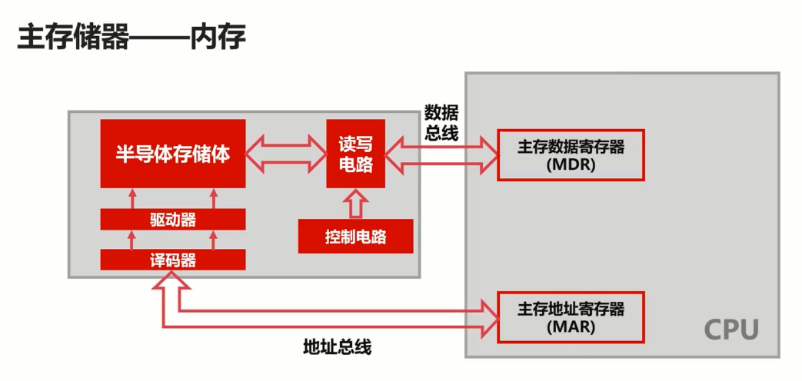

# 计算机

[TOC]

## 计算机的总线与 IO 设备

### 计算机的总线

#### 总线的概述

##### 总线的概述（是什么、什么用）

存在原因：解决不同设备之间的通信问题

生活实例，USB（Universal Serial Bus）总线作用有哪些？

-   提供了对外连接的接口
-   不同设备可以通过 USB 接口进行连接
-   连接的标准，促使外围设备接口的统一

##### 总线类型有哪些？

USB（Universal Serial Bus），PCI 总线，ISA 总线，Thunderbolt 总线

##### 出现背景？

总线出现前：各个设备直接之间都链接着一条线，通信起来非常麻烦，形成了一个分散连接的形式，新增的连接需要重新跟各个电路连接起来，这样又要重新设计电路，非常复杂。

出现后：输入设备直接连接到 IO 总线上，再与存储器，运算器，控制器连接，使线路结构更加清晰，更加容易梳理。

##### 总线的分类

###### 片内总线

意义：高集成度芯片内部的信息传输线，使用片内总线，大大简化电路结构

- 芯片内部的总线
- 寄存器与寄存器之间
- 寄存器与控制器、运算器之间

###### 系统总线

意义：连接系统外围设备的总线，CPU、主内存、IO设备、各组件之间的信息传输线

-   数据总线
    -   双向传输各个部件的数据信息
    -   数据总线的位数（总线宽度）是数据总线的重要参数
    -   一般与 CPU 位数相同（32位、64位）
-   地址总线
    -   指定 源数据 或 目的数据 在内存中的地址
    -   地址总线的位数与存储单元有关
    -   地址总线位数=n，寻址范围：0-2n
-   控制总线
    -   控制总线是用来发出各种控制信号的传输线
    -   控制信号经由控制总线从一个组件发给另外一个组件
    -   控制总线可以监视不同组件之间的状态（就绪/未就绪）

#### 总线的仲裁

##### 为什么需要总线仲裁?

当两个不同的设备同时就绪，发起交互方不知道该如何到达指定的设备，就会引起设备的冲突，总线仲裁就是**为了解决总线使用权的冲突问题**。

仲裁器：裁定不同设备使用总线优先数据问题

##### 总线仲裁的方法

-   链式查询
    -   好处：电路复杂度低，仲裁方式简单
    -   坏处：优先级低的设备难以获得总线使用权
    -   坏处：对电路故障敏感
-   计时器定时查询
    -   仲裁控制器对设备编号并使用计数器
    -   累计计数接收到仲裁信号后，往所有设备发出计数值
    -   计数值与设备编号一致则获得总线使用权
-   独立请求
    -   好处：响应速度快，优先顺序可动态改变
    -   坏处：设备连线多，总线控制复杂（相对前面）

### 计算机的输入/输出设备

#### 常见的输入输出设备

##### 字符输入设备

键盘

##### 图形输入设备

鼠标

##### 图像输出设备

CRT显示器

液晶显示器

#### 输入输出接口的通用设计

##### 输入数据需要哪些功能？

-   向设备发送数据？
-   读取数据？
-   设备有没有被占用？
-   设备是否已经启动？
-   设备是否已经连接？

##### 数据线

- 是 I/O 设备与主机之间进行数据交换的传送线
- 单向传输数据线
- 双向传输数据线

##### 状态线

- I/O 设备状态向主机报告的信号线
- 查询设备是否已经正常连接并就绪
- 查询设备是否已经被占用

##### 命令线

- CPU 向设备发送命令的信号线
- 发送读写信号
- 发送启动停止信号

##### 设备选择线

- 主机选择 I/O 设备进行操作的信号线
- 对连在总线上的设备进行选择

#### CPU 与 IO 设备的通信

前提：CPU 速度与 I/O 设备速度不一致

##### 程序中断

-   当外围 I/O 设备就绪时，向 CPU 发出中断信号
-   CPU 有专门的电路响应中断信号
-   提供低速设备通知 CPU 的一种异步的方式
-   CPU 可以高速运转同时兼顾低速设备的响应
-   坏处：如果出现频繁打断 CPU 处理，会造成一定的使用效率低下

##### DMA（直接存储器访问）

-   DMA 直接连接主存与 IO 设备
-   DMA 工作时不需要 CPU 的参与
-   当主存与 IO 设备交换信息时，不需要中断 CPU
-   可以提高 CPU 的效率

## 计算机的存储器

### 计算机的存储器概览

#### 存储器的分类

##### 按存储介质分类

-   半导体存储器
    -   内存
    -   U盘
    -   固态硬盘
-   磁存储器
    -   磁带
    -   磁盘

##### 按存取方式分类

###### 随机存储器（RAM）

- 随机读取

- 与位置无关

###### 串行存储器

- 与位置有关

- 按顺序查找

###### 只读存储器（ROM）

- 只读不写

#### 存储器的层次结构

- 读写速度，5400转，7200转

- 存储容量，2T，4G

- 价格
  - 划分依据：容量+价格=>位价：每比特位价格
- 根据位价划分

另一种层次

##### 缓存-主存层次

-   原理：局部性原理
-   实现：在 CPU 与主存之间增加一层速度快（容量小）的 Cache
-   目的：解决主存速度不足的问题，提高 CPU 内存交互效率

>   **局部性原理** 是指：CPU 访问存储器时，无论是存取指令还是存取数据，所访问的存储单元都趋于聚集在一个较小的连续区域中。

正是因为局部性原理的存在，缓存-主存才得以生效，缓存才能高效运行在计算机中

##### 主存-辅存层次

-   原理：局部性原理
-   实现：主存之外增加辅助存储器（磁盘、SD卡、U盘等）
-   目的：解决主存容量不足的问题

对于大型游戏的加载，主存-辅存的存在解决了主存容量不足的问题

### 计算机的主存储器与辅助存储器

>   计算机断电，内存数据丢失？
>   计算机断电，磁盘数据不会丢失？

#### 主存储器——内存

-   RAM（随机存取存储器：Random Access Memory）
-   RAM通过电容存储数据，必须隔一段时间刷新一次，刷新必须有电的存在
-   如果掉电，那么一段时间后将丢失所有数据

##### 对内存的支持

- 32位系统，232=4×230=4GB
- 64位系统，264=234×230=234GB

##### 内存如何与 CPU 进行交互？

过程：通过数据总线找数据地址，然后通过地址总线找数据，并在地址总线上交互数据。

#### 辅助存储器—磁盘

- 表面是可磁化的硬磁特性材料

- 移动磁头径向运动读取磁道信息

##### 数据寻找的几种算法

>   样例：读取内容磁道位置 1 4 2 3 1 5，磁头位于 4

-   先来先服务算法

    -   按顺序访问进程的磁道读写需求最短寻道时间优先

    -   行径：1 4 2 3 1 5

-   最短寻道时间优先算法

    -   与磁头当前位置有关
    -   优先访问离磁头最近的磁道
    -   行径：4 5 3 2 1 1

-   扫描算法（电梯算法）

    -   不公平
    -   每次只往一个方向移动
    -   到达一个方向需要服务的尽头再反方向移动
    -   行径：4 3 2 1 1 5
    
-   循环扫描算法

    -   相对公平
    -   可以两个方向进行读取
    -   到头了会重置到最初的位置
    -   行径：4 5 1 1 2 3

### 计算机的高速存储器

#### 高速缓存的工作原理

字：是指存放在一个存储单元中的二进制代码组合，可以表示一个数据，指令，字符串，存储单元的最小单位

子块：存储在连续的存储单元中而被看作是一个单元的一组字

>   一个字有32位，一个字块共B个字，主存共M个字块

- B \* M = 主存总字数
- B \* M * 32 = 主存总容量（bits）

##### 字的地址

-   字的地址包含两个部分
-   前 m 位指定字块的地址
-   后 b 位指定字在字块中的地址

##### 主存缓存的比较

- 存储的逻辑结构类似

- 缓存的容量较小

- 缓存的速度更快

##### CPU-缓存-主存工作

-   CPU需要的数据在缓存里
-   CPU需要的数据不在缓存里
-   不在缓存里的数据需要去主存拿

##### 性能衡量指标

-   命中率
    -   命中率是衡量缓存的重要性能指标
    -   理论上 CPU 每次都能从高速缓存取数据的时候，命中率为 1
    -   计算方式：访问 Cache 次数 / 访问主存次数+访问 Cache 次数

-   访问效率
    -   衡量缓存的性能指标
    -   计算方式：访问缓存时间 / 访问Cache-主存系统平均时间

#### 高速缓存的替换策略

>   出现背景：为了提高缓存命中率，就需要性能良好的缓存替换策略

高速缓存的替换时机：当高速缓存没有数据，需要从主存载入所需资源

##### 替换策略

-   随机算法
-   先进先出算法（FIFO）
    -   把高速缓存看做是一个先进先出的队列
    -   优先替换最先进入队列的字块
-   最不经常使用算法（LFU）
    -   优先淘汰最不经常使用的字块
    -   需要额外的空间记录字块的使用频率，频率低的进行替换
-   最近最少使用算法（LRU）
    -   优先淘汰一段时间内没有使用的字块
    -   有多种实现方法，一般使用双向链表
    -   把当前访问节点置于链表前面（保证链表头部节点是最近使用的）

## 计算机的CPU

### 计算机的指令系统3-7

#### 机器指令的形式

机器指令主要由两部分组成：操作码、地址码。样式：|操作码字段|地址码字段|

##### 操作码

-   操作码指明指令所要完成的操作
-   操作码的位数反映了机器的操作种类

##### 地址码

-   地址码直接给出操作数或者操作数的地址
-   分三地址指令、二地址指令和一地址指令
    -   三地址指令
        -   样式：|操作码(OP)|addr1|addr2|addr3|
        -   通常操作：(addr1)OP(addr2)->(addr3)
    -   二地址指令
        -   样式：|操作码(OP)|addr1|addr2|
        -   通常操作：(addr1)OP(addr2)->(addr1) 或者 (addr2)
    -   一地址指令
        -   样式：|操作码(OP)|addr1|
        -   通常操作：(addr1)OP->(addr1) 或者 (addr1)OP(ACC)->(addr1)
        -   自己对自己的操作，不需要第二个数据
        -   自身的操作
    -   零地址指令
        -   在机器指令中无地址码
        -   空操作、停机操作、中断返回操作等

#### 机器指令的操作类型

##### 数据传输

-   寄存器之间、寄存器与存储单元、存储单元之间传送
-   数据读写、交换地址数据、清零置一等操作

##### 算术逻辑操作

-   操作数之间的加减乘除运算
-   操作数的与或非等逻辑位运算

##### 移位操作

-   数据左移（乘2）、数据右移（除2）
-   完成数据在算术逻辑单元的必要操作

##### 控制指令

-   等待指令、停机指令、空操作指令、中断指令等

#### 机器指令的寻址方式

##### 指令寻址

-   顺序寻址
-   跳跃寻址

##### 数据寻址

-   立即寻址
    -   形式：操作码(OP)|addr1|6|
    -   指令直接获得操作数
    -   无需访问存储器
-   直接寻址
    -   形式：操作码(OP)|addr1|6|
    -   直接给出操作数在主存的地址
    -   寻找操作数简单，无需计算数据地址
    -   根据 addr 去主存中寻找操作数
-   间接寻址
    -   形式：操作码(OP)|R1|addr2
    -   指令地址码给出的是操作数地址的地址
    -   需要访问一次或多次主存来获取操作数
    -   根据 addr2 的地址找到操作数地址再在主存内找到操作数

##### 三种寻址方式优略比较

| 寻址方式 | 优点             | 缺点                         |
| -------- | ---------------- | ---------------------------- |
| 立即寻址 | 速度快           | 地址码位数限制操作数表示范围 |
| 直接寻址 | 寻找操作数简单   | 地址码位数限制操作数寻址范围 |
| 间接寻址 | 操作数寻址范围大 | 速度较慢                     |

### 计算机的控制器

-   程序计数器
    -   程序计数器用来存储下一条指令的地址
    -   循环从程序计数器中拿出指令
    -   当指令被拿出时，指向下一条指令
    -   主要功能：给其他控制单元当前需要执行指令的地址
-   时序发生器
    -   电气工程领域，用于发送时序脉冲
    -   CPU 依据不同的时序脉冲有节奏的进行工作
-   指令译码器
    -   指令译码器是控制器的主要部件之一
    -   计算机指令由操作码和地址码组成
    -   翻译操作码对应的操作以及控制传输地址码对应的数据
-   各种寄存器
    -   指令寄存器
        -   指令寄存器也是控制器的主要部件之一
        -   从主存或高速缓存取计算机指令
    -   主存数据寄存器
        -   保存当前CPU正要访问的内存单元的地址
        -   与数据总线交互
    -   主存数据寄存器
        -   保存当前CPU正要读或写的主存数据
    -   通用寄存器
        -   用于暂时存放或传送数据或指令
        -   可保存ALU的运算中间结果
        -   容量比一般专用寄存器要大
-   总线

### 计算机的运算器

主要功能：运算器是用来进行数据运算加工的

-   数据缓冲器
    -   分为输入缓冲和输出缓冲
    -   输入缓冲暂时存放外设送过来的数据
    -   输出缓冲暂时存放送往外设的数据
    -   如果 ALU 正在计算数据就会存放在这里
-   ALU
    -   ALU：算术逻辑单元，是运算器的主要组成
    -   常见的位运算（左右移、与或非等）
    -   算术运算（加减乘除等）
    -   
-   通用寄存器
    -   存放运算状态（条件码、进位、溢出、结果正负等）
    -   存放运算控制信息（调试跟踪标记位、允许中断位等）
-   状态字寄存器
    -   用于暂时存放或传送数据或指令
    -   可保存ALU的运算中间结果
    -   容量比一般专用寄存器要大

-   总线

### 指令执行过程

#### 指令执行过程

1.  取指令
    -   从缓存取指令
    -   送到指令寄存器
2.  分析指令
    -   指令译码器译码
    -   发出控制信号
    -   程序技术器 +1
3.  执行指令
    -   转载数据到寄存器
    -   ALU 处理数据
    -   记录运算状态
    -   送出运算结果

弊端：取指令和分析指令是在控制器操作的，执行指令是在运算器上执行的，这样造成了 CPU 的综合利用率不高。

#### CPU的流水线设计

-   类似工厂的装配线
-   工厂的装配线使得多个产品可以同时被加工
-   在同一个时刻，不同产品均位于不同的加工阶段

##### 操作方式

| 方式   |          |          |          |      |      |
| ------ | -------- | -------- | -------- | ---- | ---- |
| 取指令 | 分析指令 | 执行指令 |          |      |      |
|        | 取指令   | 分析指令 | 执行指令 |      |      |
|        |          | 取指令   | 分析指令 | 执行指令 |      |

##### 效率提升

串行m条：T1 = 3t x m

流水线执行m条：T2 = t x (m + 2)

效率提升 H = T2/T1 = 1/3 + 1/3m，m越大，效率越高