# 计算机组成原理之计算

[TOC]

## 进制运算的基本知识

### 进制运算的基础

#### 进制概述

##### 进制的定义

-   进位制是一种记数方式，亦称进位计数法或位值计数法
-   有限种数字符号来表示无限的数值
-   使用的数字符号的数目称为这种进位制的基数或底数

##### 概述

-   计算机喜欢二进制，但是二进制表达太长了

-   使用大进制位可以解决这个问题论

-   八进制、十六进制满足2的n次方的要求

>   1024=0b1000000000
>   1024=0o2000
>   1024=0×400

##### 常见的进制

###### 二十进制

-   玛雅文明的玛雅数字
-   因努伊特的因努伊特数字

###### 六十进制

-   时间、坐标、角度等量化数据

###### 十六进制

-   [0-9]和A、B、C、D、E、F

###### 八进制&十六进制

#### 二进制运算的基础

##### 整数转换

-   二进制转十进制：按权展开法
-   （整数）十进制转换二进制：重复相除2法取余数，从下往上罗列

##### 小数转换

-   二进制转十进制：按权展开法
    -   注意这里，指数是从小数点开始计算，-1，-2...
-   （小数）十进制转换二进制：重复相乘2法，从上往下罗列

## 二进制数据的表示方法

### 有符号数与无符号数

#### 原码表示法

-   使用0表示正数、1表示负数
-   规定符号位位于数值第一位
-   表达简单明了，是人类最容易理解的表示法

##### 存在问题

>   原码进行运算非常复杂，特别是两个操作数符号不同的时候

-   判断两个操作数绝对值大小
-   使用绝对值大的数减去绝对值小的数
-   对于符号值，以绝对值大的为准

##### 需要升级的地方

-   希望找到不同符号操作数更加简单的运算方法
-   希望找到使用正数代替负数的方法
-   使用加法操作代替减法操作，从而消除减法，从而简化运算

### 二进制的补码表示法

#### 定义如下

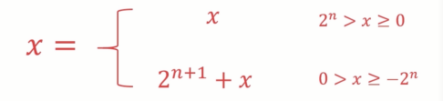

#### 相对优势

-   希望找到不同符号操作数更加简单的运算方法
-   希望找到使用正数代替负数的方法

#### 弊端

-   在计算补码的过程中，还是使用了减法！！

### 二进制的反码表示法

#### 定义如下

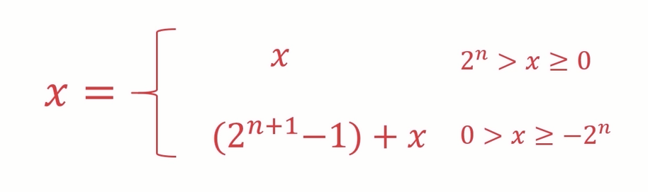

#### 原码，补码，反码之间的关系

-   负数的反码等于原码除符号位外按位取反
-   负数的补码等于反码+1

### 小数的二进制补码表示

#### 定义如下

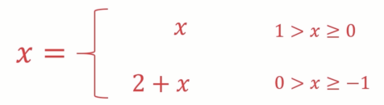

案例如下

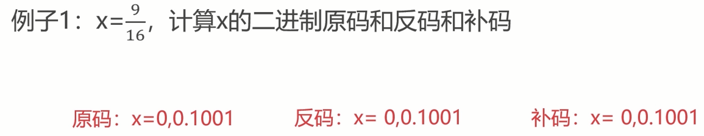

## 二进制数据的运算

### 定点数与浮点数

#### 定点数的表示方法

-   小数点固定在某个位置的数称之为定点数
-   分为：纯小数，纯整数
    -   纯小数
    -   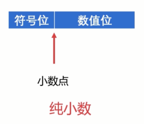
    -   纯整数
    -   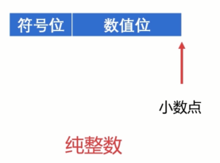
-   如果非纯小数或者纯整数，乘以比例因子以满足定点数保存格式浮点数的表示方法，以满足定点数的格式要求

#### 浮点数的表示格式

>   为什么需要浮点数？
>
>   -   计算机处理的很大程度上不是纯小数或纯整数
>   -   数据范围很大，定点数难以表达，不够灵活

##### 浮点数的表示格式

N = S x rj

S：尾数，r：基数，j：阶码

保存样式：阶码符号位|阶码数值位|尾数符号位|尾数数值位

PS：**尾数规定使用纯小数**

##### 浮点数的表示范围

-   超出范围的称为溢出
    -   上溢：这个数用绝对值表示时太大了，浮点数无法表示
    -   下溢：这个数用绝对值表示时太小了，浮点数无法表示

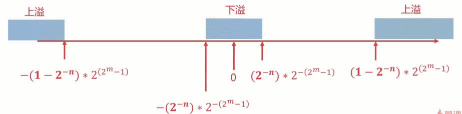

-   单精度浮点数：使用4字节、32位来表达浮点数（float）

-   双精度浮点数：使用8字节、64位来表达浮点数（double）

##### 浮点数的规格化

###### 要求

-   尾数规定使用纯小数
-   尾数最高位必须是1

###### 例子

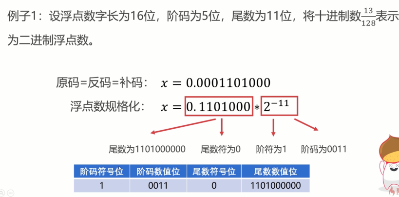

#### 定点数与浮点数的对比

-   当定点数与浮点数位数相同时，浮点数表示的<u>范围更大</u>
-   当浮点数尾数为规格化数时，浮点数的<u>精度更高</u>
-   浮点数运算包含阶码和尾数，浮点数的运算更为复杂
-   浮点数在数的表示范围、精度、溢出处理、编程等方面均优于定点数
-   浮点数在数的运算规则、运算速度、硬件成本方面不如定点数
-   浮点数使用更广，定点数使用在低成本的机器上

### 定点数的加减法运算

#### 加法规则如下

>   数值位与符号位一同运算，并将符号位产生的进位自然丢掉

-   整数加法
    -   A[补] + B[补] = [A+B\]\[补](mod2n+1)

-   小数加法
    -   A[补] + B[补] = [A+B\]\[补](mod2)

例子

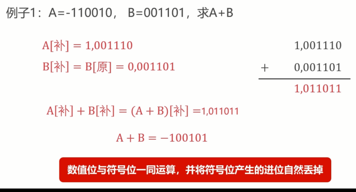

>   Python 推算
>
>   a = int(‘0b1101101’, 2)
>
>   b = int(‘0b001101’, 2)
>
>   a + b ?= int(‘result’, 2)

#### 判断溢出

双符号位判断法

-   单符号位表示变成双符号位：0=>00，1=>11
-   双符号位产生的进位丢弃
-   结果的双符号位不同则表示溢出

-   例子
    -   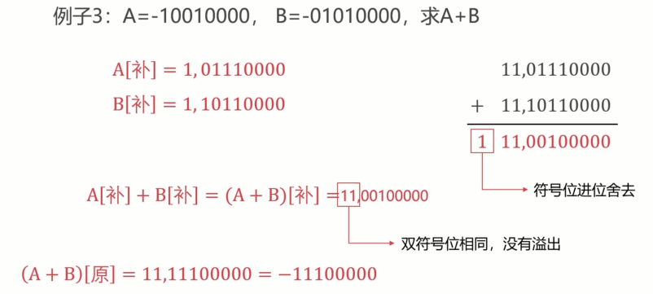定点数的加减法运算

#### 减法规则如下

>   -B[补]等于B[补]连同符号位按位取反，末位加一
>
>   如：B[补]=1，0010101（-B）[补]=0，1101011

-   整数减法
    -   A[补] - B[补] = A + (-B)\[补](mod2n+1)

-   小数减法
    -   A[补] - B[补] = A + (-B)\[补](mod2)

### 浮点数的加减法运算

>   总体流程：对阶—>尾数求和—>尾数格式化—>舍入—>溢出判断
>
>   完整流程演示：12.20开始

#### 对阶

-   对阶的目的：使得两个浮点数阶码一致，使得尾数可以进行运算
-   浮点数尾数运算简单
-   浮点数位数实际小数位与阶码有关Error
-   阶码按小阶看齐大阶的原则，小阶尾数数值位右移，阶码数值位加上右移位数

#### 尾数求和

-   使用补码进行运算

-   减法运算转化为加法运算：A - B = A +（-B）

#### 尾数格式化

>   需要进行操作的前提：符号位与最高位不一致

-   对补码进行规格化需要判断两种情况：S>0 和 S<0
    -   S[补]=00.1xxxxxx（S>0）
    -   S[补]=11.0xxxxxx（S<0）
-   如果不满足此格式，需要进行左移，同时阶码相应变化，以满足规格化
-   尾数规格化（右移）
    -   一般情况下都是左移
    -   双符号位不一致下需要右移（定点运算的溢出情况）
    -   右移的话则需要进行**舍入**操作

#### 舍入

-   “0舍1入"法（二进制的四舍五入）
-   这里针对的是尾数数值位操作

#### 溢出判断

-   定点运算双符号位不一致为溢出
-   浮点运算尾数双符号位不一致不算溢出（因为尾数双符号位可以进行右规）
-   浮点运算主要通过阶码的双符号位判断是否溢出
-   如果规格化后，阶码双符号位不一致，则认为是溢出

#### 整体流程 

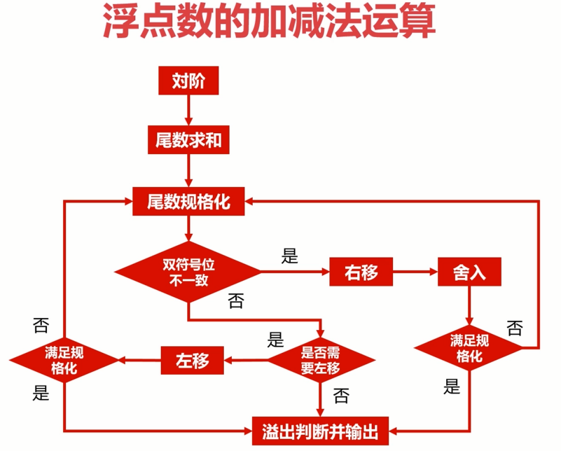

### 浮点数的乘除法运算

#### 规则如下

乘法：阶码相加，尾数求积

除法：阶码相减，尾数求商

阶码运算—>尾数运算—>尾数规格化—>舍入—>溢出判断