# 计算机网络-概述

[TOC]

## 计算机网络概述

### 发展历史

#### 互联网的发展历史

##### 第一阶段：单个网络 ARPANET

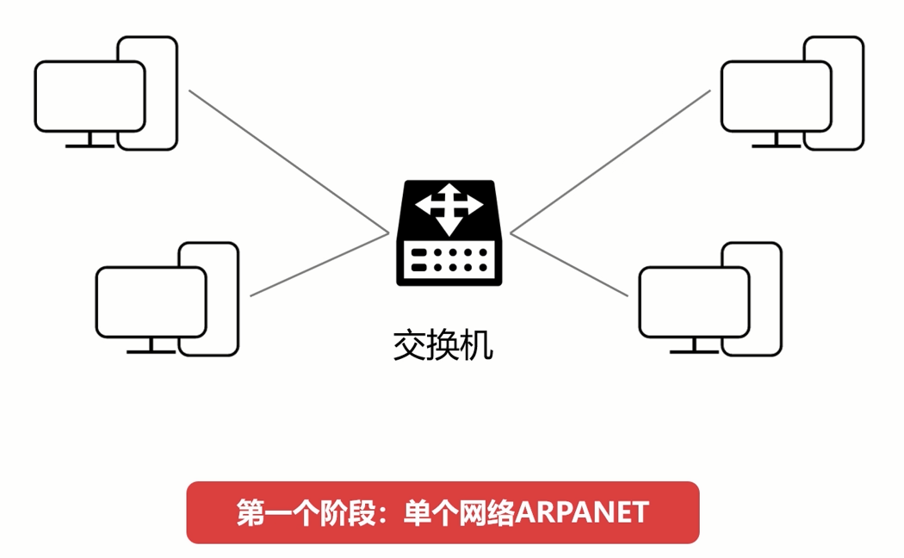

##### 第二阶段：三级结构互联网

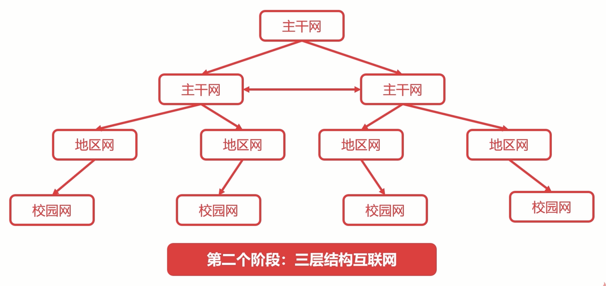

-   ISP（Internet Service Provider）：网络服务提供商

-   中国电信、中国移动、中国联通等

##### 第三阶段：多层次 ISP 互联网

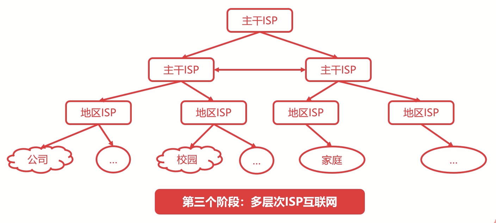

### 中国互联网的发展简史

-   1980 年开始互联网实验
-   1989 年第一个公共网络建立运行
-   1994 接入国际互联网

#### 目前中国最大的几个公用网络

-   中国电信互联网 CHINANET

-   中国联通互联网 UNINET

-   中国移动互联网 CMNET

-   中国教育与科研计算机网 CERNET

-    中国科学技术网 CSTNET

#### 互联网企业发展史

-   1996年，张朝阳创建搜狐
-   1997年，丁磊创建网易
-   1998年，王志东创建新浪
-   1998年，马化腾、张志东创建腾讯
-   1999年，马云创建阿里巴巴
-   2000年，李彦宏创建百度

### 层次结构

#### 层次结构设计的基本原则

>   计算机  A <- 数据通路 -> 计算机 B 

##### 为什么需要分层？

>   分层实现不同的功能

-   保证数据通路顺畅
-   目的计算机状态
-   识别目的计算机
-   数据是否错误

##### 用户接触的网络

网络应用数据 -> 视频、文件、游戏数据

可靠通信 -> 数据错误、重复

物理网络接入 -> 光电等物理特性

##### 分层要求

-   各层之间是相互独立的
-   每一层要有足够的灵活性
-   各层之间完全解耦

#### OSI 七层模型

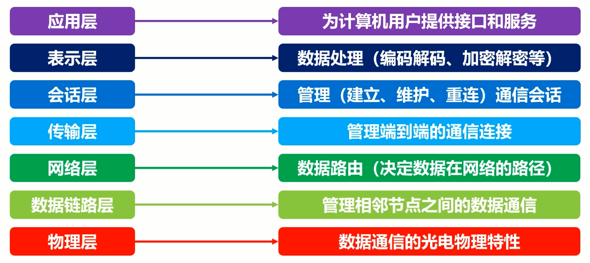

##### OSI 的发展进程

-   OSI 欲成为全球计算机都遵循的标准
-   OSI 在市场化过程中困难重重，TCP/IP 在全球范围成功运行
-   OSI 最终并没有成为广为使用的标准模型

OSI 未成为标准的原因？

-   OSI 的专家缺乏实际经验
-   OSI 标准制定周期过长，按 OSI 标准生产的设备无法及时进入市场
-   OSI 模型设计的并不合理，一些功能在多层中重复出现

#### TCP/IP 四层模型

##### 相比 OSI 模型

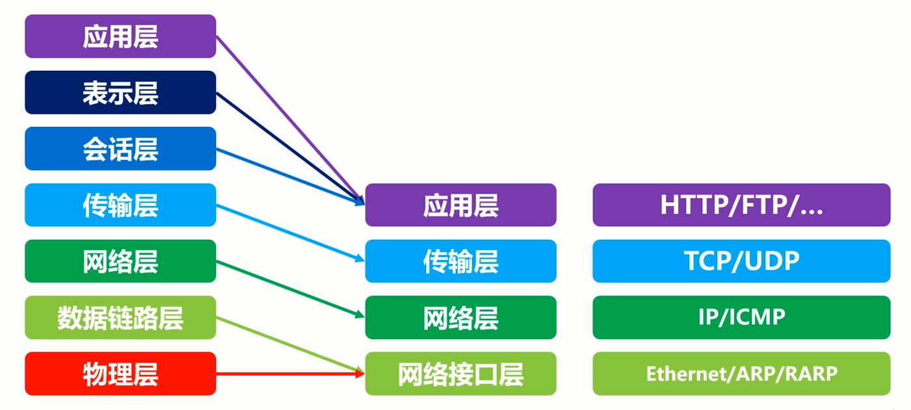

##### 两台计算机交互流程

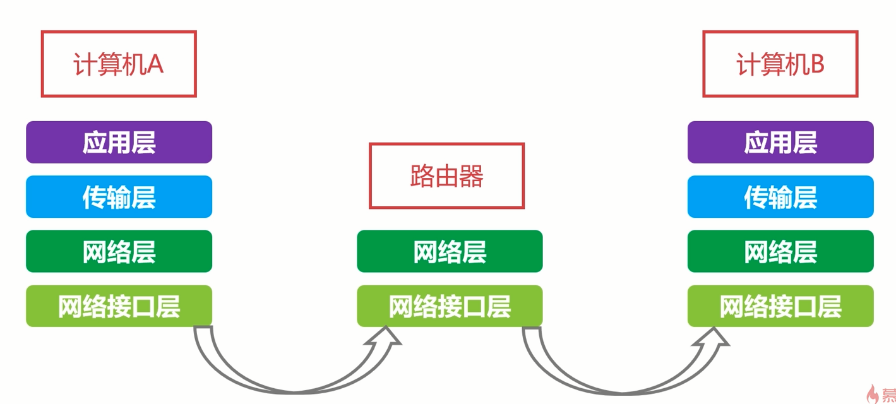

##### TCP/IP 模型形状

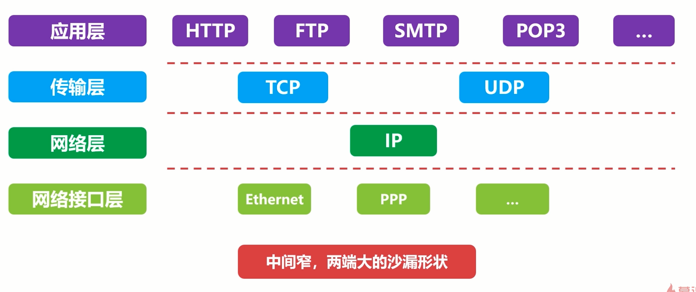

### 网络拓补

#### 边缘部分

##### 家庭

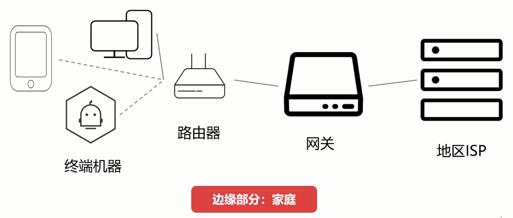

##### 企业

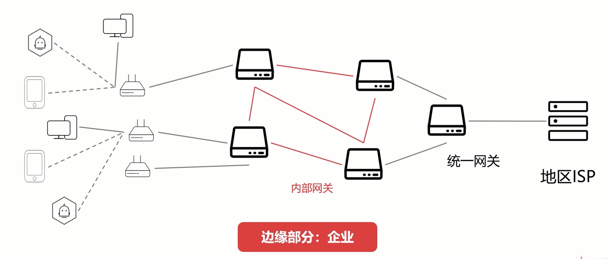

#### 核心部分

##### 小部分

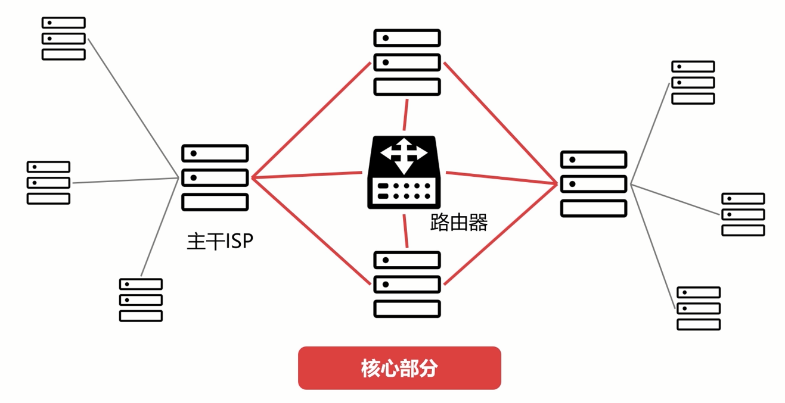

##### 大部分

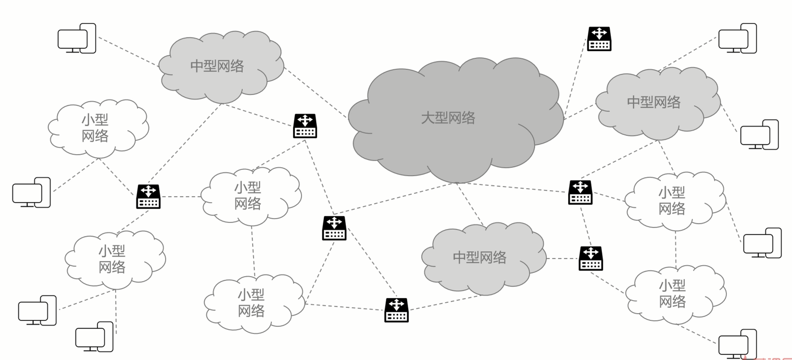

#### 核心部分和边缘部分合并

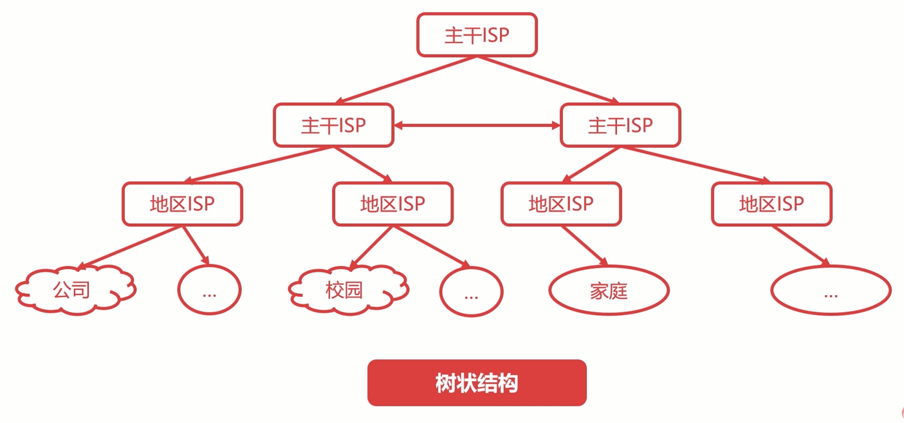

##### 客户-服务器（C/S）模式

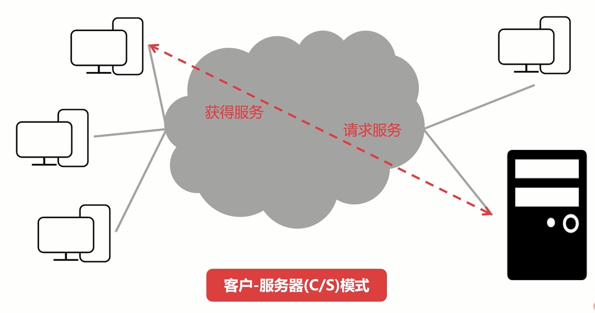

##### 对等连接 P2P 模式

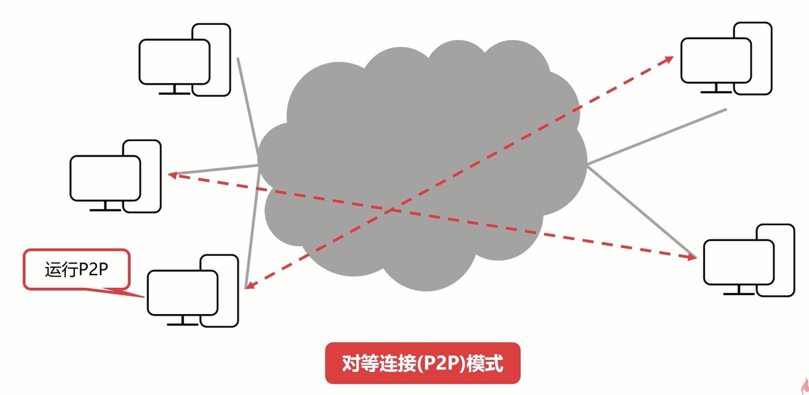

### 性能指标

>   学习评估和判断网络的性能方法

#### 存储单位

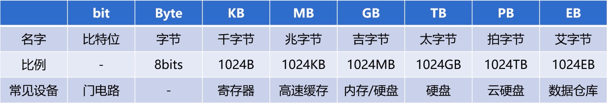

速率：bps = bit/s

#### 网络单位

网络常用单位为（Mbps）

100M/s = 100Mbps = 100Mbit/s

100Mbit/s =（100/8）MB/s = 12.5MB/s

#### 时延

>   总时延 = 发送时延 + 排队时延 + 传播时延 + 处理时延

##### 发送时延

- 发送时延 = 数据长度（bit）/ 发送送速率（bit/s）

- 受限于计算机网卡

##### 传播时延

- 传播时延 = 传输路径距离 / 传播速率（bit/s）

- 受限于传输介质

##### 排队时延

- 数据包在网络设备中等待被处理的时间

##### 处理时延

- 数据包到达设备或者目的机器被处理所需要的时间

#### 往返时间 RTT

- RTT（Route-Trip Time）是评估网络质量的一项重要指标

- RTT 表示的是数据报文在端到端通信中的来回一次的时间

- 通常使用 ping 命令查看 RTT

## 物理层

### 物理层概述

#### 物理层的作用

##### 连接不同的物理设备

**传输介质**

###### 双绞线

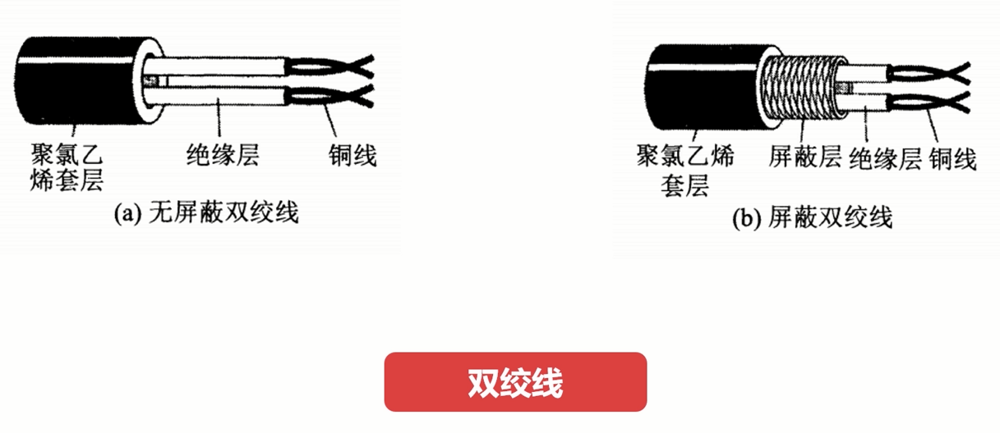

###### 同轴电缆

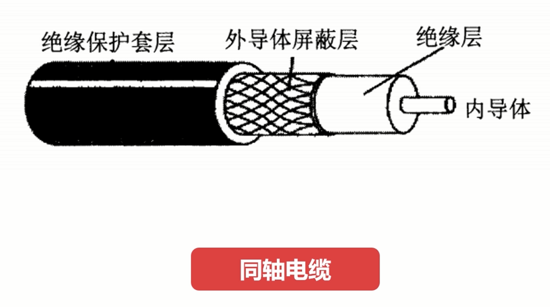

###### 光纤

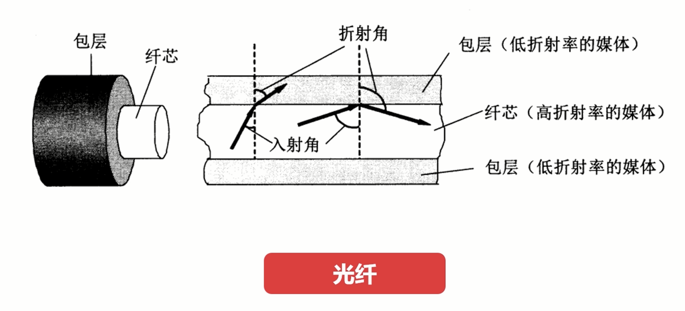

###### 红外线

###### 无线

###### 激光

###### 比特流

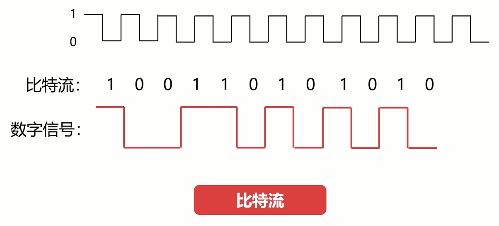

##### 传输比特流

##### 物理特性

- 机械特性

- 电气特性

- 功能特性

- 过程特性

#### 信道的基本概念

- 信道是往一个方向传送信息的媒体

- 一条通信电路包含一个接收信道和一个发送信道

提问：发送和接收会不会冲突？冲突了怎么办？

##### 单工通信信道

- 只能一个方向通信，没有反方向反馈的信道

- 有线电视、无线电收音机等等

##### 半双工通信信道

- 双方都可以发送和接收信息

- 不能双方同时发送，也不能同时接收

##### 全双工通信信道

- 双方都可以同时发送和接收信息

#### 分用-复用技术

>   出现原因：多个计算机进行交互并不是都处于活跃状态，导致信道的利用效率不高

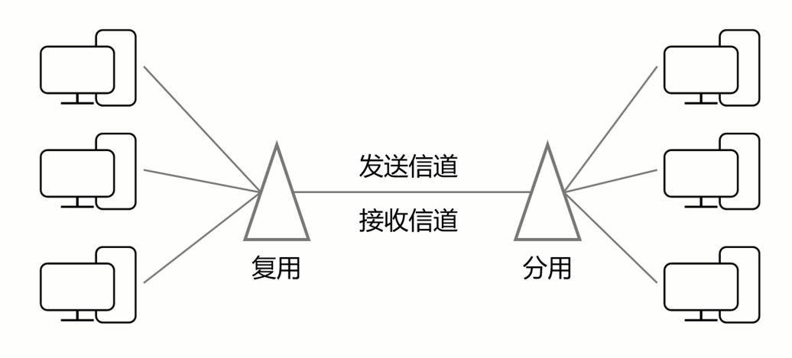

具体的分用-复用物理层已经帮我们实现，具体细节不必理会

那具体使用哪些技术?

>   都应用在物理层

频分复用

时分复用

波分复用

码分复用

## 数据链路层

### 数据链路层概述

#### 封装成帧

>   物理层才不管你“帧”不“帧”，只关注比特流传输

- “帧”是数据链路层数据的基本单位

- 发送端在网络层的一段数据前后添加特定标记形成“帧”

- 接收端根据前后特定标记识别出“帧”

##### 帧模型

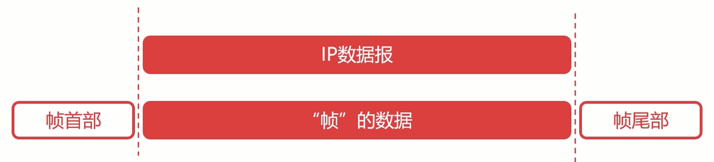

-   帧首部和尾部是特定的控制字符（特定比特流）
-   标记符号
    -   SOH:00000001
    -   EOT:00000100

数据里面恰好有这些比特流咋办？透明传输有解

#### 透明传输*

-   "透明”在计算机领域是非常重要的一个术语
-   “一种实际存在的事物却又看起来不存在一样”
-   “即是控制字符在帧数据中，但是要当做不存在的去处理”

怎么处理？转义！

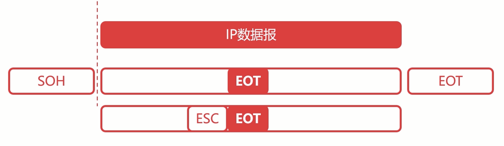

-   编程语言中"\"一般为转义字符
-   "\n"、"\t"等控制字符
-   "\\"、"\\\\"

#### 差错监测

-   物理层只管传输比特流，无法控制是否出错
-   数据链路层负责起“差错监测”的工作
    -   怎么差错检测，涉及网络层内容

### 差错检测

#### 奇偶校验码

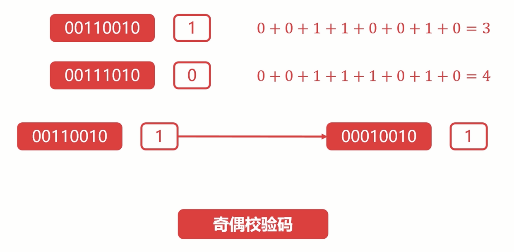

##### 弊端

出错两位，奇偶校验码校测不到错误

#### 循环冗余校验码 CRC

-   一种根据传输或保存的数据而产生固定位数校验码的方法

-   检测数据传输或者保存后可能出现的错误

-   生成的数字计算出来并且附加到数据后面

>   模“2”除法
>
>   模“2”除法是二进制下的除法
>
>   与算术除法类似，但除法不借位，实际是“异或”操作（异或：同值得0，反之得1）

-   选定一个用于校验的多项式G（x），并在数据尾部添加 r 个0
-   将添加 r 个 0 后的数据，使用 模“2"除法 除以多项式的位串
-   **得到的余数**填充在**原数据 r 个 0 的位置**得到可校验的位串

##### 计算过程

第一步：

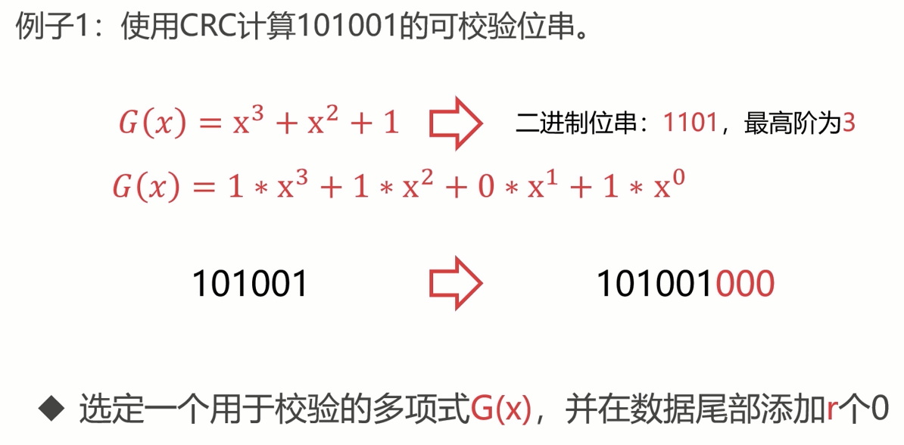

第二步：

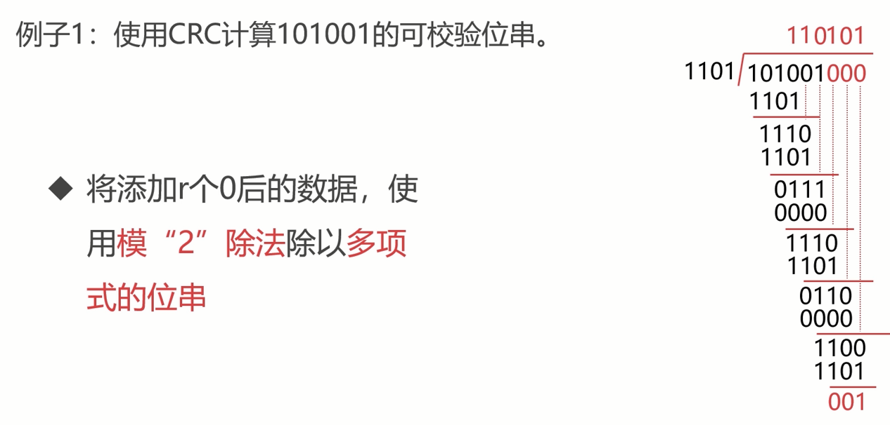

第三步：

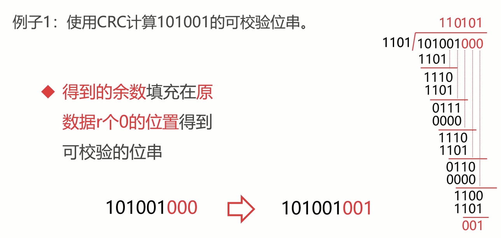

##### 接收端校验

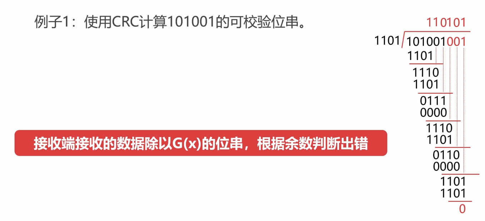

-   CRC的错误检测能力与位串的阶数 r 有关
-   数据链路层只进行数据的检测，不进行纠正

>   注意，阶数 r 为 1 的时候退化为奇偶校验位

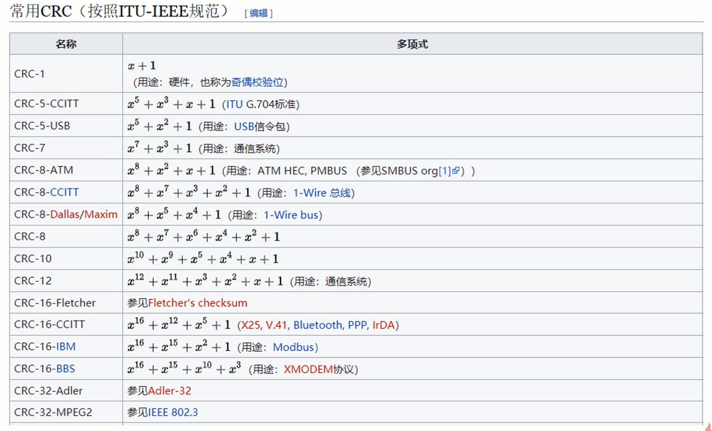

### 最大传输单元MTU

#### MTU

-   最大传输单元 MTU（Maximum Transmission Unit）

-   数据链路层的数据帧也不是无限大的

>   受限于底层物理硬件

-   数据帧过大或过小都会影响传输的效率

-   以太网 MTU 一般为 1500 字节

#### 路径 MTU

- 路径 MTU 由链路中 MTU 的最小值决定

### 以太网协议

#### MAC地址

-   MAC 地址（物理地址、硬件地址）
-   每一个设备都拥有唯一的 MAC 地址（设备的身份证号）
-   MAC 地址共 48 位，使用十六进制表示

#### 以太网协议

-   以太网（Ethernet）是一种使用广泛的局域网技术
-   以太网是一种应用于数据链路层的协议
-   使用以太网可以完成相邻设备的数据帧传输

##### 数据格式

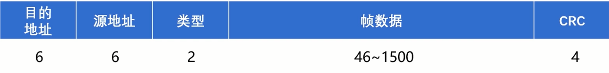

>   6 的含义：一个MAC 地址 48 位，1个字节8个比特位，48/8=6，表示6个字节

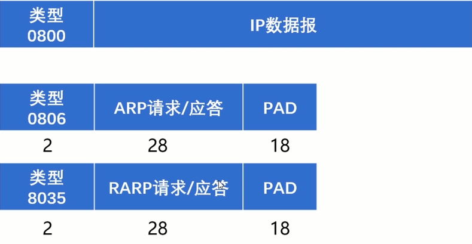

##### MAC地址表

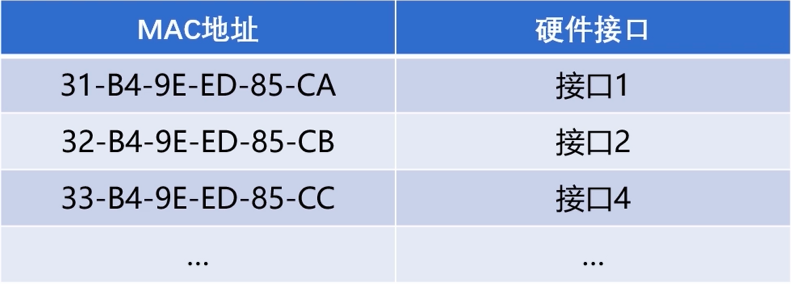

##### 过程

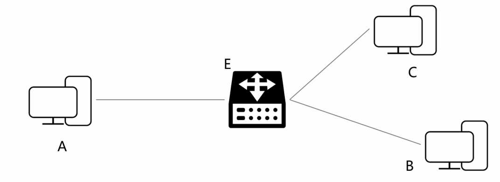

###### MAC 地址表有全部 MAC 地址对应接口信息

-   A 通过网卡发出数据帧

-   数据帧到达路由器，路由器取出前 6 字节

-   路由器匹配 MAC 地址表，找到对应的网络接口

-   路由器往该网络接口发送数据帧

-   ###### MAC 地址表存在 MAC 地址对应的接口未知

-   E 检查 MAC 地址表，发现没有 C 的信息
-   E 将广播A的数据包到除 A 以外的端口
-   E 将收到来自 B、C 的回应，并将地址记录

提问：A怎么跨设备传输数据到C？