# 计算机网络-网络层

[TOC]

## 网络层IP协议相关

### IP协议

#### 虚拟互连网络

-   实际的计算机网络是错综复杂的
-   物理设备通过使用 IP 协议，屏蔽了物理网络之间的差异
-   当网络中的主机使用 IP 协议连接时，则无需关注网络细节

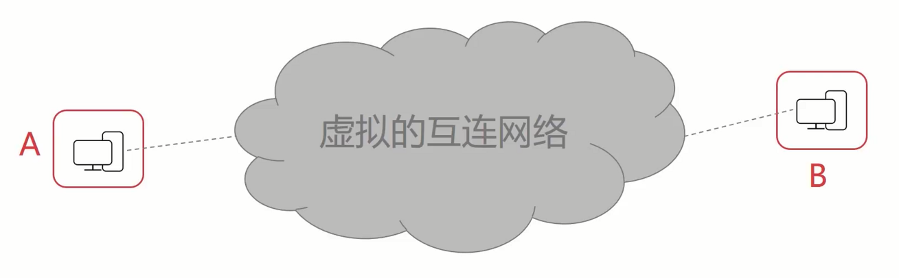

-   IP 协议使得复杂的实际网络变为一个虚拟互连的网络
-   IP 协议使得网络层可以屏蔽底层细节而专注网络层的数据转发
-   IP 协议解决了在虚拟网络中数据报传输路径的问题

#### IP协议

##### 表示方式

>   使用点分十进制

-   MAC地址是永久固定的
-   IP地址会因网络环境而发生改变

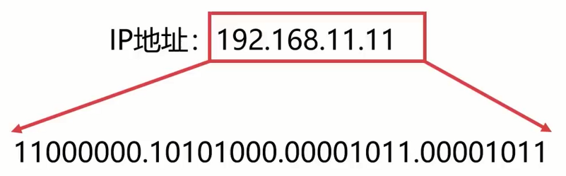

-   IP地址长度为32位，常分成 4 个 8 位

-   IP地址常使用点分十进制来表示（0\~255.0\~255.0\~255.0\~255）

-   最大可以表示：232 = 4294961296

##### IP数据报划分

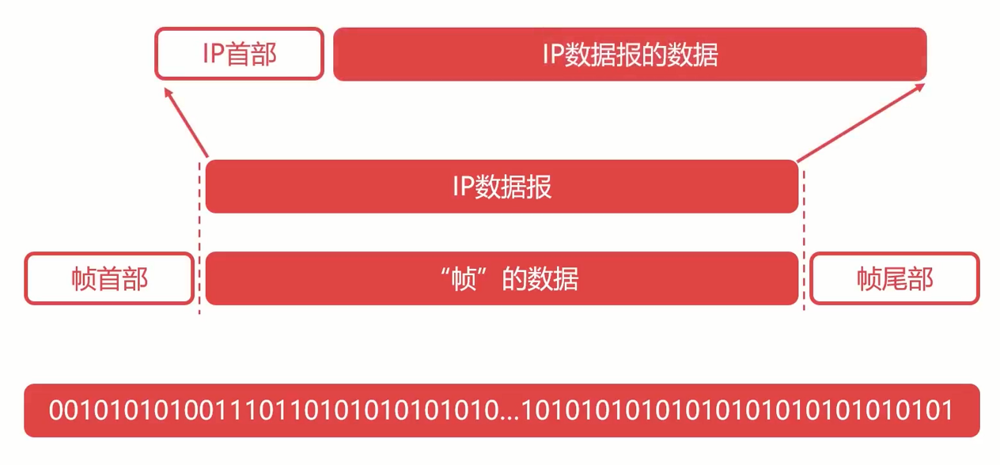

##### IP数据报具体内容

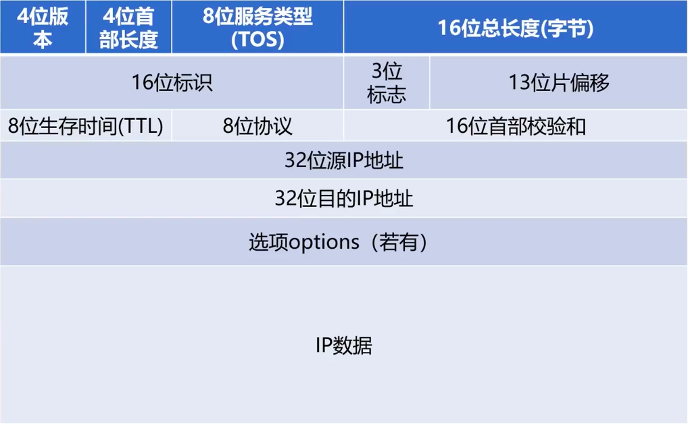

-   **版本**：占4位，指的是IP协议的版本，通信双方的版本必须一致，当前主流版本是4，即IPV4，也有IPv6
-   **首部位长度**：占4位，最大数值为15，表示的是IP首部长度，单位是“32位字”（4个字节），也即是IP首部最大长度为60字节
-   **总长度**：占16位，最大数值为65535，表示的是IP数据报总长度（IP首部+IP数据）
    -   数据链路层MTU最多可以发送1500字节的内容，如果IP数据报内容过长，会拆分成多个数据帧进行传输
-   标识
-   标志，标记是否可以拆分数据报
-   片偏移，记录的是本帧是拆分的第几个数据
-   **TTL**：占8位，表明IP数据报文在网络中的寿命，每经过一个设备，TTL减1，当TTL=0时，网络设备必须丢弃该报文
    -   解决问题：当数据报文找不到终点时候，避免报文无限流通，消耗带宽，为此而设置寿命
-   协议：占8位，表明IP数据所携带的具体数据是什么协议的（如：TCP、UDP等）

-   首部校验和：占16位，校验IP首部是否有出错

### IP协议转发流程

#### 逐跳（hop-by-hop）

不断跳跃到下一个媒介，以达到最终的目标主机

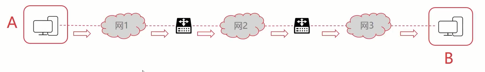

#### 路由表简介

##### 回顾

>   重点关注路由表的作用

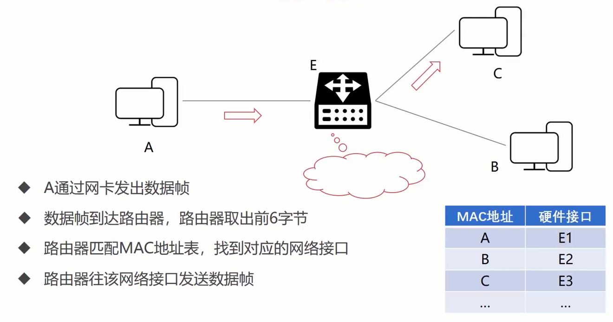

#### IP协议的转发流程

##### 转发方法如下

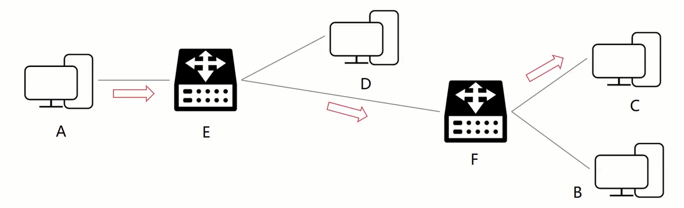

-   A 发出目的地为 C 的 IP 数据报，查询路由表发现下一跳为 E 
-   A 将数据报发送给 E 
-   E 查询路由表发现下一跳为 F，将数据报发送给 F 
-   F 查询路由表发现目的地 C 直接连接，将数据报发送给 C

##### 配合路由表进行

>   网络层告知目的 MAC 地址都是查询ARP缓存得出来的

###### 第一步

-   A 发出目的地为 C 的 IP 数据报，查询路由表发现下一跳为 E
-   A 将 IP 数据报交给数据链路层，并告知目的 MAC 地址是 E
-   数据链路层填充源 MAC 地址 A 和目的 MAC 地址 E
-   数据链路层通过物理层将数据发送给 E

###### 第二步

-   E 的数据链路层接收到数据帧，把帧数据交给网络层
-   E 查询路由表，发现下一跳为 F 
-   E 把数据报交给数据链路层，并告知目的 MAC 地址为 F 
-   E 的数据链路层封装数据帧并发送

###### 第三步

-   F 的数据链路层接收到数据帧，把帧数据交给网络层
-   F 查询路由表，发现下一跳为 C 
-   F 把数据报交给数据链路层，并告知目的 MAC 地址为 C 
-   F 的数据链路层封装数据帧并发送

##### 注意点

-   数据帧每一跳的MAC地址都在变化
-   IP数据报每一跳的IP地址始终不变

### 子网划分

为什么需要子网划分？

IP地址最多可以划分：232 = 4294961296，规划和分配IP地址非常麻烦，所以才需要进行一定的规划

#### 分类的IP地址

##### 根据网络号+主机号划分

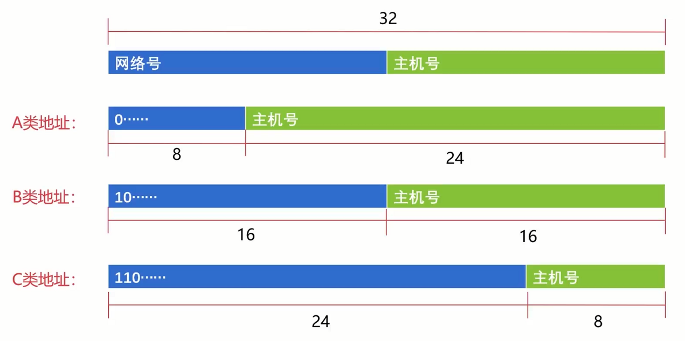

>   D，E 仅作为特殊地址

##### 根据ABC类地址运算

>   注意：这里是除去特殊主机号和特殊网络号

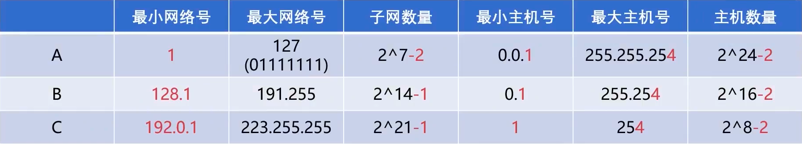

##### 特殊主机号

-   主机号全0表示当前网络段，不可分配为特定主机
-   主机号为全1表示广播地址，向当前网络段所有主机发消息
-   1.2.3.4
    -   1.0.0.0
    -   1.255.255.255

##### 特殊的网络号

-   A类地址网络段全0（00000000）表示特殊网络
-   A类地址网络段后7位全1（01111111：127）表示回环地址
-   B类地址网络段（10000000.00000000：128.0）是不可使用的
-   C类地址网络段（192.0.0）是不可使用的

##### 地址类型推算演示

>   先转换为二进制，再根据前八位推算

125.125.3.6->001111101

163.70.31.23->10100011

210.36.127.11->11010010

##### 本地回环

127.0.0.1，通常被称为本地回环地址（Loopback Address），不属于任何一个有类别地址类。它代表设备的本地虚拟接口，所以默认被看作是永远不会宕掉的接口。在Windows操作系统中也有相似的定义，所以通常在安装网卡前就可以ping通这个本地回环地址。一般都会用来检查本地网络协议、基本数据接口等是否正常的。

#### 划分子网

某公司拥有256名员工，每人配备一个计算机，请问该公司应该申请哪种网络段？

答：申请 193.10.10.0，这个可以拥有 254 个主机号（子网划分后使用 193.10.10.128）

某公司拥有256名员工，每人配备一个计算机，请问该公司应该申请哪种网络段？

答：申请 190.17.0.0，这个可以拥有 N 个主机号，造成了很大的地址浪费

所以，为避免集体网络浪费大量无用的地址空间，在分类IP地址基础之上，提出了划分子网的概念

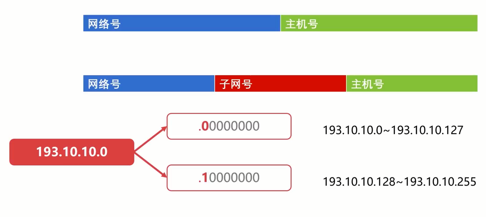

子网号这么多...

##### 如何快速判断某个IP的网络号？

###### 子网掩码

-   子网掩码和IP地址一样，都是32位
-   子网掩码由连续的1和连续的0组成
-   某一个子网的子网掩码具备网络号位数个连续的1

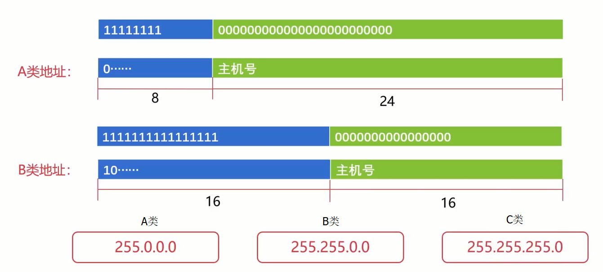

###### 例子演示定位网络号

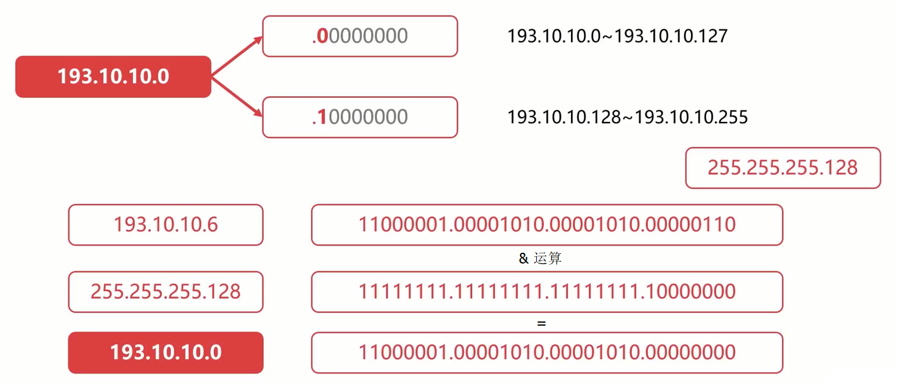

#### 无分类编址CIDR

CIDR中没有A、B、C类网络号、和子网划分的概念
CIDR将网络前缀相同的IP地址称为一个“CIDR地址块"

网络前缀是任意位数的

##### 斜线记法

-   193.10.10.129/25
    -   11000001.00001010.00001010.10000001

##### 具体划分表格

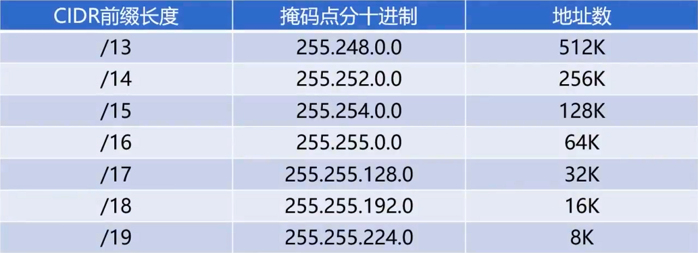

-   子网掩码和地址的计算都是跟子网划分的一致
-   除了网络前缀和网络号不同之外，特殊的主机号、特殊的网路号和特殊的地址号**限制都是通用的**

##### 优势

-   相比原来子网划分更加灵活，现实使用更广泛
-   但也需要学习分类的IP地址，子网划分，以便更好的理解CIDR

##### 回顾前面分配网络段

100名员工，使用  /25

100名员工，但划分为两个部门，使用 两个 /25 的小型网络搭配一个 /24 的中型网络

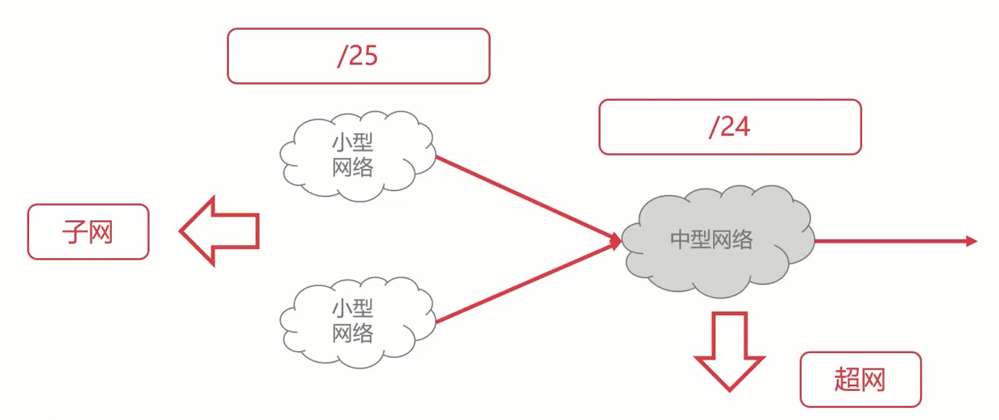

更大的划分

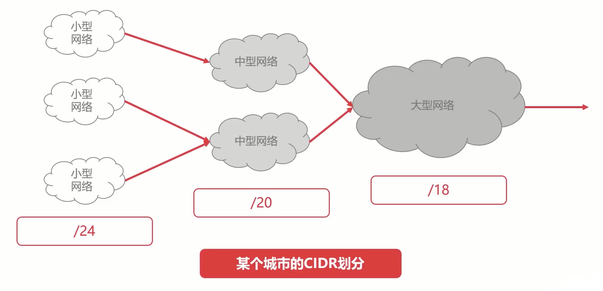

### 简单路由过程

## 网络层其他协议

### ARP协议与RARP协议

#### ARP协议

ARP（Address Resolution Protocol）地址解析协议

作用：网络层IP32位地址-->>ARP协议-->>数据链路层MAC48位地址

##### ARP缓存表

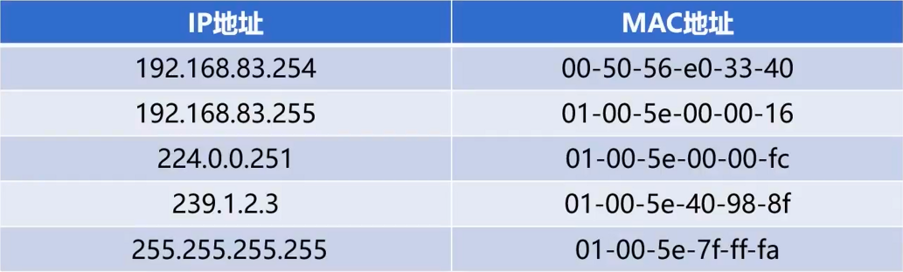

##### ARP缓存有无情况

-   ARP缓存表缓存有 IP 地址和 MAC 地址的映射关系
-   ARP缓存表没有缓存 IP 地址和 MAC 地址的映射关系

>   如果<u>网络层可以直接告知数据链路层目的MAC地址</u>意味是ARP有缓存的，反之缓存表里没有对应关系。
>
>   那如何处理缓存表没有对应关系的问题？
>
>   这时ARP协议可以**广播全局以获取**某个IP的信息，收到回应的设备都会回应一个包，表示我是否是这个IP地址和MAC地址，这时候可以直接更新缓存

#### RARP协议

>   现在很少使用，仅作了解

RARP（Reverse Address Resolution Protocol）逆地址解析协议

作用：数据链路层MAC48位地址-->>RARP协议-->>网络层IP32位地址

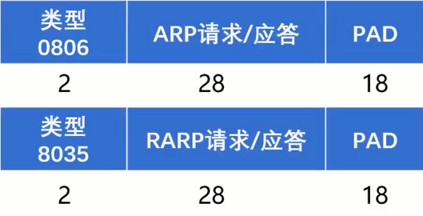

#### 协议模型

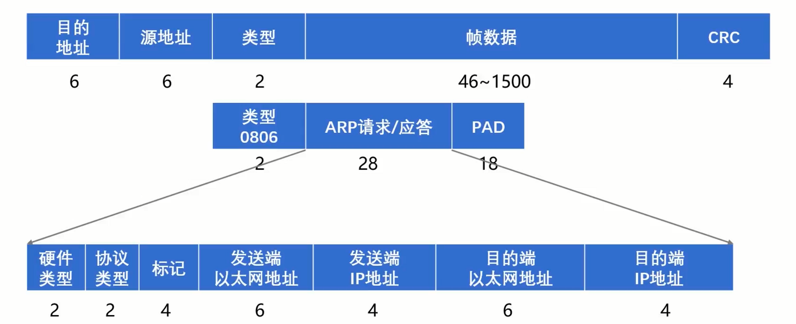

ARP协议封装在数据帧中，为什么会属于网络层？

因为ARP协议带有IP协议，所以归于网络层，它是网络层和数据链路层配合使用的一个重要协议

#### 总结

-   ARP缓存表是ARP协议和RARP协议运行的关键
-   ARP缓存表缓存了IP地址到硬件地址之间的映射关系
-   ARP缓存表中的记录并不是永久有效的，有一定的期限（IP地址会发生变化）
-   （R）ARP协议是TCP/IP协议栈里面基础的协议（主要帮助网络层和数据链路层的配合工作）
    ARP和RARP的操作对程序员是透明的
-   理解（R）ARP协议有助于理解网络分层的细节

### ICMP协议

-   网际控制报文协议（Internet Control Message Protocol）
-   ICMP协议可以报告错误信息或者异常情况
-   主要是辅助 IP 协议进行数据传输，有 ICMP 协议以更好的进行数据传输

#### 报文格式

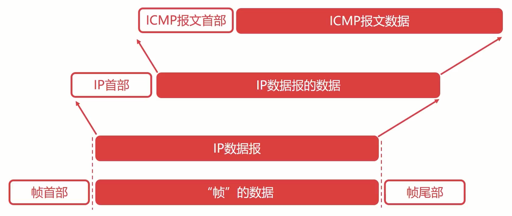

#### 报文模型

注意，ICMP协议是写在 IP协议的 8位协议内容上的，协议名为 1

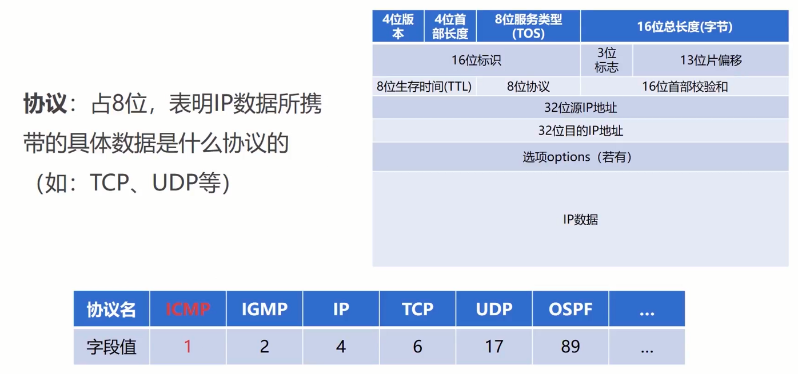

#### 差错报告报文

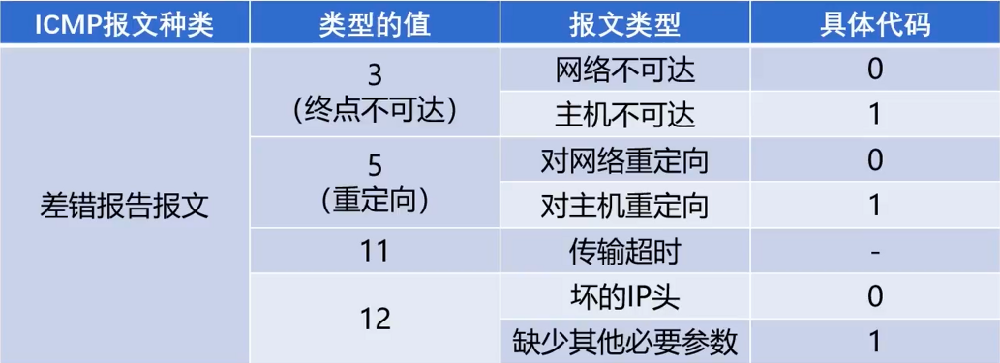

#### 询问报文

>   主要是用于 验证网络是否通的，对时间同步问题

#### ICMP协议的应用

##### Ping应用

先组装一个ICMP的数据报，再封装到 IP 数据报里

###### 网络排查过程

-   Ping回环地址127.0.0.1
-   Ping网关地址
-   Ping远端地址

##### Traceroute应用

-   Traceroute可以探测IP数据报在网络中走过的路径
-   巧妙利用 TTL 的寿命 和 ICMPICMP终点不可达差错报文，不断探测网络
-   TTL 从 1 到 n，不断记录，直到目标机器或者接收不可达差错报文

### 网络地址转换NAT技术

-   为什么需要NAT技术？IP地址不够用

-   IPV4最多只有40+亿个IP地址
-   早期IP地址的不合理规划导致IP号浪费

#### 地址的划分

##### 外网地址

-   全球范围使用
-   全球公网唯一

##### 内网地址

-   内部机构使用
-   避免与外网地址重复
-   三类内网地址划分（主要是给内部使用，不会引起冲突）
    -   10.0.0.0~10.255.255.255（支持干万数量级设备）
    -   172.16.0.0~172.31.255.255（支持百万数量级设备）
    -   192.168.0.0~192.168.255.255（支持万数量级设备）

家庭

企业

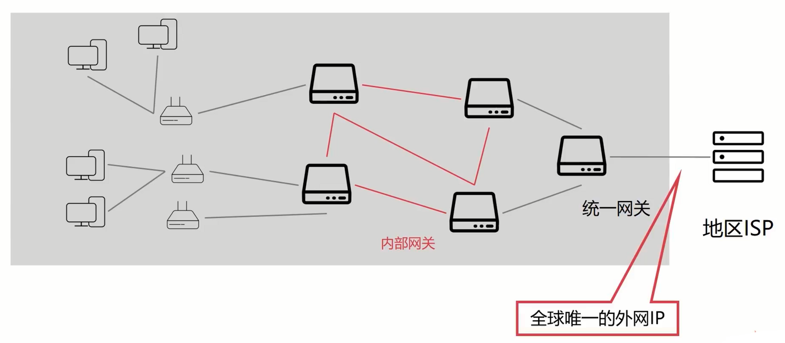

内网多个设备使用同一个外网IP请求外网的服务，外部怎么知道具体是哪个设备在请求的？

#### NAT技术

-   网络地址转换NAT（Network Address Translation）
-   NAT技术用于多个主机通过一个公有IP访问互联网的私有网络中
-   NAT减缓了IP地址的消耗，但是增加了网络通信的复杂度
-   使用 NAT 表进行转换，将 内网IP+Port 转换为 外网IP+Port 
-    虚拟机，路由器都使用该技术

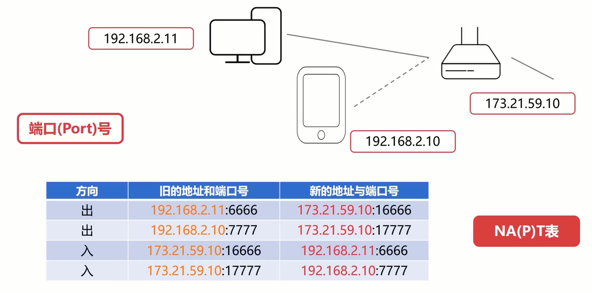

## IP的路由算法

### 路由的概述

#### 路由算法的本质

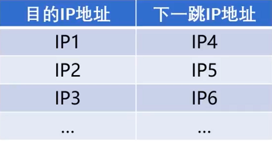

-   下一跳地址是怎么来的？
-   下一跳地址是唯一的吗？
-   下一跳地址是最佳的吗？
-   路由器怎么多，他们是怎么协同工作的？

这时需要一个好的算法去解决这些事情

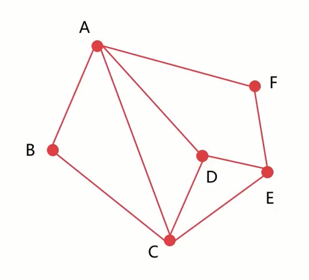

-   每一顶点表示一个网络、路由器或计算机
-   每一条边表示一条网络路径
-   路由算法实际上是图论的算法
-   网络环境复杂
-   路由算法要比图论的算法要复杂

##### 具体算法实现内容

-   算法是正确的、完整的
-   算法在计算上应该尽可能的简单
-   算法可以适应网络中的变化
-   算法是稳定的和公平的

##### 其他

>   对互联网进行划分

-   互联网的规模是非常大的
-   互联网环境是非常复杂的

#### 自治系统

>   自治系统（Autonomous System）

-   一个自治系统（AS）是处于一个管理机构下的网络设备群
-   AS内部网络自行管理，AS对外提供一个或者多个出（入）口
-   自治系统内部路由的协议称为：内部网关协议（RIP、OSPF）
-   自治系统外部路由的协议称为：外部网关协议（BGP）

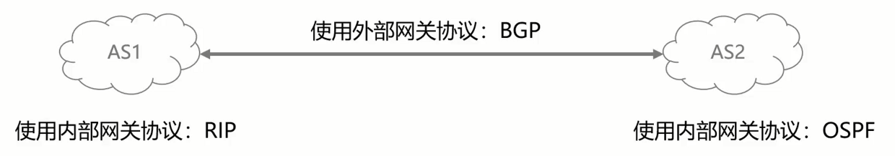

### 内部网关路由协议-RIP

#### 距离矢量（DV）算法(*(缺))

每一个节点使用两个向量 Di 和 Si

Di 描述的是当前节点到别的节点的距离

Si 描述的是当前节点到别的节点的下一节点

每一个节点与相邻的节点交换向量 Di 和 Si 的信息

每一个节点根据交换的信息更新自己的节点信息

#### RIP协议的过程

-   RIP（Routing Information Protocol）协议
-   RIP协议是使用DV算法的一种路由协议
-   RIP协议把网络的跳数（hop）作为DV算法的距离
-   RIP协议每隔30s交换一次路由信息
-   RIP协议认为跳数>15的路由则为不可达路由

##### 协议过程

1，路由器初始化路由信息（两个向量D；和S；）

2，对相邻路由器X发过来的信息，对信息的内容进行修改（下一跳地址设置为X，所有距离加1）

-   检索本地路由，将信息中新的路由插入到路由表里面
-   检索本地路由，对于下一跳为X的，更新为修改后的信息
-   检索本地路由，对比相同目的的距离，如果新信息的距离更小，则更新本地路由表

3，如果3分钟没有收到相邻的路由信息，则把相邻路由设置为不可达（16跳）

##### 弊端

>   故障信息传递慢

-   随便相信“隔壁老王"
-   “自己不思考”“视野不够”

##### 总结

-   RIP协议：实现简单，开销很小
-   RIP协议：限制了网络的规模

### Dijkstra（迪杰斯特拉）算法(缺) 10-11

-   Dijkstra算法是著名的图算法
-   Dijkstra算法解决有权图从一个节点到其他节点的最短路径问题
-   “以起始点为中心，向外层层扩展”

>   最短路径问题

##### 算法具体流程

1，初始化两个集合（S，U）（S为只有初始顶点点A的集合，U为其他顶点集合）

2，如果U不为空，对U集合顶点进行距离的排序，并取出距离A最近的一个顶点D

-   将顶点D的纳入S集合
-   更新通过顶点D到达U集合所有点的距离（如果距离更小则更新，否则不更新）
-   重复2步骤

3，直到U集合为空，算法完成

### 内部网关路由协议-ospf(缺)

#### 链路状态（LS）协议

-   向所有的路由器发送消息消息
    -   一传十、十传百
    -   只和相邻的路由器交换信息
-   描述该路由器与相邻路由器的链路状态（距离，时延，带宽等指标）
    -   网络管理人员决定的"代价"
    -   只使用跳数
-   只有链路状态发生变化时，才发送更新信息

#### OSPF协议的过程（实现LS规则）

-   OSPF（Open Shortest Path First：开放最短路径优先）
-   OSPF协议的核心是Dijkstra算法

##### 如何实现？

-   向所有的路由器发送消息消息
    -   获得网络中的所有信息 -->“网络的完整拓扑"
    -   也称为“链路状态数据库”
    -   “链路状态数据库”是全网一致的
    -   每个路由器都可以实现 Dijkstra（迪杰斯特拉）算法
    -   通过算法计算，可以得到自己到达目标地点的最短路径
-   描述该路由器与相邻路由器的链路状态（距离，时延，带宽等指标）
    -   OSPF协议更加客观、更加先进（仅使用跳出作为指标）
-   只有链路状态发生变化时，才发送更新信息
    -   减少了数据的交换，更快收敛

##### 物种消息类型

-   问候消息（Hello）
    -   以确认自己与隔壁路由器是否真正可达
-   链路状态数据库描述信息
    -   用于发送链路状态数据库给隔壁路由器
-   链路状态请求信息
    -   用于向隔壁请求链路状态数据库
-   链路状态更新信息（重要且频繁）
    -   OSPF 最常见消息
-   链路状态确认信息
    -   用于对链路状态的确认

##### 具体过程

路由器接入网络 -> 路由器向邻居发出问候信息 -> 与邻居交流链路状态数据库(发送链路状态数据库描述信息，保持与整个网络的数据库一致) -> 广播和更新未知路由(链路状态更新信息)

##### 对比 RIP 协议

|         RIP协议          |            OSPF协议            |
| :----------------------: | :----------------------------: |
|       从邻居看网络       |         整个网络的拓扑         |
|   在路由器之间累加距离   |    Dijkstra算法计算最短路径    |
| 频繁、周期更新，收敛很慢 |     状态变化更新，收敛很快     |
|    路由间拷贝路由信息    | 路由间传递链路状态自行计算路径 |

### 外部网关路由协议

-   BGP（Border Gateway Protocol：边际网关协议）
-   BGP协议是运行在AS之间的一种协议
-   BGP协议能够找到一条到达目的比较好的路由
-   AS之间通过BGP发言人来进行路由信息的交换

##### 为什么需要BGP协议？

-   旦联网的规模很大
-   AS内部使用不同的路由协议
-   AS之间需要考虑除网络特性以外的一些因素（政治、安全..…）

如何配置？

>   这里涉及一个关键词：BGP发言人（speaker）

-   BGP 并不关心内部网络拓扑
-   AS 之间通过BGP发言人交流信息
-   BGP Speaker 可以人为配置策略
-   一些敏感内容是可以通过BGP过滤

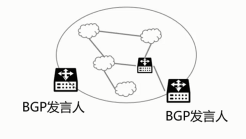

##### 使用BGP speaker连接的拓补

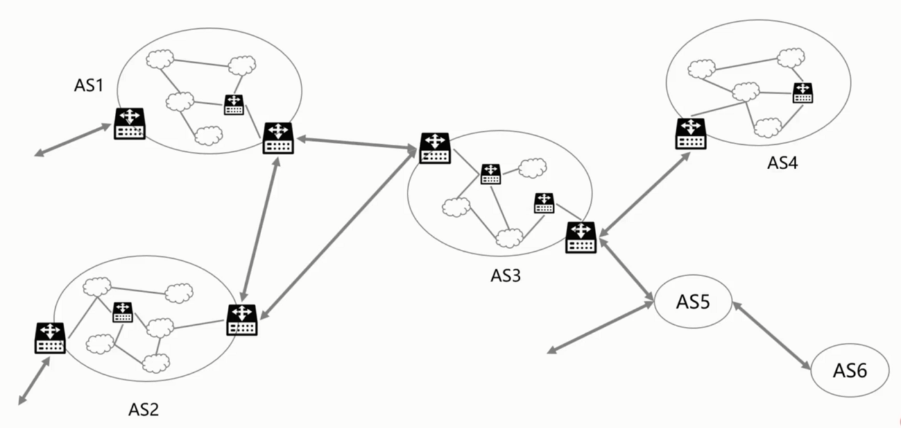

##### 配合ISP

-   AS1：通过我可以到达AS2和AS3，但是你需要持有“通行证"
-   AS2：通过我可以到达AS4和AS5

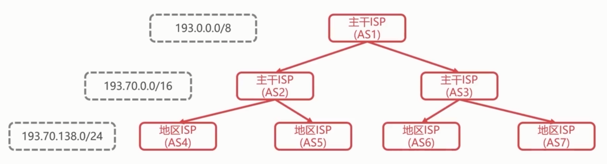