# 计算机网络-传输层

[TOC]

## UDP

### UDP 协议详解

-   UDP（User Datagram Protocol：用户数据报协议）
-   UDP是一个非常简单的协议

>   数据报（Datagram），UDP 采用不合并，不拆分，直接装载进报文里

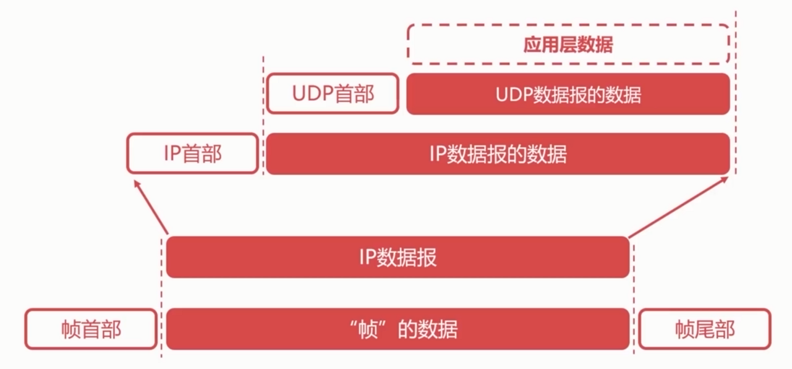

#### 协议模型

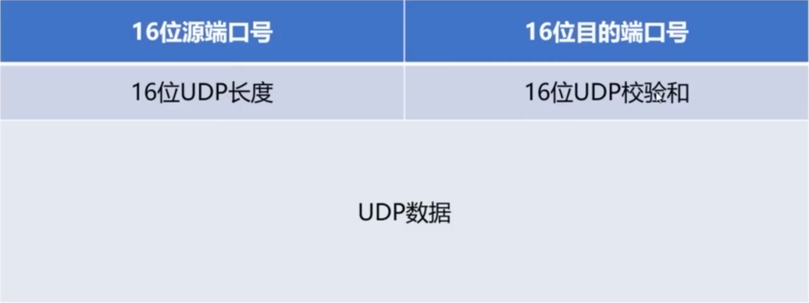

端口号：对应机器正在使用网络的进程

校验和：检测 UDP 的数据报是否出错

#### 特点

-   UDP是无连接协议
-   UDP不能保证可靠的交付数据
    -   “想发就发”，“无法保证数据在网络中是否丢失"
-   UDP是面向报文传输的
    -   不拆分，不合并，直接硬塞进数据报
-   UDP没有拥塞控制
    -   路黑照样走
-   UDP的首部开销很小
    -   只有五个主体内容

## TCP

### TCP 协议详解

-   TCP（Transmission Control Protocol：传输控制协议）
-   TCP协议是计算机网络中非常复杂的一个协议

#### 存在位置

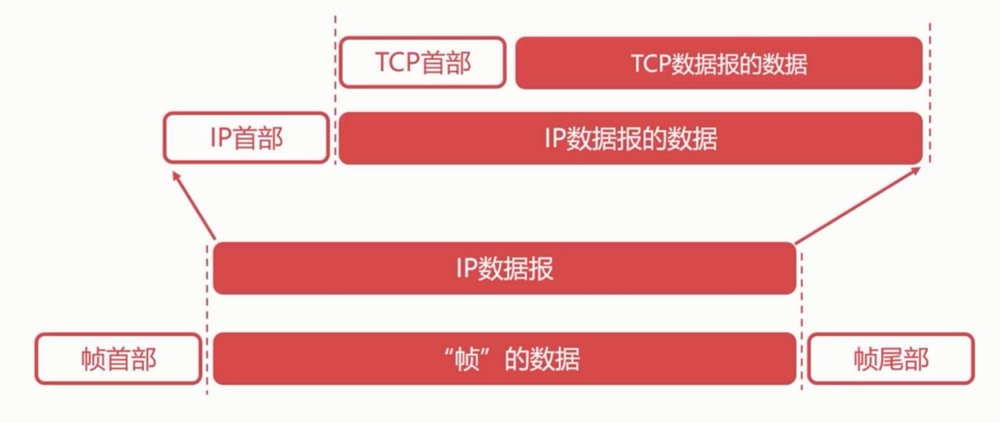

#### 特点

-   TCP是面向连接的协议
-   TCP的一个连接有两端（点对点通信）
-   TCP提供可靠的传输服务
-   TCP协议提供全双工的通信
-   TCP是面向字节流的协议

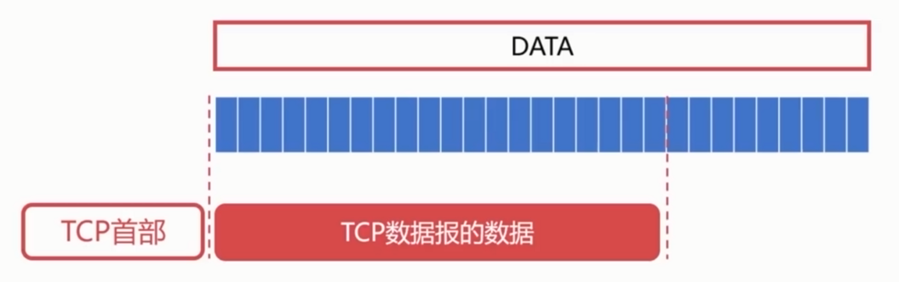

#### 协议模型

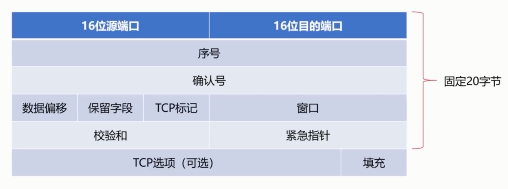

##### 序号

-   0~2^32-1
-   一个字节一个序号
-   指的是 数据首字节序号
-   常配合确认号使用
-   

##### 确认号

-   0~2^32-1
-   一个字节一个序号
-   期望收到数据的首字节序号*
-   确认号为N：则表示N-1序号的数据都已经收到

-   已经收到 501-600 的数据，下次发送请从 601 开始
    -   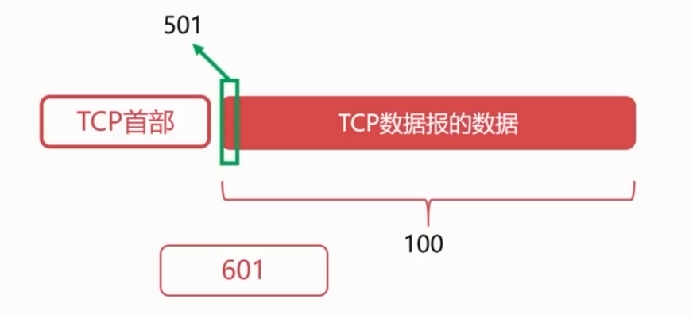

##### 数据偏移

-   占4位：0~15，单位为：32位字
-   数据偏离首部的距离（因为不知道TCP选项的确切长度，以此来记录）

##### TCP标记

-   占6位，每位各有不同意义

| 标记 | 含义                                           |
| ---- | ---------------------------------------------- |
| URG  | Urgent：紧急位，URG=1，表示紧急数据            |
| ACK  | Acknowledgement：确认位，ACK=1，确认号才生效   |
| PSH  | Push：推送位，PSH=1，尽快地把数据交付给应用层  |
| RST  | Reset：重置位，RST=1，重新建立连接             |
| SYN  | Synchronization：同步位，SYN=1表示连接请求报文 |
| FIN  | Finish：终止位，FIN=1表示释放连接              |

##### 窗口

-   占16位：0~2^16-1
-   窗口指明允许对方发送的数据量

##### 校验和

##### 紧急指针

-   紧急数据（URG=1）
-   指定紧急数据在报文的位置

##### TCP选项

-   最多40字节
-   支持未来的拓展

### 可靠传输基本原理

#### 停止等待协议

##### 数据传输理想态-无差错

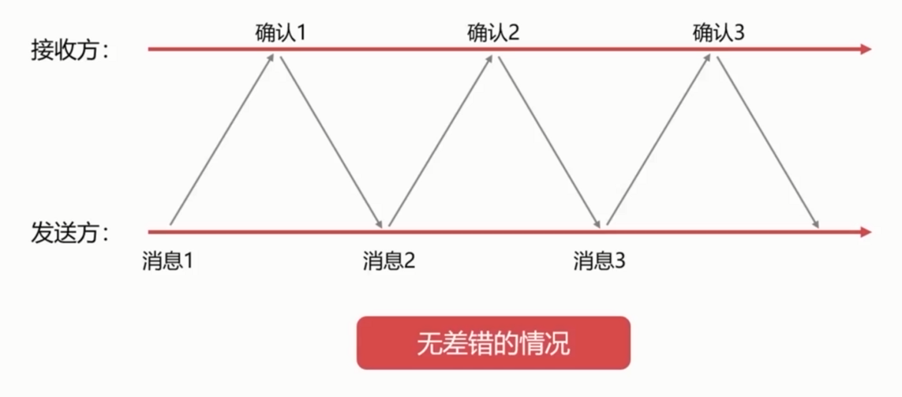

##### 数据传输失败

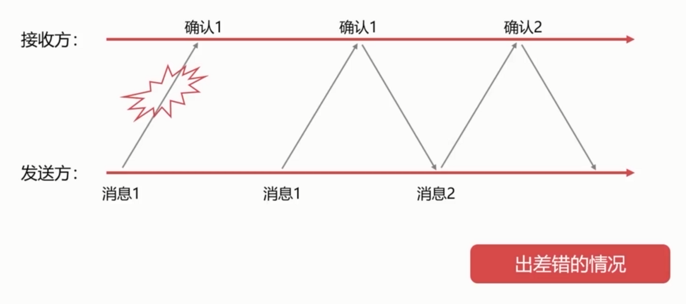

##### 确认消息获取失败

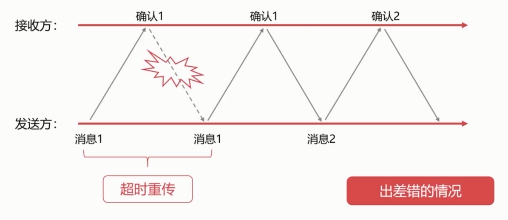

##### 确认消息许久才收到

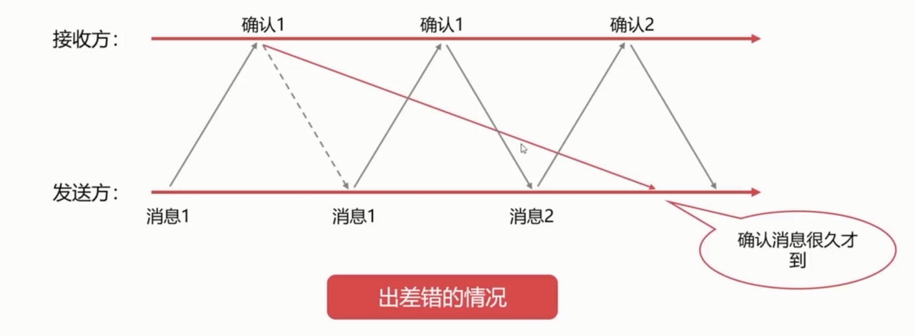

##### 可靠传输出现的三个原因

-   发送的消息在路上丢失了
-   确认的消息在路上丢失了
-   确认的消息很久才到

##### 超时定时器

每发送一个消息，都需要设置一个定时器

##### 总结

-   停止等待协议是最简单的可靠传输协议
-   停止等待协议对**信道的利用效率**不高
    -   发送方发送完成数据以后，需要停止等待接收方的确认消息，如果没有收到确认消息，会持续等待，这不利于有效率连接

#### 连续ARQ协议

-   ARQ（Automatic Repeat reQuest：自动重传请求）

既然单个发送和确认效率低，可不可以批量发送和确认？

##### 滑动窗口

-   窗口内的数据都可以发送
-   如果前面数据收到确认消息，窗口可以向前移动，以发送后面的内容
-   不需要每个字节都进行确认，而是采用一种累计确认的方法

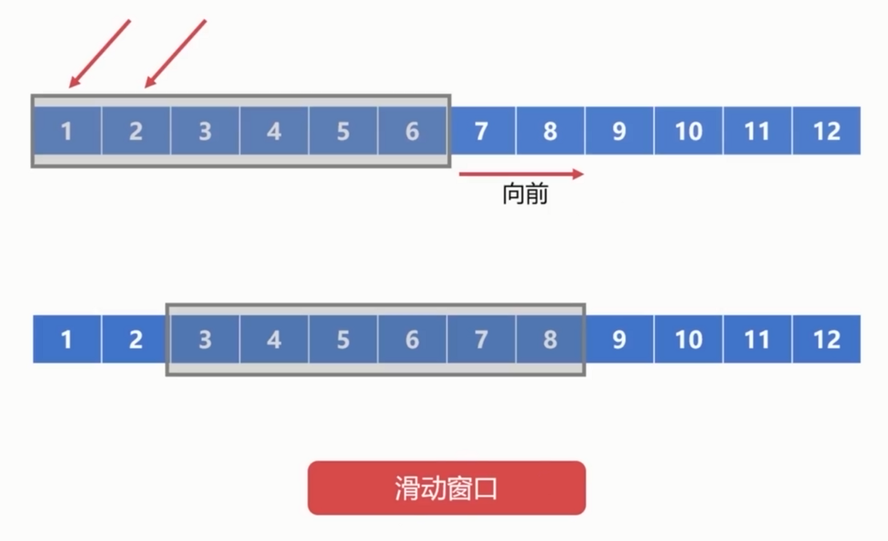

##### 累计确认

-   如果收到 5 号数据的确认消息，表示5号数据前的数据都已经收到了，这时窗口可以直接从第 6 号数据开始发送
-   减少了确认报文的数据，提高了网络的利用效率

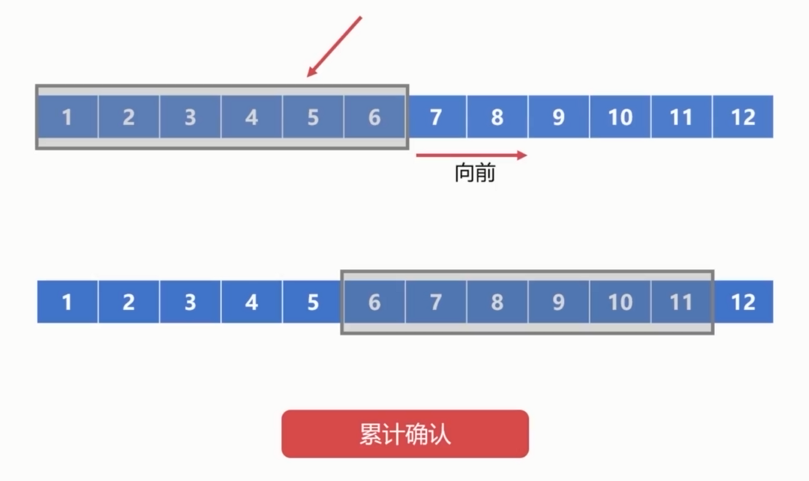

### TCP 协议可靠传输

#### TCP的可靠传输基于连续ARQ协议

-   TCP的可靠传输基于连续ARQ协议
-   TCP的滑动窗口以字节为单位

##### 结合TCP首部的确认号

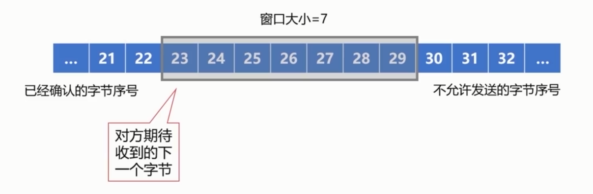

收到确认消息窗口移动

>   23，24收到确认消息，窗口移动

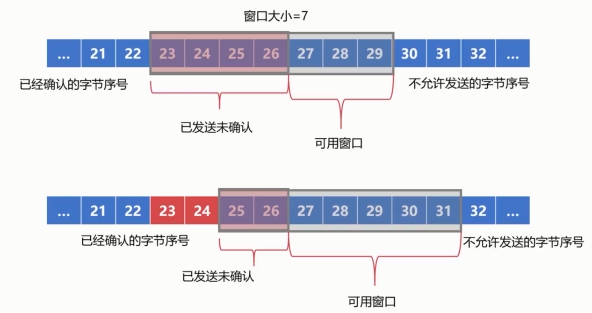

##### 数据已发送但未收到确认消息

>   全部未收到确认消息，窗口是不能移动的，可用窗口此时为0
>
>   如果全部字节都没有收到确认消息，会等待一段时间后进行超时重传

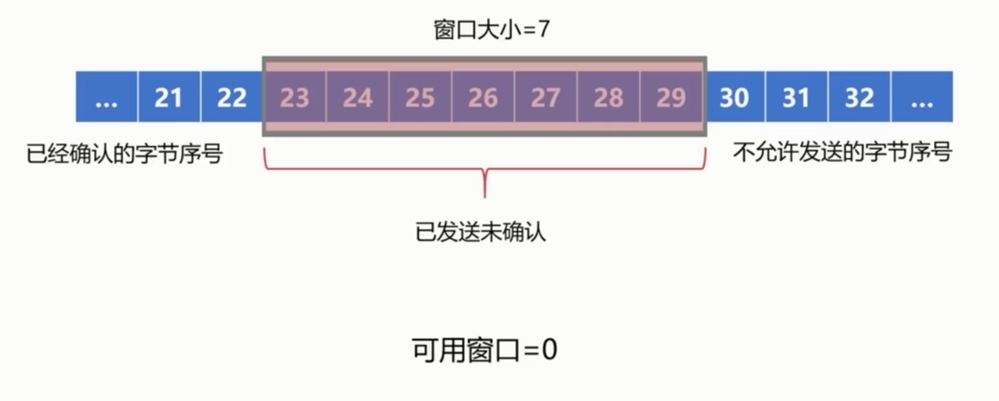

##### 确认消息不是按序到达

-   23、24 没有收到
    -   此时窗口是不能移动的，尽管已经收到 25，27 的确认消息
-   从 23 开始重传
    -   如果重新发送整个窗口的内容，未免会造成浪费，选择重传此时生效了

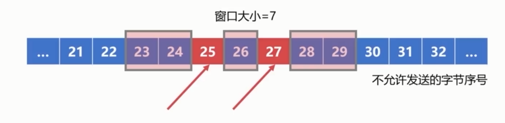

#### 选择重传

-   选择特定的消息进行重传
-   选择重传需要指定需要重传的字节
-   每一个字节都有唯一的32位序号

-   如果存储选择需要重传的序号需要耗费很多空间，实际重传的数据是存储在 TCP 选项的
-   因为数据偏移的原因，限制于 TCP 首部的长度（最多 60 字节）
-   序号实际不是选择指定的某个字节的
-   选择重传更多时候是进行某一段数据的重传（指定两个边界进行，边界内的数据进行重传）

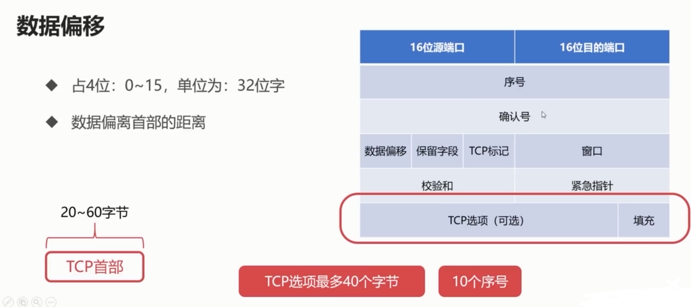

>   重传一段字节流

### TCP 协议流量控制

#### TCP协议使用滑动窗口实现流量控制

- 流量控制指让发送方发送速率不要太快

- 流量控制是使用滑动窗口来实现的

##### TCP首部的窗口

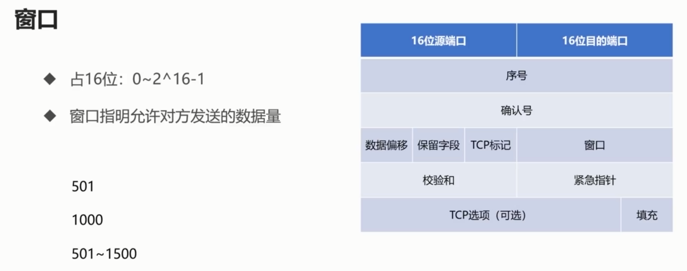

##### 发送-接收过程演示

>   ack，期待收到的字节开始位置
>
>   rwnd，窗口大小

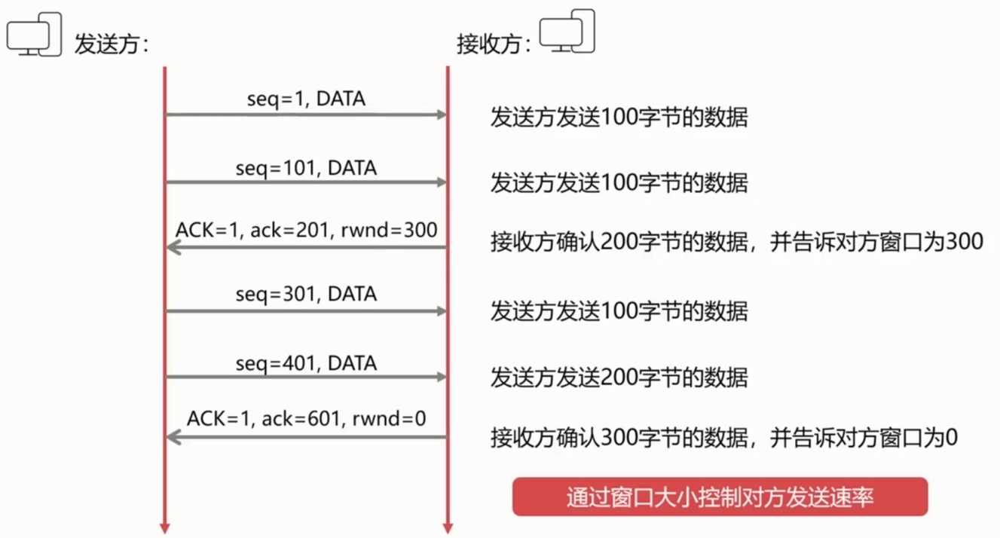

##### 窗口确认确认失败

>   接收方，发送方都会一直等待，形成死锁局面
>
>   不是可靠传输吗？
>
>   TCP 可靠传输针对的是数据完整性讨论的。

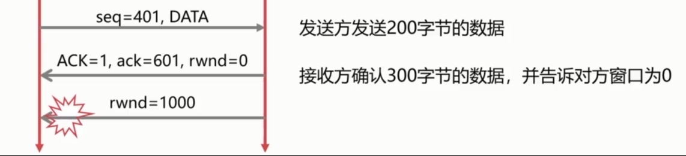

#### 坚持定时器的作用

-   当接收到窗口为0的消息，则启动坚持定时器
-   坚持定时器每隔一段时间发送一个窗口探测报文
-   解决双方等待而死锁的局面

### TCP 协议拥塞控制

为什么需要拥塞控制？

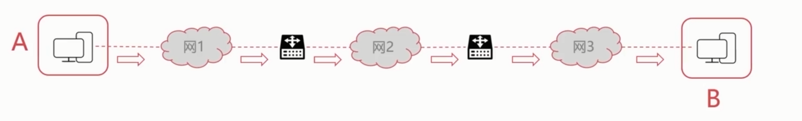

-   一条数据链路经过非常多的设备
-   数据链路中各个部分都有可能成为网路传输的瓶颈

#### 流量控制与拥塞控制的区别

-   流量控制考虑点对点的通信量的控制

-   拥塞控制考虑整个网络，是全局性的考虑
    -   如何知道发生拥塞？报文超时则认为是拥塞

#### 拥塞控制的方法

##### 慢启动算法

-   由小到大逐渐增加发送数据量
-   每收到一个报文确认，就加一
    -   指数增长，1 2 4 8 16 ...
-   慢启动阈值（ssthresh），如果增长到达阈值，就不再增长了

##### 拥塞避免算法

-   维护一个拥塞窗口的变量
-   只要网络不拥塞，就试探着拥塞窗口调大
    -   增长，1 2 4 8 16 .. 17 18 19..

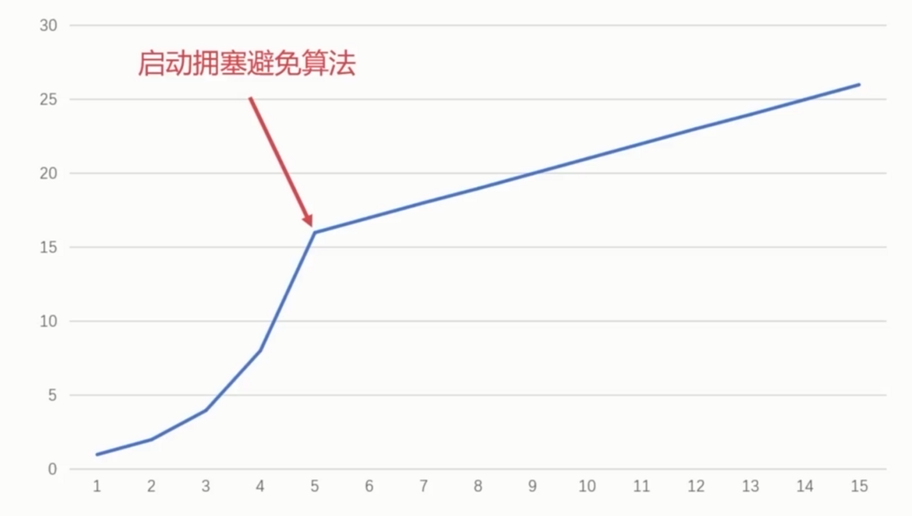

### TCP 协议三次握手

#### TCP标记

| 标记 | 含义                                           |
| ---- | ---------------------------------------------- |
| ACK  | Acknowledgement：确认位，ACK=1，确认号才生效   |
| SYN  | Synchronization：同步位，SYN=1表示连接请求报文 |
| FIN  | Finish：终止位，FIN=1表示释放连接              |

#### 具体握手流程

-   建立连接的时间不一样
-   发送方在第二次握手时就已经变为建立连接的状态了
-   接受方要在第三次握手之后才变为建立连接状态

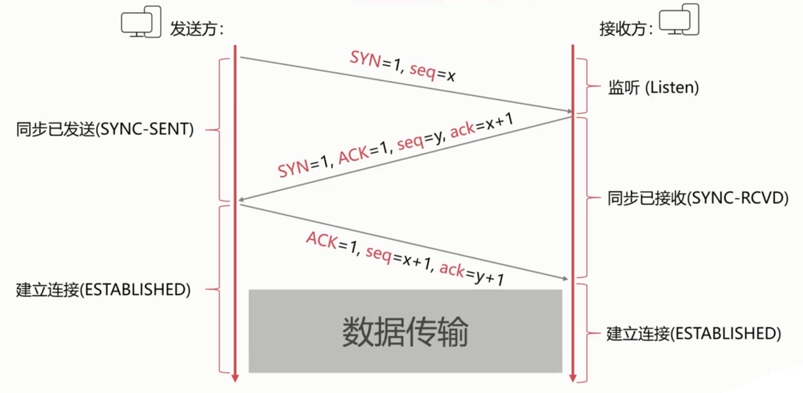

#### 为什么发送方要发出第三个确认报文呢？

-   已经**失效的连接请求报文**传送到对方，**引起错误**

##### 失效的请求报文

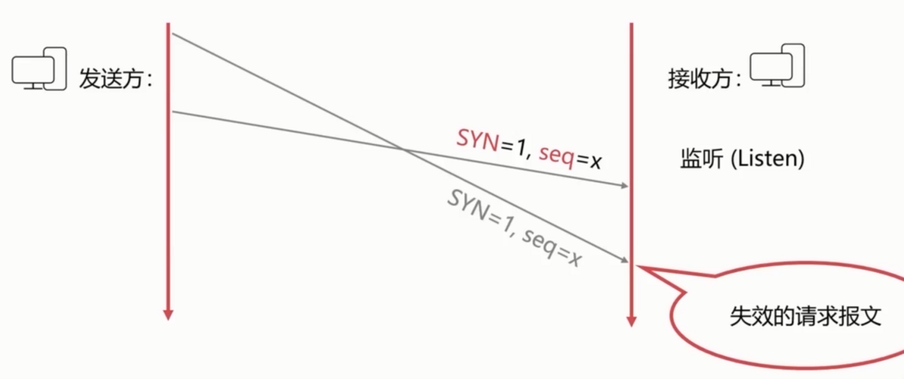

##### 两次握手建立连接

>   会引发两个TCP连接错误

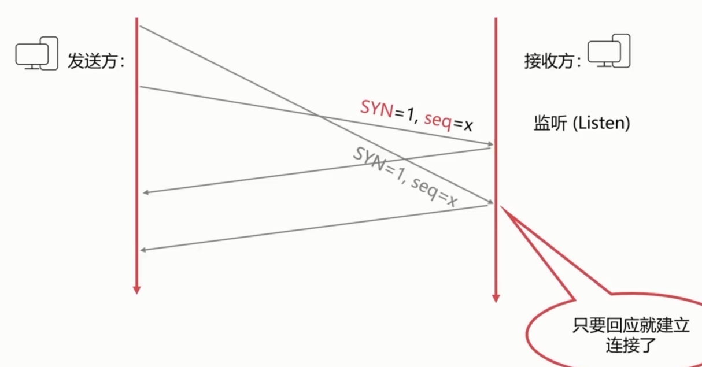

##### 如何处理？

>   对于第二次确认消息，发送方会直接忽略掉 ，避免引发错误

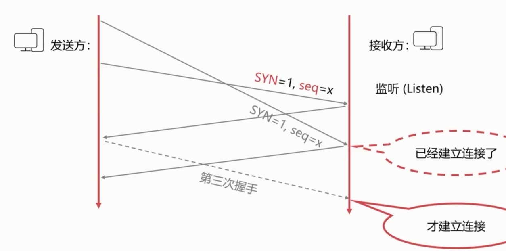

### TCP 协议四次挥手

#### 具体挥手流程

-   FIN-WAIT-1，断开连接第一个等待状态
-   FIN-WAIT-2，断开连接第二个等待状态
-   CLOSE-WAIT，这个状态里面，接收方还可以进行数据的发送
-   LAST-ACK，为了确认发送方已经接收到连接断开的请求报文
-   TIME-WAIT，为了确认连接断开没有任何问题，等待计时后才进入关闭状态

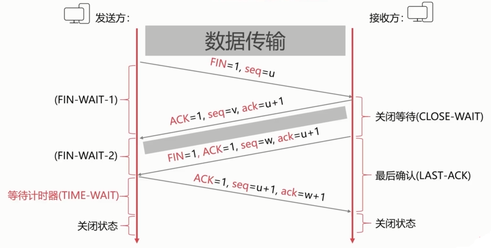

#### 等待计时器

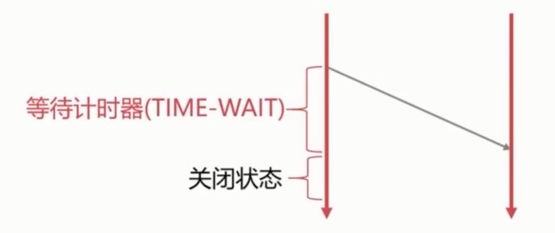

-   MSL（Max Segment Lifetime）：最长报文段寿命
-   MSL建议设置为2分钟
-   TIME-WAIT状态一般等待 2MSL 时间
-   每个TCP连接都会占用一个端口，在连接状态里，如果想起另一个网络进程使用端口，会提示端口被占用的情况
-   等待计时器还没结束的时候，会一直占用端口

#### 为什么需要等待2MSL？

-   最后一个报文没有确认
-   确保发送方的ACK可以到达接收方
-   2MSL也是网络报文最长存活时间 
-   2MSL时间内没有收到，则接收方会重发
    -   重发第三次挥手内容
-   确保当前连接的所有报文都已经过期

### 套接字

-   使用端口（Port）来标记不同的网络进程
-   端口（Port）使用16比特位表示（0~65535）
-   形式：{ IP : Port } ，两个组合在一起形成了套接字
-   套接字（Socket）是抽象概念，表示TCP连接的一端
-   通过套接字可以进行数据发送或接收
-   通过两个 IP 和 端口号，确定一个 TCP 连接
    -   TCP = { Socket1 : Socket2 } = { {IP:Port} : {IP:Port} }
-   TCP连接由两个套接字组成
-   使用套接字开发
    -   一般看作 C/S 架构
    -   客户端 <- TCP 连接 -> 服务端

#### 套接字开发

-   服务端：创建套接字 -> 绑定(BIND)套接字 -> 监听(Listen)套接字 -> 接收&处理消息
-   客户端：创建套接字 -> 连接套接字 -> 发送消息

#### 网络套接字VS域套接字

##### 网络套接字

-   数据需要走一遭协议栈

##### 域套接字

-   数据不需要经过协议栈

##### 总结

-   单机时使用域套接字，网络传输使用 网络套接字