# 计算机网络-应用层

[TOC]

## 概述

-   传输层以及以下的层提供完整的通信服务
-   应用层是面向用户的一层
    -   面向传输层的编程
    -   更多的是针对特定业务开发

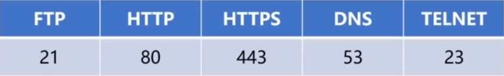

### UDP vs TCP

#### UDP

-   多媒体信息分发
    -   视频，语音，实时信息

#### TCP

-   可靠消息传输
    -   金融交易，可靠通讯，MQ

### 工作职责

>   定义应用间通信的规则

-   应用进程的报文类型（请求报文、应答报文）
-   报文的语法、格式
-   应用进程发送数据的时机、规则

## DNS

-   DNS（Domain Name System：域名系统）
-   DNS 是应用 UDP 协议的应用层协议
-   IP:Port 找到对应的主机进程
    -   Web 服务
    -   网络存储服务
    -   远程调用服务
    -   邮件服务

### DNS 存在的意义

-   使用域名帮助使用者记忆

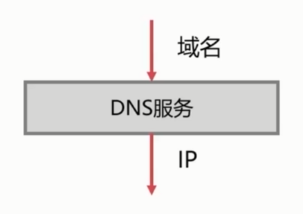

### 域名的详解

-   域名由点、字母和数字组成
-   点分割不同的域
-   域名可以分为顶级域、二级域、三级域
    -   顶级域：.com
    -   二级域：taobao
    -   三级域：www

#### 顶级域

##### 国家

-   cn，US，uk，ca

##### 通用

-   com，net，gov，org

#### 二级域

-   aliyun，qq，taobao，amazon，baidu，google，alibaba，facebook

#### 域名树

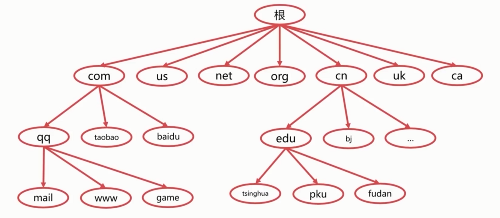

### 域名服务器

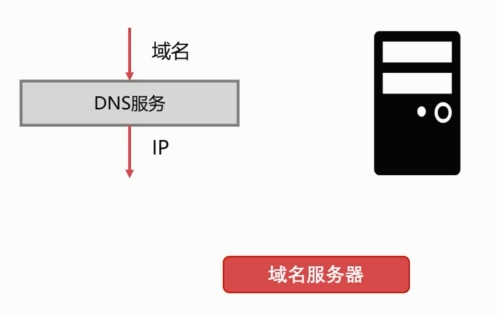

#### 具体内容

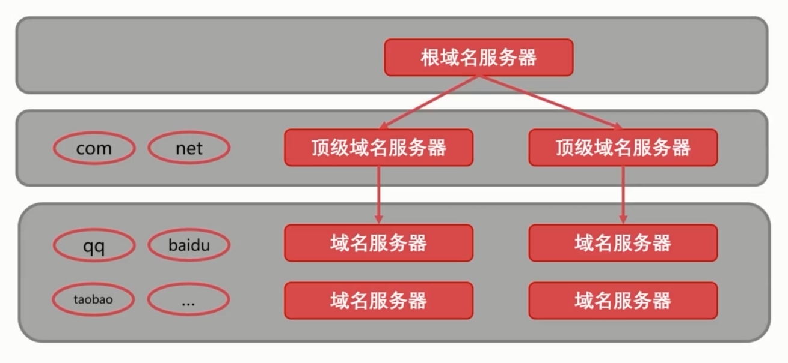

## DHCP 协议

### DHCP 是什么

-   DHCP（Dynamic Host Configuration Protocol：动态主机设置协议）
-   DHCP 是一个局域网协议
    -   局域网想要和外网交互需要 AGP 协议

-   DHCP 是应用 UDP 协议的应用层协议

### DHCP 的作用

-   实现即插即用联网
-   分配临时 IP
-   实现 IP 的租借（分配的 IP 是有租期的）

### DHCP的执行流程

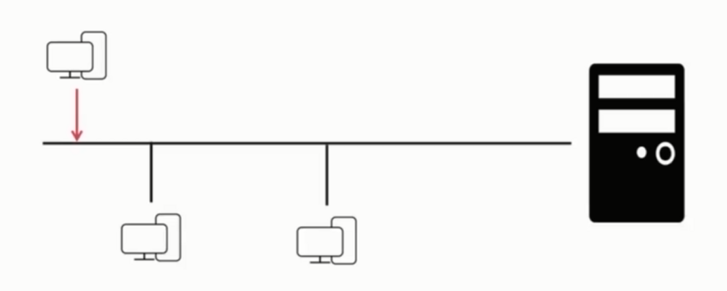

-   DHCP 服务器监听默认端口：67
-   主机使用 UDP 协议广播 DHCP 发现报文
-   DHCP 服务器发出 DHCP 提供报文
-   主机向 DHCP 服务器发出 DHCP 请求报文
-   DHCP 服务器回应并提供 IP 地址

>   局域网内完成

## HTTP 协议

### HTTP 是什么

-   HTTP（Hyper Text Transfer Protocol：超文本传输协议）
-   超文本，“超级文本”，“带超链接文本”
-   网站地址
    -   http(s)://<主机>:<端口>/<路径> （80端口）
-   HTTP协议是可靠的数据传输协议（基于 TCP 进行传输）
    -   文本，图片，音频，文件，动图，视频

#### Web 服务器

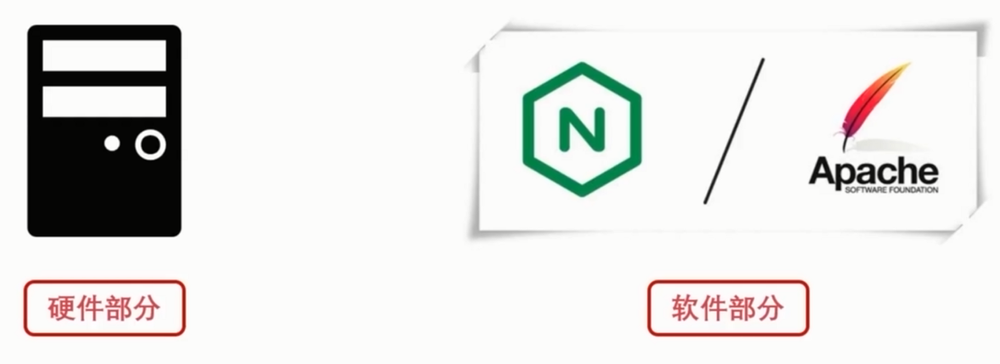

### HTTP 工作过程

接受客户端连接 -> 接收请求报文 -> 处理请求  -> 访问 Web资源 -> 构造应答 -> 发送应答

### 请求方法

-   GET
    -   获取指定的服务端资源
-   POST
    -   提交数据到服务端
-   DELETE
    -   删除指定的服务端资源
-   UPDATE
    -   更新指定的服务端资源

### 指定资源

#### 在地址中指定

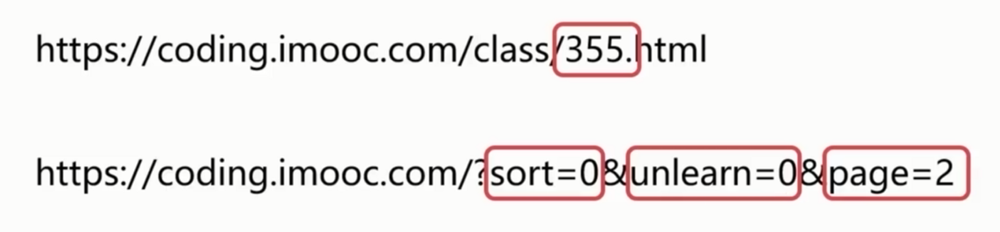

#### 在请求数据中指定

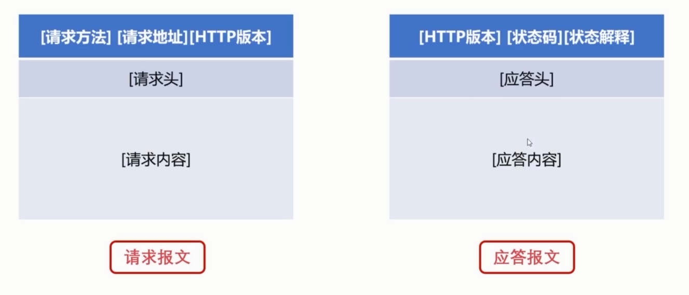

### 状态码

| 状态码  | 含义             |
| ------- | ---------------- |
| 200~299 | 成功状态码       |
| 300~399 | 重定向状态码     |
| 400~499 | 客户端错误状态码 |
| 500~599 | 服务端错误状态码 |

## HTTP 工作

### Web 缓存

-   二八原则
-   存储器层次结构
    -   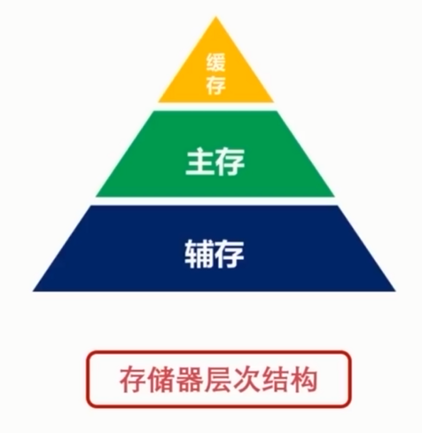
-   缓存方式
    -   Redis
    -   Memcached
    -   内存、SSD

### Web 代理

作为一个中间媒人，处理 Client 和 Server 的连接

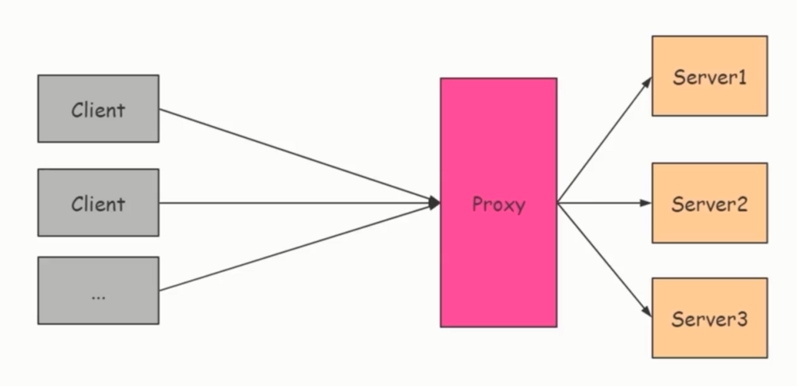

#### 正向代理

>   多个 Client 经由一个 Proxy 连接 Server

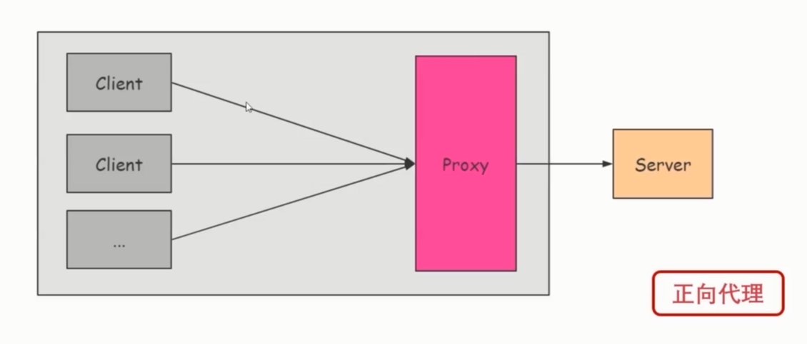

#### 反向代理

>    Client 连接 Proxy，Proxy 自行分发

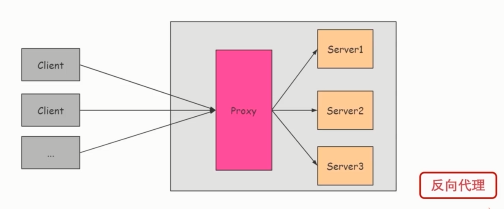

#### 代理软件

-   Nginx
-   HAProxy

### CDN

-   CDN（Content Delivery Network：内容分发网络）
-   主要是多媒体内容

### 爬虫

-   网络机器人
-   增加网络拥塞
-   损耗服务器资源
-   注意原则， 不要给目标服务器造成巨大压力

## HTTPs 协议

-   HTTP 是明文传输的

-   对于账号密码，交易信息，个人信息，敏感信息，账户金额不安全

-   HTTPS（Secure）是安全的 HTTP 协议
-   http(s)://<主机>:<端口>/<路径>(443端口)

### 加密模型

#### 对称加密

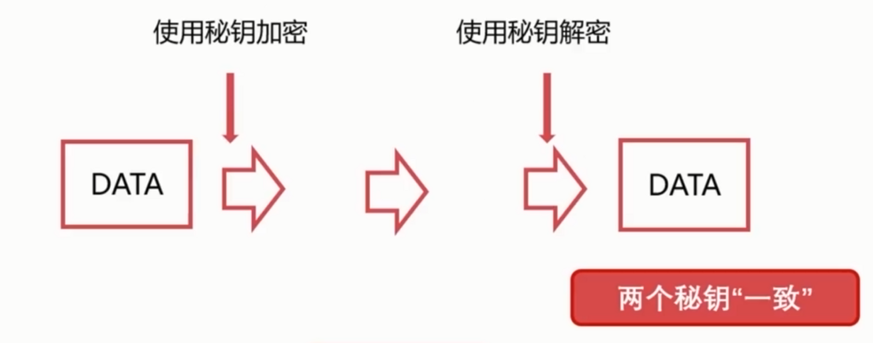

#### 非对称加密

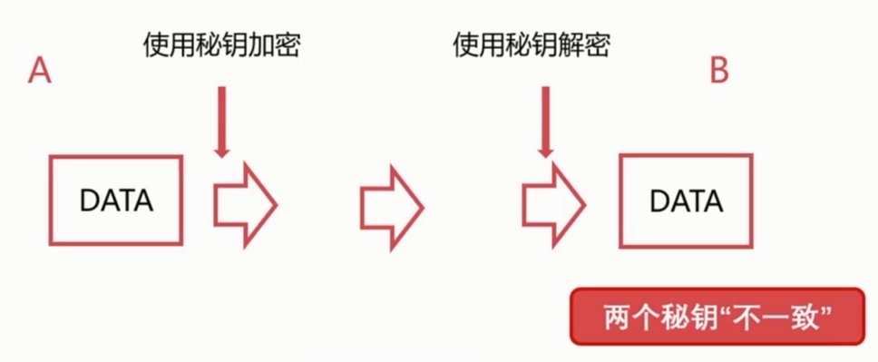

-   A、B 是拥有一定数学关系的一组秘钥
    -   私钥
        -   私钥自己使用，不对外公开
    -   公钥
        -   公钥给大家使用，对外公开

#### 数字签证

-   数字证书是**可信任组织**颁发给**特定对象**的认证
    -   可信任组织，经过客户端，服务端同时认定的机构
    -   特定对象，某一个类特定对象

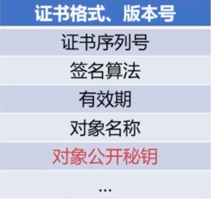

### SSL

-   SSL（Secure Sockets Layer：安全套接层）
-   数据安全和数据完整
    -   安全，不会泄露
    -   完整，不被篡改
-   对传输层数据进行加密后传输

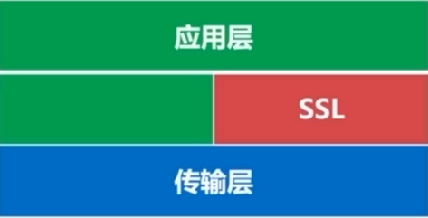

### HTTPs 工作流程 *

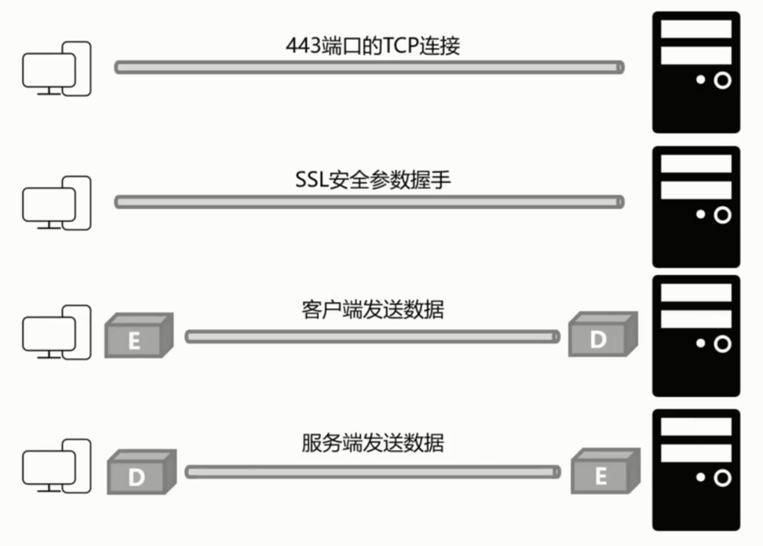

#### 重点理解 SSL 安全参数握手 

-   客户端首先发起
-   第二步确定了加密算法，但加密算法还没生成
-   如果证书无效，服务器会认定为不安全
-   公钥是从服务器发送来的证书内获取的

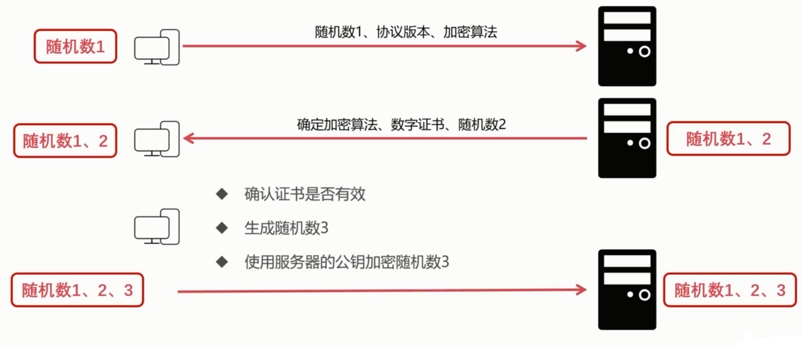

##### 后续

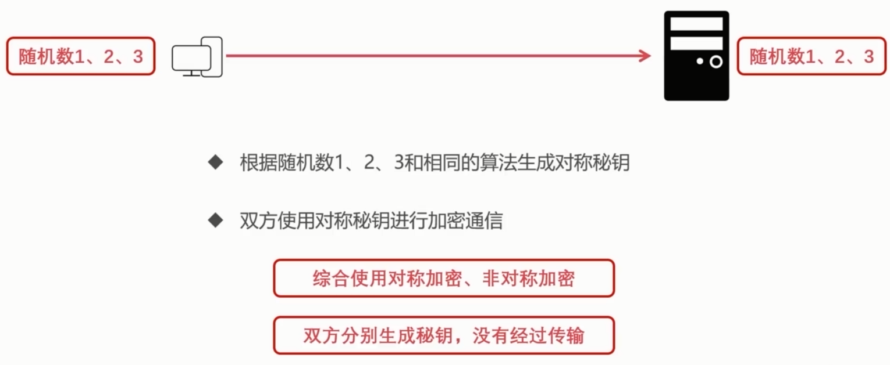

-   在交换随机数的时候使用非对称加密进行的
    -   保证了安全性
-   确定随机数以后，使用对称加密
    -   保证了效率（非对称加密运算难度高）