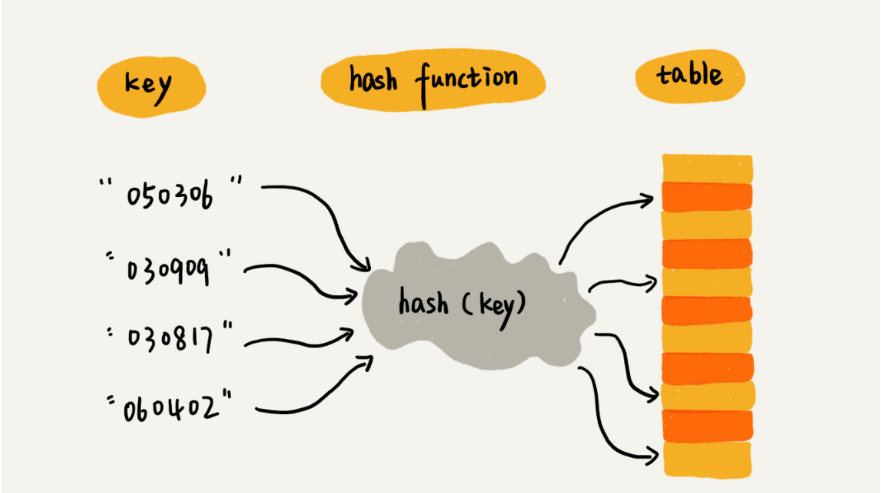
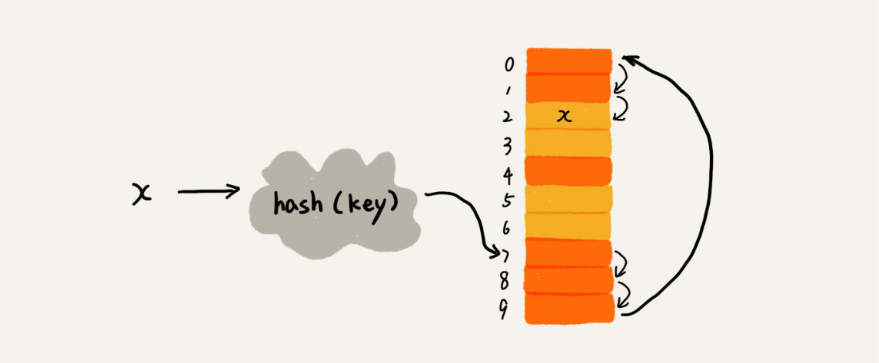
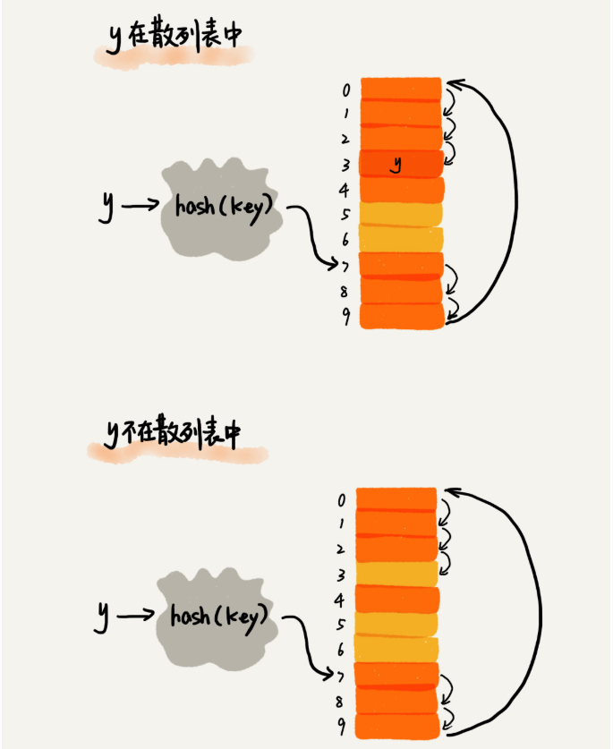
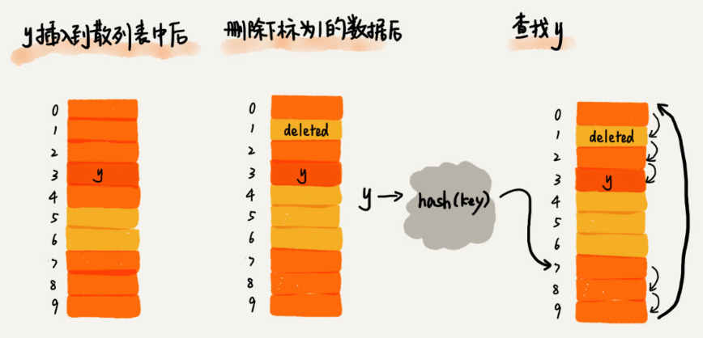

# 散列表

[TOC]

## 基础

思想：散列表 使用 数组支持按照下标随机访问数据的特性，其实它就是数组的一种扩展，由数组演化而来。可以说，没有数组，就没有散列表。

散列表 使用 数组支持按照下标随机访问的时候，时间复杂度 O（1）的特性。我们通过 散列函数 把元素的键值映射为下标，然后将 数据存储在数组中对应下标的位置。当我们按照 键值 查询元素时，我们用同样的散列函数，将 键值 转化 数组下标，从对应的数组下标的 位置取数据。



## 散列函数

作用：可以把它定义成 hash（key），其中key表示元素的键值，hash（key）的值表示经过散列函数计算得到的散列值。

散列函数三点设计要求：

1，散列函数计算得到的散列值是一个非负整数；下标得从 0 开始

2，如果 key1 = key2，那 hash（key1）== hash（key2）；经过函数得到的散列值得是相同的。

3，如果 key1 != key2，那 hash（key1）!= hash（key2）。（会出现散列冲突，很难实现）

## 散列冲突

常用解决方法：开放寻址法（open addressing），链表法（chaining）

1，开放寻址法

核心思想：如果出现了散列冲突，我们就重新探测一个空闲位置，将其插入。

那如何重新探测新的位置呢？我先讲一个比较简单的探测方法，线性探测（Linear Probing）。

插入过程

当我们往散列表中插入数据时，如果某个数据经过散列函数散列之后，存储位置已经被占用了，我们就从当前位置开始，依次往后查找，看是否有空闲位置，直到找到为止。



>   黄色的色块表示空闲位置，橙色的色块表示已经存储了数据。

查找过程

通过散列函数求出要查找元素的键值对应的散列值，然后比较数组中下标为散列值的元素和要查找的元素。如果相等，则说明就是我们要找的元素；否则就顺序往后依次查找。如果遍历到数组中的空位置，还没有找到，就说明要查找的元素并没有在散列表中。



删除操作

可以将删除的元素，特殊标记为deleted。当线性探测查找的时候，遇到标记为deleted的空间，并不是停下来，而是继续往下探测。



结论

当散列表中插入的数据越来越多时，散列冲突发生的可能性就会越来越大，空闲位置会越来越少，线性探测的时间就会越来越久。

极端情况下，我们可能需要探测整个散列表，所以最坏情况下的时间复杂度为O（n）。同理，在删除和查找时，也有可能会线性探测整张散列表，才能找到要查找或者删除的数据。

对于开放寻址冲突解决方法，除了线性探测方法之外，还有另外两种探测方法，二次探测（Quadratic probing）和双重散列（Double hashing）。

不管采用哪种探测方法，当散列表中空闲位置不多的时候，散列冲突的概率就会大大提高。为了尽可能保证散列表的操作效率，一般情况下，我们会尽可能保证散列表中有一定比例的空闲槽位。我们用装载因子（load factor）来表示空位的多少。

```
散列表的装载因子 = 填入表中的元素个数 / 散列表的长度
```

装载因子越大，说明空闲位置越少，冲突越多，散列表的性能会下降。

2，链表法

在散列表中，每个“桶（bucket）”或者“槽（slot）”会对应一条链表，所有散列值相同的元素我们都放到相同槽位对应的链表中。


当插入的时候，只需要通过散列函数计算出对应的散列槽位，将其插入到对应链表中即可，所以插入的时间复杂度是 O（1）。当查找、删除一个元素时，我们同样通过散列函数计算出对应的槽，然后遍历链表查找或者删除。

那查找或删除操作的时间复杂度是多少呢？

这两个操作的时间复杂度跟链表的长度k成正比，即 O（k）。

对于散列比较均匀的散列函数来说，理论上讲，k=n/m，其中n表示散列中数据的个数，m表示散列表中“槽”的个数。

## 场景

1，Word文档中单词拼写检查功能是如何实现的？

常用的英文单词有20万个左右，假设单词的平均长度是10个字母，平均一个单词占用10个字节的内存空间，那20万英文单词大约占2MB的存储空间，就算放大10倍也就是20MB。对于现在计算机来说，这可以用散列表来存储整个英文单词词典。

当用户输入某个英文单词时，我们拿用户输入的单词去散列表中查找。如果查到，则说明拼写正确；如果没有查到，则说明拼写可能有误，给予提示。

2，假设我们有10万条URL访问日志，如何按照访问次数给URL排序？

遍历10万条数据，以URL为key，访问次数为value，存入散列表，同时记录下访问次数的最大值K，时间复杂度O（N）。
如果K不是很大，可以使用桶排序，时间复杂度O（N）。如果K非常大（比如大于10万），就使用快速排序，复杂度O（NlogN）。

3，有两个字符串数组，每个数组大约有10万条字符串，如何快速找出两个数组中相同的字符串？

以第一个字符串数组构建散列表，key为字符串，value为出现次数。再遍历第二个字符串数组，以字符串为key在散列表中查找，如果value大于零，说明存在相同字符串。时间复杂度O（N）。