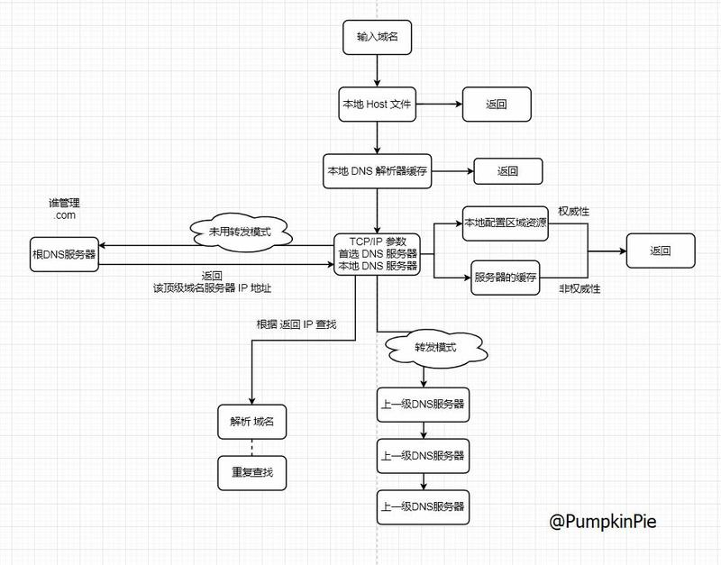

## 提问

**网络：**

1，简述TCP和UDP的区别


2，七层协议每一层的任务及作用


3，简述http状态码


4，简述http协议与https协议


5，简述SSL协议


6，解析DNS过程


7，三次握手，四次挥手的过程？？为什么三握？？


----------


main

1，TCP | UDP 协议差异

2，七层协议每一层的任务及作用

3，HTTP状态码

4，HTTP 与 HTTPs 区别

5，SSL协议

6，DNS过程

7，TCP 三次握手 and 四次握手


--------


TCP三次握手与四次挥手

三次握手

-   A>B：你愿意嫁给我吗？
-   B>A：我愿意；你愿意娶我吗？
-   A>B：我愿意

四次挥手

-   A>B：我不爱你了
-   B>A：知道了；但是请让我最后再爱你一次。
-   B>A：我也不爱你了
-   A>B：如道了

三次挥手

-   A>B：我不爱你了
-   B>A：知道了；正巧，我也不爱你了
-   A>B：知道了


目录

[TOC]

# 网络基础

## 七层协议每一层的任务及作用

中和OSI 和 TCP/IP 的优点，采用只有五层协议的体系结构

### 1，应用层

任务：通过应用程序的交互来完成特定任务的应用；

协议定义：进程间通信和交互规则；

应用层的数据单元：报文；

存在协议：DNS，HTTP，SMTP

### 2，运输层

任务：向两台主机之间提供 通用的数据传输服务。应用进程使用该该服务传输应用层报文。

多个进程的操作：

-   复用（多个应用进程同时使用运输层下面的服务）；
-   分用（运输层收到的信息分别交付给应用层上面对应的进程）；

存在协议：TCP and UDP

#### TCP | UDP 协议差异

UDP：

1，无连接；

2，尽最大可能交付；（不需要维持复杂的网络状态）

3，面向报文；

4，没有拥塞控制。（网络拥塞不降低源主机的发送速率，适用于实时网络场景）；

5，支持一对多，多对一，多对多等；

6，首部开销小，首部只需要 8 个字节；

TCP：

1，面向连接，连接需要拨号，建立连接，连接结束后要挂机释放；

2，只能有两个端点。仅支持一对一；

3，提供可靠的交付服务。数据无差错，不丢失，不重复，按序到达；

4，提供双全工通信。允许双方进程任何时间发送数据。两端设有发送缓存和接收缓存；

5，面向字节流。TCP仅把交付下来的数据看成是无结构的字节流；

### 3，网络层

出现背景：通信端之间存在多个数据连路 or 经过多个通信子网；

任务：选择合适的网络路由 and 交换节点，确保数据传达；

细节：把输出层产生的报文段 or 用户数据端段封装成分组 or 包 进行传递；

协议：IP 协议；

### 4，数据链路层

出现背景：主机之间数据传输总是一段一段在链路传送，需要专门的链路层协议。
任务：把网络层传输下来的 IP 数据报组成成 帧（frame）。在俩节点之间的链路上传送帧，每一帧包括数据和必要的控制信息。同步信息 or 地址信息 or 差错信息 or 控制信息

帧的控制信息作用：
1，从控制信息中知道数据从哪个比特开始，哪个比特结束，从中提取数据，上交给网络层。

2，控制信息可以使接收端检测收到的帧有无差错。发现了，可以简单抛弃，避免消耗网络资源。

3，提供可靠性协议，来纠正数据。

5，物理层

单位：比特

任务：尽可能屏蔽掉具体传输介质和物理设备的差异。使其上层不必考虑具体介质。 

### 5，物理层

任务：实现相邻计算机之间比特流的透明传送，尽可能 屏蔽掉具体传送介质 和 物理设备的差异；

物理层上的传送单位：比特；

透明比特流：经实际电路传送后没有发生变化；

特殊：0和1表示的电气特性及表示信号意义的逻辑特性；

## IP 数据报 **

版本：4 or 6。对应 IPv4 ，IPv6

首部长度：待定

区分服务：待定

总长度：首部长度，数据部分长度；

生存时间：TTL，防止数据无法交付在网络中兜圈子；

协议：携带的数据应上交给哪个协议进行处理；

首部校验和：待定

标识：数据报过长发生分片，标识可以使用分片标识对应查找；

片位移：用于发生分片情况，单位为 8 个字节；

### ARP 协议

全称：地址解析协议；

作用：根据 IP 地址获取 MAC 地址；

任务：应用程序更多关心IP地址，而不关心 MAC地址，需要通过ARP协议来获知目的主机MAC地址，完成数据封装；

### ICMP协议

全称：国际控制报文协议
作用：更有效转发 IP 数据和提高交付成功率。
位置：封装在IP 数据报中

## TCP 连接

序号：Seq序号，占32位，标识从TCP源端向目的端发送的字节流，发起方发送数据时对此进行标记。

确认序号：Ack 序号，占32位，只有 ACK标志位为 1时，确认序号字段才有效，Ack=Seq+1

报文特殊字段：

1，ACK：确认序号有效

2，RST：重置连接

3，SYN：发起一个新连接

4，FIN：释放一个连接

PS：1，确认序号Ack与标志位ACK不同；2，确认方Ack=发起方Req+1；

## TCP 可靠传输

方式：使用超时重传。在规定时间未完成，重传。所经过时间，往返RTT；

## TCP 拥塞控制

出发点：为了降低整个网路的拥塞情况。（对比，流量控制，使接受方来得及接收）；

方式：通过四个算法，慢开始，拥塞避免，快重传，快恢复；

细节：发送方需要维持一个拥塞窗口；

## FTP 文件传送协议

全称：文件传送协议

实现方式：使用 TCP 进行连接，需要两个连接传送一个文件，1，控制连接，server 端打开21端口，等待客户端，连接后，使用这个连接将客户端命令传送服务器，并传回应答；2，数据连接，用来传输文件数据；

是否主动连接，分主动 and 被动；

主机，server 端 20端口，client端 大于1024端口；

被动，client端自定端口，client端随机端口；

## DNS 域名系统

DNS：全称，DNS(Domain Name System)，域名系统；

### 为什么要有DNS？

用户直接记录 IP 地址不方便；

### 为什么不直接使用域名确认接受方？

直接使用域名，网络请求数据量会增加很多，因为常见的域名通常几十个字符，最长支持 255 个字符，比 IP 表示大了太多；

### 什么时候进行 DNS 查询？

发生在 TCP/IP 前， 在 TCP/IP 协议栈的时候已经是有 IP 地址了。

### DNS 为什么不设置在 TCP/IP 里面？

不是 TCP/IP 的核心业务呗。TCP/IP 只负责通讯，不负责 IP 地址的查询。各司其职，互不干扰；

### 实际上，是谁在进行 DNS 查询？

操作系统进行的 DNS 查询，操作系统同时管理 DNS 缓存；

DNS工作情况：

-   DNS 不仅只是查询 IP；
-   不是一台服务器，是分布式服务器；

DNS 查询过程



DNS 安全问题

-   DNS反射/放大攻击

    向大量开放DNS服务器发送大范围域名查询的DNS请求，并将该DNS请求的源IP地址伪造成想要攻击的目标IP地址。

-   DDOS攻击可能造成域名解析瘫痪

-   DNS/域名劫持

    在劫持的网络范围内拦截域名解析的请求，分析请求的域名，返回假的IP地址或者使请求失去响应；

-   DNS污染

    服务器伪装成DNS服务器向用户发回错误的地址的行为；

-   DNS信息黑客被修改

DNS优化

-   DNS Prefetching

    在请求某个链接之前，浏览器先尝试解析该链接的域名再将其进行缓存；

-   域名收敛

    将静态资源只放在一个域名下面，可以有效减少dns的请求；

-   HTTPDNS

    基于Http 协议向HTTPDNS服务器发送域名解析请求；可以避免运营商的域名劫持和进行精准调度。

### CDN

#### CDN是什么？

CDN的全称是Content Delivery Network，即内容分发网络；

#### 有什么作用？

其目的是使用户可就近取得所需内容，解决 Internet网络拥挤的状况，提高用户访问网站的响应速度。

#### CDN的过程是怎样的？

用户访问的资源原本是存放在你自己的服务器，通过修改DNS让用户根据IP等情况来选择合适的CDN缓存服务器来获取资源。

#### CDN的优点？

-   本地Cache加速，加快访问速度；
-   镜像服务，消除运营商之间互联的瓶颈影响，保证不同网络的用户都能得到良好的访问质量；
-   远程加速，自动选择cache服务器；
-   宽优化，分担网络流量，减轻压力；
-   集群抗攻击；
-   节约成本；

# HTTP

## GET and POST

GET：获取资源。POST：传输实体主体；

作用：GET用户获取资源，而POST用户传输实体主体；

参数：GET以查询字符串形式出现，POST参数存储子啊实体主体中。（POST 的内容一样可以抓包）

URL：GET中中文等字符会被转换成ASCII码，POST则支持标准字符集；

PS：安全的HTTP方法不会改变服务器状态，它只是可读的；

安全：GET是安全的，POST不是，POST的目的是：传送实体主体内容；

安全方法：GET，HEAD，OPTIONS；不安全方法：POST，PUT，DELETE；

幂等性：同样的请求被执行一次与连续执行多次的效果都是一样的。所有的安全方法都是幂等；

可缓存性：{ 

满足条件：
1，请求报文的HTTP方法本身可缓存（GET or HEAD）；

2，相应报文的状态码可缓存（200, 203, 204, 206, 300, 301, 404, 405, 410, 414, and 501。）；

3，报文的Cache-Control 首部字段没有指定不缓存。

}

XMLHttpRequest：为客户端提供两端之间的传输数据的功能。提供一个简单的URL来获取数据，并不会使页面刷新，在AJAX中大量使用；

## 状态码

—— HTTP状态码：服务器返回的的相应报文中 第一行为状态行，包含了状态码以及原因短语，用来告知客户端请求的结果。

1XX：信息
	100 continue

2XX：成功

​	200 OK

​	204 No content

3XX：重定向

​	301 Moved Permanently

​	302 Found

4XX：客户端错误

​	400 Bad Request

​	403 Forbidden

​	404 Not Found

5XX：服务器错误

​	500 Internal Server Error

​	503 Service Unavailable

## Cookie

出现：HTTP/1.1 引入Cookie 来保存状态信息；

处理方式：服务器发送到客户端浏览器并保存在本地的一小块数据；

作用：在之后，向同一服务器再次发送请求的时候被携带上，用于告知服务器两个请求是否来自同一个浏览器。（同时会增加开销）；

现代方式：新浏览器API 允许开发者直接将数据存储到本地；

1，用途

- 会话状态管理。用户登陆状态

- 个性化设置。用户自定义主题

- 浏览器行为跟踪。跟踪分析用户行为

2，创建过程

- 服务器的相应报文 Set-Cookie 字段，得到客户端可继续后续操作

3，分类

- 会话期Cookie：浏览器关闭自删除

- 持久性Cookie：指定过期时间，有效期

4，作用域

- Domain 标识指定了哪些主机可以接受Cookie

- Path 标识指定了主机下哪些路径可以接受 Cookie

5，JavaScript 

-   通过 document.cookie 创建新 Cookie，亦可通过该属性访问 非HttpOnly 标识的 Cookie

6，HttpOnly 

-   标记为 HttpOnly 的 Cookie 不能被 JavaScript 脚本调用。一定程度上避免 XSS 攻击。

7，Secure

-   标记为 Secure 的cookie 只能通过 被 HTTPS 协议加密过的请求发送给客户端。（但也不该通过cookie 传输敏感信息）

8，Session 

-   作用：将用户信息存储在服务端；

-   使用 Session 维护用户登录状态的过程如下：
    1，用户提交用户名和密码，放入HTTP请求报文中；
    2，服务端验证，正确后放入Redis中，Redis 中 Key 称为 Session ID；
    3，服务端返回的响应报文 Set-Cookie 首部字段包含 Session ID，客户端收到后存储；
    4，客户端之后的请求都包含Cookie值，服务器去除 Session ID，从Redis中取出用户信息，继续之前的操作；

9，浏览器禁用 Cookie

-   此时无法使用Cookie，只能使用 Session。该使用 URL 重写技术，将 Session ID 作为参数传递；

10，Cookie 与 Session 选择

- 数据复杂性首选 Session；

- 非隐私数据Cookie 加密存储，服务器解密；

- 不建议所有用户信息存储到Session，开销巨大；

## 缓存

1，优点

- 缓解服务器压力

- 降低客户端获取资源的延迟

2，实现方法

- 代理服务器缓存

- 客户端浏览器缓存

3，Cache-Control

​    HTTP/1.1 通过 Cache-Control 首部字段来控制缓存。

- 1）禁止缓存：
  `Cache-Control: no-store`

- 2）强制确认缓存：先确认有效性，再确认缓存服务
  `Cache-Control: no-cache`

- 3）私有化缓存和公共缓存：

  私有：只能被单独用户使用

  `Cache-Control: private`

  共有：可被多个用户使用

  `Cache-Control: public`

- 4）缓存过期机制：max-age 指令
  包装在请求报文中，资源的缓存时间小于该指令指定的时间，那能接受该缓存。

  出现在响应报文中，表示缓存资源在缓存服务器中保存的时间。

  Expires 首部字段，告知缓存服务器该资源什么时候会过期。

  `Cache-Control: max-age=31536000`

4，缓存验证

- 1）ETag 首部字段：资源唯一标识
  可将缓存资源的 ETag 值 放入 If-None-Match 首部，Server 端接受请求，判断资源的ETag与资源的最新 ETag 是否一致。有效，则返回 304 Not Modified

  `If-None-Match: "82e22293907ce725faf67773957acd12"`

- 2）Last-Modiied首部字段：源服务器发送的响应报文，指示源服务器对资源的最后修改时间。
  弱校验器，作为 ETag 备用方案；

  `Last-Modified: Wed, 21 Oct 2015 07:28:00 GMT `

## 连接管理

### 短链接 & 长链接

出现背景：HTTP 请求频繁，造成TCP开销巨大

长连接只需要建立一次TCP连接就能进行多次HTTP通信。

- HTTP/1.1开始，默认长连接，如需断开，Client端orServer端提出断开
  `Connection:close;`
- HTTP/1.1 之前，默认短连接，如需长连接，使用 Keep-Alive
  `Connection:Keep-Alive`

### HTTPs

HTTP存在问题：1，使用明文通信；2，不验证通信方身份；3，无法证明报文完整性；

HTTPs实现原理：HTTP 先和 SSL 通信，SSL 再和 TCP 通信。

HTTPs 相对优势：1，加密；2，认证；3，完整性保护；

### 加密

1，对称性加密：优，运算快；缺，无法安全传输。
2，非对称性加密：优，安全传输；缺，运算慢。

- 加密解密使用不用的密钥；
- 判断签名是否正确：发送方使用私有密钥签名，接收方使用公开密钥解密
  3，HTTPs 加密
- 混合加密
- 非对称密钥加密，用于保证传输对称密钥来保证传输过程的安全性，之后使用对称密钥加密，进行通信来保证通信过程的效率。

### 认证

操作：使用证书来对通信方进行认证；

CA：数字证书认证机构，Server端，Client端双方都可信赖的第三方机构；

实现细节：HTTPs通信时，Server端把证书发送给Client端，Client端取得其中的公开密钥之后，先使用数据签名进行验证，如果验证通过，就开始通信；

### 完整性保护

SSL 提供报文摘要功能来进行完整性保护；

HTTPs 报文摘要安全原因：结合了加密解密过程，解密成本高，修改困难。

HTTPs缺点
- 需要进行加密解密
- 支付证书授权的高额费用

### HTTP/2.0

HTTP/1.x 缺陷：实现简单，牺牲性能为代价

- Client端需要使用多个连接才能实现并发 and 缩短延迟；
- 不压缩请求和响应头部，从而导致不必要的网络流量；
- 不支持有效的资源优先级，导致底层TCP 连接的利用率低下；

### 二进制分帧层

HTTP/2.0 将报文分成 HEADERS 帧 and DATA 帧，都是二进制格式
实现细节：通信过程中，只有一个 TCP 连接存在，它承载了任意数量的双向数据流（Stream）。

- 一个数据流（Stream）都有一个唯一标识符 and 可选的优先级信息，用于承载双向信息。
- 消息（Message），与逻辑请求 or 响应对应的完整的一系列帧。
- 帧，最小的通信单位，来自不同的数据流的帧可以交错发送，然后根据每个帧头的数据流标识符重新组装。

### 服务端推送

HTTP/2.0 在 Client 端请求一个资源时，会把相关的资源一起发送给Client 端，Client 不需要再次发送请求。

### 首部压缩

HTTP/1.1 首部有大量信息，而且要重复发送。

HTTP/2.0 要求Client 端 and Servr端同时维护更新一个之前见过的首部字段表，从而避免重复传输。

HTTP/2.0 也使用 Huffman 编码对首部字段进行压缩。

## TCP 三次握手 and 四次握手

简单示意：
1，Client端，发送带有 SYN 标志的数据包；

2，Server端，发送带有 SYN/ACK 标志的数据包；

3，Client端，发送带有 ACK 标志的数据包；

### 为什么要三次握手

三次握手目的：建立可靠的通信信道。确认通信双方的接受 and 发送是正常的。

### 为什么回传 SYN？

回传SYN目的：告诉 发送端，收到的信息确实是"你"发送的信号了。

### 回传 SYN，为什么需要 ACK？

回传SYN：发送方 link 接收方 通道畅通。

ACK信号目的：验证 接收到 到发送方的通道是否畅通。

断开一个 TCP 连接，需要 四次挥手

简单示意：

1，客户端，发送 FIN，关闭 客户端到服务端的数据传输；

2，服务端，收到 FIN，传回 ACK，确认需要为收到的 序号 +1；

3，服务端，关闭与客户端的连接，发送 一个 FIN 给客户端；

4，客户端，发回 ACK 报文确认，将确认需要设置为 收到的序号 +1；

### 为什么需要 四次挥手？

任何一方都可以在数据传输结束后发出连接释放通知，待对方确认后进入半关闭状态，当 另一方也没有数据发送时，则发出连接释放的通知，对方确认后就完全关闭 TCP 连接。

### TCP and UDP 适用场景

UDP适用：QQ语音，QQ视频，直播等；

TCP适用：文件传输，发送 and 接收邮件，远程登陆等；

### TCP可靠性

体现在哪？传递数据之前，三次握手建立连接；数据传递时，有确认，窗口，重传，拥塞控制机制；数据传递完成后，可断开连接节约资源。

### TCP 协议如何保证可靠传输

1，应用数据被切割成 TCP 认为的最合适发送的数据块

2，TCP 给发送的每一个包进行编号，接受方对数据包进行排序，过后，把有序的数据传送给应用层。

3，检验和，TCP 会保持它首部 和数据的校验和，这里会有一个端到端的检验和。目的是：检验数据在传输过程中的任何变化。如果收到的报文段检验有差错，TCP 将丢弃这个报文段 和 不确认收到此报文段。

4，TCP 的接收端会丢弃重复的数据。

5，流量控制：TCP 的每一方都有一个固定大小的缓冲空间，TCP 接收端只允许发送端发送 接收端缓冲区大小的数据。接收方来不及处理发送方的数据，能提示发送方降低发送速率，防止包丢失。TCP 使用的流量控制协议：可变大小的滑动窗口协议。

6，拥塞控制：当网络拥塞时，减少数据发送。

7，停止等待协议：为了实现可靠传输，基本原理，每发完一个分组就停止发送，等待对方确认。在收到确认后再发送下一个分组。

8，超时重传：当TCP 发出一个段后，它启动一个定时器，等待目的端确认收到这个报文段，如果不能及时收到确认。将重发这个报文。

### 停止等待协议

原理：发完一个分组后，停止发送，等待对方确认。在收到确认后再发送下一个分组。（若接收方收到重分组，就丢弃该分组，但同时还要发送确认）

1）无差错情况：发送方发送分组，接收方在规定时间内收到，并且回复确认，发送方再次发送

2）出现差错情况（超时重传）：超过一定时间没有收到确认，就重传前面发送的分组；

自动重传请求 APQ：每发送完一个分组需要设置要给超时计时器，其重转时间应比数据在分组传输的平均往返时间更长一些。（连续 APQ协议 可以提高信道利用率。）

发送可以为一个发送窗口，凡位于发送窗口内的分组可连续发送出去，而不需要等待对方确认。
接收方一般采用累计确认，对按序到达的最后一个分组发送确认，表明这个分组位置的所有分组都已经正确收到了。
3）确认丢失 and 确认迟到

-   1，确认丢失，补就：一，丢失重传信息，不向上层交付；二，向发送方确认消息（代表消息已经丢失）；

-   2，确认迟到，补就：发送方收到重复确认后，直接丢弃；二，接收端首都奥重复消息后，直接丢弃重复的接收信息；

### 自动重传请求 APQ 协议

优：简单

缺：信道利用率低

连续 APQ 协议

优：可以提高信道的利用率，容易实现，即使确认丢失，也不必重传。

缺：不能向发送方详细反映接收方已经正确收到所有分组信息。发5个丢no.3，确认 2个，继续发送后 3个。

### 滑动窗口

目的：实现流量控制

注意：当滑动窗口为0时，发送方一般不能再发送数据报。除外两点，一，可以发送紧急数据；二，发送 1 字节数据报通知重设滑动窗口大小。

### 流量控制

目的：控制发送方的发送速率，保证接收方来得及接收

### 拥塞控制

拥塞：资源需求大于可提供，网络性能要变坏（供大于需）

拥塞控制的四种算法：

1，慢开始：先探测，后不断增加发送数据

2，拥塞避免：让拥塞窗口 cwnd 缓慢增大，RTT 后把发送方 cwnd+1

3，快重传 and 快恢复（FRR）：

没有FRR：数据包丢失，TCP 使用定时器要求传输暂停，暂停的时间内，没有新的or复制的数据包被发送；

存在FRR：一，接收端收到不按序的数据段，它会立即给发送端发送一个重复确认。如果发送端收到三个重复确认，它会假定确认指出的数据段丢失，并立即重传；二，不会因为重传时要求的暂停被耽误；

### URL到显示页面过程

1，DNS 解析
2，TCP连接

3，发送 HTTP 请求

4，服务器处理请求并返回 HTTP报文

5，连接结束

各种协议 与 HTTP 协议之间的关系

--------发送-------

HTTP协议职责：生成针对目标 Web 服务器的 HTTP请求报文

TCP 协议职责：方便通信，将 HTTP 请求报文分割成报文段，在把每个报文段可靠安全地传给对方
--------寻找-------

IP协议职责：搜索对方地址，一边中转，一边传送
--------接收-------

TCP协议职责：从对方那接收报文段，按序重组报文段；

HTTP协议职责：对 Web 服务器请求的内容的处理

请求的处理结果同样利用 TCP/IP 通信协议向用户进行回传。  

## SSL协议

作用区域：SSL在传输层对网络连接进行加密；

提供服务：

1）认证用户和服务器，确保数据发送到正确的客户机和服务器；

2）加密数据以防止数据中途被窃取；

3）维护数据的完整性，确保数据在传输过程中不被改变/

SSL会话状态：

会话（Session）和连接（Connection）是SSL中两个重要的概念，在规范中定义如下：

1）SSL连接：用于提供某种类型的服务数据的传输，是一种点对点的关系。一般来说，连接的维持时间比较短暂，并且每个连接一定与某一个会话相关联；

2）SSL会话：是指客户和服务器之间的一个关联关系。会话通过握手协议来创建。它定义了一组安全参数。

体系结构：

SSL的体系结构中包含两个协议子层，其中底层是SSL记录协议层（SSL Record Protocol Layer）；高层是SSL握手协议层（SSL HandShake Protocol Layer）；

SSL记录协议层的作用是为高层协议提供基本的安全服务；

SSL握手协议的作用是协调客户和服务器的状态，使双方能够达到状态的同步；

## HTTP 与 HTTPs 区别

### 一，HTTP 与 HTTPs 基本概念？

HTTP：用于从WWW服务器传输超文本到本地浏览器的传输协议，使浏览器更加高效，网络传输减少

HTTPs：以安全为目标，HTTP 加入 SSL 层加密数据，加密的详细内容需要 SSL。

HTTPs主要作用：一，建立安全信道；二，确认网站的真实性

### 二，HTTP 与 HTTPS 有什么区别？

主要区别如下：

1，https 需要 ca 申请证书，需要费用

2，http 是超文本传输，信息是明文，https 是具有安全性的 ssl 加密协议

3，http and https 使用不同的连接方式，端口也不同，http 80 端口，https 443 端口

4，http 连接简单，无状态；https 由 ssl + http 协议构建加密传输，身份验证

### 三，HTTPS 的工作原理？

客户端在使用HTTPS方式与Web服务器通信时有以下几个步骤，如图所示。

1）客户使用https的URL访问Web服务器，要求与Web服务器建立SSL连接。

2）Web服务器收到客户端请求后，会将网站的证书信息（证书中包含公钥）传送一份给客户端。

3）客户端的浏览器与Web服务器开始协商SSL连接的安全等级，也就是信息加密的等级。

4）客户端的浏览器根据双方同意的安全等级，建立会话密钥，然后利用网站的公钥将会话密钥加密，并传送给网站。

5）Web服务器利用自己的私钥解密出会话密钥。

6）Web服务器利用会话密钥加密与客户端之间的通信。

### 四，HTTPs 优缺点

优点：

1，https 可认证用户和服务器，确保数据发送到两端

2，使用 ssl 协议加密数，可防止数据在传输过程中不被窃取，改变，确保数据的完整性。

3，不是绝对的安全，加大中间人攻击成本、

4，排名更前

缺点：

1，https 握手耗时，页面加载时间延长50%，10-20%的耗电

2，https 缓存不如 http 高效，增加开销和功耗。

3，ssl 证书需要钱，功能越大，开销越高。

4，ssl 证书需要绑定 IP，同一 IP 不能绑定 多个域名

5，https 协议加密范围有限，黑客攻击，拒绝式服务攻击，服务器劫持等不起作用

### 五，http切换到 https

需要将页面所有链接改为 https

其次，可以实现兼容，具体实现方式是，去掉页面链接中的http头部，这样可以自动匹配http头和https头。例如：将http://www.baidu.com改为//www.baidu.com。然后当用户从http的入口进入访问页面时，页面就是http，如果用户是从https的入口进入访问页面，页面即使https的；

# Socket

## IO 模型

### 阻塞 I/O（blocking IO）

大白话：等等等，内核还没完全接受完信息前，内核一直会堵塞等待操作完成，同时，用户进程这边，整个进程也会被堵塞。什么时候双方解除堵塞状态？当内核一直等到数据准备完成，数据会从内核 copy 到用户内存，等待内核返回结果，用户进程此时才解除堵塞状态。

特点：在IO执行的两个阶段都被block了

### 非阻塞 I/O（nonblocking IO）

大白话：用户进程一直问：内核，数据准备好了没？内核：没有（返回 error）；得到情况结果后，会不断再询问内核，数据准备好了没，直到数据准备完成前都会重复此操作。一旦内核准备好了数据，此时接收到 用户进程的询问，这时可以立马将数据拷贝到用户内存，并返回。

特点：用户进程 需要 不断的主动询问 kernel 数据 好了没有。

### I/O 多路复用（ IO multiplexing）

即是：select，poll，epoll，也称这种IO方式为event driven IO

select/epoll 的好处：单个process就可以同时处理多个网络连接的IO；（关键：能够处理更多连接）

基本原理：select，poll，epoll 这个 function 会不断的轮询所负责的所有 socket，当某个 socket 有数据到达了，就通知用户进程；

特点：通过一种机制一个进程能同时等待多个文件描述符，而这些文件描述符（套接字描述符）其中的任意一个进入读就绪状态，select()函数就可以返回。

### 异步 I/O（asynchronous IO）

用户进程发起read操作之后，立刻就可以开始去做其它的事。

而另一方面，从 kernel 的角度，当它受到一个 asynchronous read 之后，首先它会立刻返回，所以不会对用户进程产生任何block。然后，kernel会等待数据准备完成，然后将数据拷贝到用户内存，当这一切都完成之后，kernel会给用户进程发送一个 signal，告诉它read操作完成了；

### 总结

#### blocking和non-blocking的区别

调用blocking IO会一直block住对应的进程直到操作完成，而non-blocking IO在kernel还准备数据的情况下会立刻返回；

#### synchronous IO  & asynchronous IO 的区别

synchronous IO：当kernel中数据准备好的时候，recvfrom会将数据从kernel拷贝到用户内存中，这个时候进程是被block了，在这段时间内，进程是被block的。

asynchronous IO ：当进程发起IO 操作之后，就直接返回再也不理睬了，直到kernel发送一个信号，告诉进程说IO完成。在这整个过程中，进程完全没有被block。

## 多路复用 之 select、poll、epoll

### select

```
int select (int n, fd_set *readfds, fd_set *writefds, fd_set *exceptfds, struct timeval *timeout);
```

select 函数监视的文件描述符分3类，分别是writefds、readfds、和exceptfds。调用后select函数会阻塞，直到有描述副就绪（有数据 可读、可写、或者有except），或者超时（timeout指定等待时间，如果立即返回设为null即可），函数返回。当select函数返回后，可以 通过遍历fdset，来找到就绪的描述符。

select的一个缺点：单个进程能够监视的文件描述符的数量存在最大限制，在Linux上一般为1024，可以通过修改宏定义甚至重新编译内核的方式提升这一限制，但 是这样也会造成效率的降低。

### poll

```
int poll (struct pollfd *fds, unsigned int nfds, int timeout);
```

poll使用一个 pollfd的指针实现

```
struct pollfd {
    int fd; /* file descriptor */
    short events; /* requested events to watch */
    short revents; /* returned events witnessed */
};
```

poll返回后，需要轮询pollfd来获取就绪的描述符。

### 总结

select和poll都需要在返回后，`通过遍历文件描述符来获取已经就绪的socket`。

事实上，同时连接的大量客户端在一时刻可能只有很少的处于就绪状态，因此随着监视的描述符数量的增长，其效率也会线性下降。

### epoll

epoll使用一个文件描述符管理多个描述符，将用户关系的文件描述符的事件存放到内核的一个事件表中，这样在用户空间和内核空间的copy只需一次；

epoll事先通过epoll_ctl()来注册一 个文件描述符，一旦基于某个文件描述符就绪时，内核会采用类似callback的回调机制，迅速激活这个文件描述符，当进程调用epoll_wait() 时便得到通知；

epoll的优点：

-   监视的描述符数量不受限制，它所支持的FD上限是最大可以打开文件的数目，这个数字一般远大于2048
-   IO的效率不会随着监视fd的数量的增长而下降。epoll不同于select和poll轮询的方式，而是通过每个fd定义的回调函数来实现的。只有就绪的fd才会执行回调函数。

# 参考

主题

CyC2018 @ github

JavaGuide@ github

文章

[CDN与DNS知识汇总](http://hpoenixf.com/DNS%E4%B8%8ECDN%E7%9F%A5%E8%AF%86%E6%B1%87%E6%80%BB.html)

[DNS 灵魂三问：why，when，how ](https://juejin.im/post/5a5c441f518825545d75c111)

[Linux IO模式及 select、poll、epoll详解](https://segmentfault.com/a/1190000003063859)